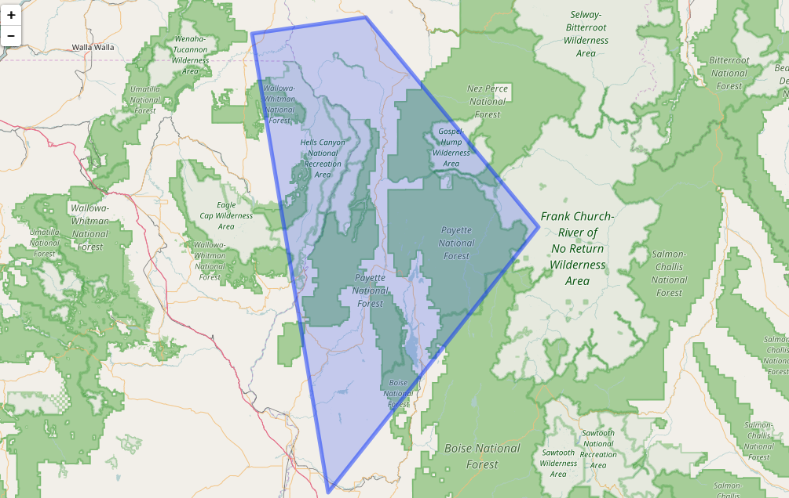
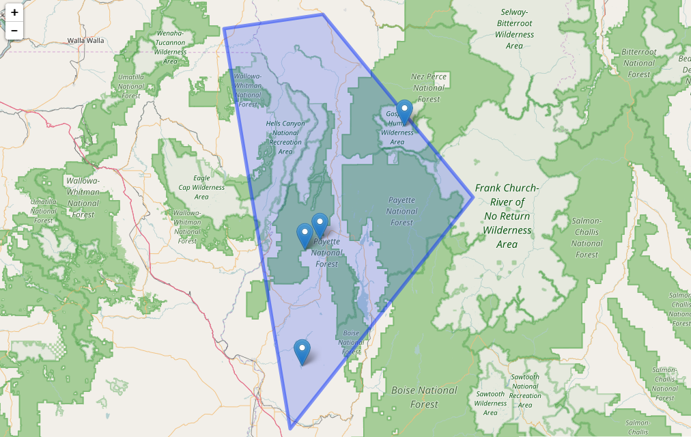

**randgeo** generates random points and shapes in GeoJSON and WKT formats for 
use in examples, teaching, or statistical applications.

Points and shapes are generated in the long/lat coordinate system and with
appropriate spherical geometry; random points are distributed evenly across
the globe, and random shapes are sized according to a maximum great-circle
distance from the center of the shape. 

**randgeo** was adapted from <https://github.com/tmcw/geojson-random> to have 
a pure R implementation without any dependencies as well as appropriate 
geometry. Data generated by **randgeo** may be processed or displayed of with 
packages such as [**sf**](https://cran.r-project.org/package=sf),
[**wicket**](https://cran.r-project.org/package=wicket),
[**geojson**](https://cran.r-project.org/package=geojson),
[**wellknown**](https://cran.r-project.org/package=wellknown),
[**geojsonio**](https://cran.r-project.org/package=geojsonio), or
[**lawn**](https://cran.r-project.org/package=lawn).

Package API:

* `rg_position` - random position (lon, lat)
* `geo_point` - random GeoJSON point
* `geo_polygon` - random GeoJSON polygon
* `wkt_point` - random WKT point
* `wkt_polygon` - random WKT polygon


## setup

Install `randgeo` - and we'll need a few other packages for examples below.

```{r eval=FALSE}
install.packages("randgeo")
install.packages(c('leaflet', 'lawn'))
```

```{r}
library(randgeo)
```


## GeoJSON

Functions that start with `geo` are for creating GeoJSON data in JSON format.
If you want to create an R list or data.frame, you can use `jsonlite::fromJSON`.

### Random point

Evenly distributed across the sphere.  The `bbox` option allows
you to limit points to within long/lat bounds.

```{r}
geo_point()
```

### Random polygon 

Centered on a random point, with default maximum size

```{r}
geo_polygon()
```

Visualize your shapes with **lawn**.

```{r eval=FALSE}
lawn::view(jsonlite::toJSON(unclass(geo_polygon(count = 4)), auto_unbox = TRUE))
```


## WKT

Functions prefixed with `wkt` create random Well-Known Text (WKT) data. These functions
wrap the GeoJSON versions, but then convert the data to WKT.

### Random point

```{r}
wkt_point()
```

### Random polygon

```{r}
wkt_polygon()
```


## Use case

Example of geospatial data manipulation, using `randgeo`, `leaflet` and
`lawn`.

Steps:

* Generate random overlapping polygons
* Calculate a single polygon from overlapping polygons
* Map polygon
* Generate random locaitons (points)
* Clip locations to the polygon
* Overlay locations (more random points) on the polygon

```{r}
library(randgeo)
library(lawn)
library(leaflet)
```

### generate random data

```{r}
set.seed(5)
polys <- randgeo::geo_polygon(count = 2, num_vertices = 4, bbox = c(-120, 40, -100, 50))
```

### Get intersection of polygons

```{r}
polysinter <- lawn::lawn_intersect(polys$features[[1]], polys$features[[2]])
```

### map polygons

```{r eval=FALSE}
polysinter %>% lawn::view()
```



### generate random points - clip points to polygon

```{r}
pts <- randgeo::geo_point(count = 500, bbox = c(-120, 40, -100, 50))
pts <- lawn::lawn_within(
  points = lawn_featurecollection(pts),
  polygons = lawn_featurecollection(polysinter)
)
```

### Draw polygon + points on map

```{r eval=FALSE}
polysinter %>% 
  view() %>% 
  addGeoJSON(geojson = jsonlite::toJSON(unclass(pts)))
```



## Feedback

Let us know what you think!  `randgeo` doesn't have any revdep's on CRAN yet, but 
is being [used in one package on GitHub](https://github.com/search?utf8=%E2%9C%93&q=%22randgeo%22+language%3AR+-user%3Acran+-user%3Aropensci&type=Code).
