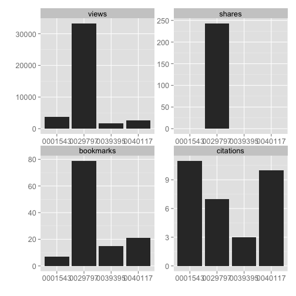

## What are article level metrics?

Glad you asked. The canonical URL for this is perhaps [altmetrics.org](http://altmetrics.org/manifesto/). Basically it is a metric that measures something about an article. This is in stark contrast to journal level metrics, like the Journal Impact Factor.

## Are there other altmetrics data providers?

Yes indeedy.

+ [ImpactStory](http://impactstory.it/)
+ [Altmetric.com](http://altmetric.com/)
+ [PlumAnalytics](http://www.plumanalytics.com/)

## Authentication

You aren't currently not required to use an API key to access the PLoS ALM API, but soon will need to.

Get your PLoS API key [here](http://api.plos.org/)

Put your API key in your .Rprofile file using exactly this:
options(PlosApiKey = "YOUalmAPIKEY"),
and the functions within this package will be able to use your API key without you having to enter it every time you run a search.

<section id="installation">

## Installation

You can get this package by installing via `install_github()` within Hadley Wickham's devtools package.


```r
install.packages("devtools")
require(devtools)
install_github("alm", "rOpenSci")
```


```r
library(alm)
```

<section id="usage">

## Usage

### The default call with either doi, pmid, pmcid, or mdid without specifying an argument for info

(We'll not print a few columns so the table prints nicely)


```r
alm(doi = "10.1371/journal.pone.0029797")[, -c(6:8)]
```

```
                      .id  pdf  html shares groups  total
1               citeulike   NA    NA      1     NA      1
2                crossref   NA    NA     NA     NA      7
3                  nature   NA    NA     NA     NA      4
4                  pubmed   NA    NA     NA     NA      2
5                  scopus   NA    NA     NA     NA      7
6                 counter 2412 29163     NA     NA  31687
7        researchblogging   NA    NA     NA     NA      1
8                     pmc   64   416     NA     NA    480
9                facebook   NA    NA      0     NA      0
10               mendeley   NA    NA     69      0     69
11                twitter   NA    NA     NA     NA     12
12              wikipedia   NA    NA     NA     NA     50
13          scienceseeker   NA    NA     NA     NA      0
14         relativemetric   NA    NA     NA     NA 150729
15                  f1000   NA    NA     NA     NA      0
16               figshare    0    11     NA     NA     11
17              pmceurope   NA    NA     NA     NA      4
18          pmceuropedata   NA    NA     NA     NA     10
19            openedition   NA    NA     NA     NA      0
20              wordpress   NA    NA     NA     NA      0
21                 reddit   NA    NA     NA     NA      0
22               datacite   NA    NA     NA     NA      0
23             copernicus   NA    NA     NA     NA      0
24        articlecoverage   NA    NA     NA     NA      0
25 articlecoveragecurated   NA    NA     NA     NA      0
26          plos_comments   NA    NA     NA     NA     16
27         twitter_search   NA    NA     NA     NA      0
```


### Details for a single DOI


```r
out <- alm(doi = "10.1371/journal.pone.0029797", info = "detail")
## totals
out[["totals"]][, -c(6:8)]
```

```
                      .id  pdf  html shares groups  total
1               citeulike   NA    NA      1     NA      1
2                crossref   NA    NA     NA     NA      7
3                  nature   NA    NA     NA     NA      4
4                  pubmed   NA    NA     NA     NA      2
5                  scopus   NA    NA     NA     NA      7
6                 counter 2412 29163     NA     NA  31687
7        researchblogging   NA    NA     NA     NA      1
8                     pmc   64   416     NA     NA    480
9                facebook   NA    NA      0     NA      0
10               mendeley   NA    NA     69      0     69
11                twitter   NA    NA     NA     NA     12
12              wikipedia   NA    NA     NA     NA     50
13          scienceseeker   NA    NA     NA     NA      0
14         relativemetric   NA    NA     NA     NA 150729
15                  f1000   NA    NA     NA     NA      0
16               figshare    0    11     NA     NA     11
17              pmceurope   NA    NA     NA     NA      4
18          pmceuropedata   NA    NA     NA     NA     10
19            openedition   NA    NA     NA     NA      0
20              wordpress   NA    NA     NA     NA      0
21                 reddit   NA    NA     NA     NA      0
22               datacite   NA    NA     NA     NA      0
23             copernicus   NA    NA     NA     NA      0
24        articlecoverage   NA    NA     NA     NA      0
25 articlecoveragecurated   NA    NA     NA     NA      0
26          plos_comments   NA    NA     NA     NA     16
27         twitter_search   NA    NA     NA     NA      0
```

```r
## history
head(out[["history"]])
```

```
        .id      dates totals
1 citeulike 2014-04-17      1
2 citeulike 2014-04-17      1
3 citeulike 2014-03-04      1
4 citeulike 2014-01-27      1
5  crossref 2014-04-15      7
6  crossref 2014-03-05      7
```


### Search using various identifiers, including pubmed id, pmc id, and mendeley id


```r
# A single PubMed ID (pmid)
alm(pmid = 22590526)[, -c(6:8)]
```

```
                      .id  pdf  html shares groups total
1               citeulike   NA    NA      5     NA     5
2                crossref   NA    NA     NA     NA     3
3                  nature   NA    NA     NA     NA     1
4                  pubmed   NA    NA     NA     NA     5
5                  scopus   NA    NA     NA     NA     7
6                 counter 1058 15178     NA     NA 16279
7        researchblogging   NA    NA     NA     NA     1
8                     wos   NA    NA     NA     NA     4
9                     pmc   31   119     NA     NA   150
10               facebook   NA    NA     70     NA   182
11               mendeley   NA    NA     63      0    63
12                twitter   NA    NA     NA     NA   154
13              wikipedia   NA    NA     NA     NA     0
14          scienceseeker   NA    NA     NA     NA     0
15         relativemetric   NA    NA     NA     NA 33527
16                  f1000   NA    NA     NA     NA     0
17               figshare   NA    NA     NA     NA     0
18              pmceurope   NA    NA     NA     NA     5
19          pmceuropedata   NA    NA     NA     NA     0
20            openedition   NA    NA     NA     NA     0
21              wordpress   NA    NA     NA     NA     1
22                 reddit   NA    NA     NA     NA     0
23               datacite   NA    NA     NA     NA     0
24             copernicus   NA    NA     NA     NA     0
25        articlecoverage   NA    NA     NA     NA     0
26 articlecoveragecurated   NA    NA     NA     NA     0
27          plos_comments   NA    NA     NA     NA     3
28         twitter_search   NA    NA     NA     NA     0
```

```r

# A single PubMed Central ID (pmcid)
alm(pmcid = 212692)[, -c(6:8)]
```

```
                      .id  pdf  html shares groups   total
1               citeulike   NA    NA      8     NA       8
2                crossref   NA    NA     NA     NA     152
3                  nature   NA    NA     NA     NA       0
4                  pubmed   NA    NA     NA     NA     158
5                  scopus   NA    NA     NA     NA     326
6                 counter 2571 20553     NA     NA   23282
7        researchblogging   NA    NA     NA     NA       0
8                     pmc 2331  4898     NA     NA    7229
9                facebook   NA    NA      0     NA       0
10               mendeley   NA    NA    114      0     114
11                twitter   NA    NA     NA     NA       0
12              wikipedia   NA    NA     NA     NA       0
13          scienceseeker   NA    NA     NA     NA       0
14         relativemetric   NA    NA     NA     NA 1346375
15                  f1000   NA    NA     NA     NA       0
16               figshare    1     6     NA     NA       7
17              pmceurope   NA    NA     NA     NA     197
18          pmceuropedata   NA    NA     NA     NA      53
19            openedition   NA    NA     NA     NA       0
20              wordpress   NA    NA     NA     NA       0
21                 reddit   NA    NA     NA     NA       0
22               datacite   NA    NA     NA     NA       0
23             copernicus   NA    NA     NA     NA       0
24        articlecoverage   NA    NA     NA     NA       0
25 articlecoveragecurated   NA    NA     NA     NA       0
26          plos_comments   NA    NA     NA     NA       0
27         twitter_search   NA    NA     NA     NA       0
```

```r

# A single Mendeley UUID (mdid)
alm(mdid = "35791700-6d00-11df-a2b2-0026b95e3eb7")[, -c(6:8)]
```

```
NULL
```


### Search on many identifiers


```r
dois <- c("10.1371/journal.pone.0001543", "10.1371/journal.pone.0040117", "10.1371/journal.pone.0029797",
    "10.1371/journal.pone.0039395")
out <- alm(doi = dois)
lapply(out, head)
```

```
[[1]]
        .id  pdf  html shares groups comments likes citations total
1 citeulike   NA    NA      1     NA       NA    NA        NA     1
2  crossref   NA    NA     NA     NA       NA    NA         7     7
3    nature   NA    NA     NA     NA       NA    NA         4     4
4    pubmed   NA    NA     NA     NA       NA    NA         2     2
5    scopus   NA    NA     NA     NA       NA    NA         7     7
6   counter 2412 29163     NA     NA       NA    NA        NA 31687

[[2]]
        .id pdf html shares groups comments likes citations total
1 citeulike  NA   NA      0     NA       NA    NA        NA     0
2  crossref  NA   NA     NA     NA       NA    NA         3     3
3    nature  NA   NA     NA     NA       NA    NA         0     0
4    pubmed  NA   NA     NA     NA       NA    NA         2     2
5    scopus  NA   NA     NA     NA       NA    NA         5     5
6   counter 318 1526     NA     NA       NA    NA        NA  1861

[[3]]
        .id pdf html shares groups comments likes citations total
1 citeulike  NA   NA      0     NA       NA    NA        NA     0
2  crossref  NA   NA     NA     NA       NA    NA         0     0
3    nature  NA   NA     NA     NA       NA    NA         0     0
4    pubmed  NA   NA     NA     NA       NA    NA         1     1
5    scopus  NA   NA     NA     NA       NA    NA         3     3
6   counter 211 1047     NA     NA       NA    NA        NA  1282

[[4]]
        .id pdf html shares groups comments likes citations total
1 citeulike  NA   NA      0     NA       NA    NA        NA     0
2  crossref  NA   NA     NA     NA       NA    NA         7     7
3    nature  NA   NA     NA     NA       NA    NA         0     0
4    pubmed  NA   NA     NA     NA       NA    NA         7     7
5    scopus  NA   NA     NA     NA       NA    NA        11    11
6   counter 435 2626     NA     NA       NA    NA        NA  3105
```


### Get altmetrics by year

You can also get metrics by day (`sum_metrics='day'`) or month (`sum_metrics='month'`)


```r
alm(doi = "10.1371/journal.pone.0036240", sum_metrics = "year")[, -c(6:8)]
```

```
                      .id year pdf  html shares citations total  x
1               citeulike 2012  NA    NA      5        NA     5 NA
2                crossref 2013  NA    NA     NA         3     3 NA
3                  nature   NA  NA    NA     NA        NA    NA NA
4                  pubmed   NA  NA    NA     NA        NA    NA NA
5                  scopus   NA  NA    NA     NA        NA    NA NA
6                 counter 2012 699 10502     NA        NA 11234 NA
7                 counter 2013 299  3605     NA        NA  3911 NA
8                 counter 2014  60  1071     NA        NA  1134 NA
9        researchblogging 2013  NA    NA     NA         1     1 NA
10                    pmc 2012  16    53     NA        NA    69 NA
11                    pmc 2013  13    66     NA        NA    79 NA
12                    pmc 2014   2     0     NA        NA     2 NA
13               facebook   NA  NA    NA     NA        NA    NA NA
14               mendeley   NA  NA    NA     NA        NA    NA NA
15                twitter 2012  NA    NA     NA        NA   103 NA
16                twitter 2013  NA    NA     NA        NA    33 NA
17                twitter 2014  NA    NA     NA        NA    18 NA
18              wikipedia   NA  NA    NA     NA        NA    NA NA
19          scienceseeker   NA  NA    NA     NA        NA    NA NA
20         relativemetric   NA  NA    NA     NA        NA    NA NA
21                  f1000   NA  NA    NA     NA        NA    NA NA
22               figshare   NA  NA    NA     NA        NA    NA NA
23              pmceurope   NA  NA    NA     NA        NA    NA NA
24          pmceuropedata   NA  NA    NA     NA        NA    NA NA
25            openedition   NA  NA    NA     NA        NA    NA NA
26              wordpress 2012  NA    NA     NA         1     1 NA
27                 reddit   NA  NA    NA     NA        NA    NA NA
28               datacite   NA  NA    NA     NA        NA    NA NA
29             copernicus   NA  NA    NA     NA        NA    NA NA
30        articlecoverage   NA  NA    NA     NA        NA    NA NA
31 articlecoveragecurated   NA  NA    NA     NA        NA    NA NA
32          plos_comments   NA  NA    NA     NA        NA    NA NA
33         twitter_search   NA  NA    NA     NA        NA    NA NA
```


### Output an-easy-to-combine-with-other-results data.frame


```r
alm(doi = "10.1371/journal.pone.0035869", total_details = TRUE)[, 3:10]
```

```
      publication_date citeulike_pdf citeulike_html citeulike_shares
1 2012-05-11T07:00:00Z            NA             NA               26
  citeulike_groups citeulike_comments citeulike_likes citeulike_citations
1               NA                 NA              NA                  NA
```


### Get detailed data for altmetrics using `almevents`


```r
out <- almevents(doi = "10.1371/journal.pone.0029797")
names(out)  # names of sources
```

```
 [1] "citeulike"              "crossref"
 [3] "nature"                 "pubmed"
 [5] "scopus"                 "counter"
 [7] "researchblogging"       "pmc"
 [9] "facebook"               "mendeley"
[11] "twitter"                "wikipedia"
[13] "scienceseeker"          "relativemetric"
[15] "f1000"                  "figshare"
[17] "pmceurope"              "pmceuropedata"
[19] "openedition"            "wordpress"
[21] "reddit"                 "datacite"
[23] "copernicus"             "articlecoverage"
[25] "articlecoveragecurated" "plos_comments"
[27] "twitter_search"
```

```r
out <- out[!out %in% c("sorry, no events content yet", "parser not written yet")]  # remove those with no data
out[["pmc"]]  # get the results for PubMed Central
```

```
   abstract cited-by figure full-text month pdf scanned-page-browse
1         1        0      9        51     1   8                   0
2         0        0     11        15     2   4                   0
3         0        0      0        11     3   4                   0
4         1        0      0         6     4   2                   0
5         0        0      0         5     5   1                   0
6         0        0      2         7     6   2                   0
7         1        0      3         6     7   3                   0
8         1        0      0         5     8   0                   0
9         0        0      3        14     9   5                   0
10        1        0      1        20    10   4                   0
11        0        0      1        13    12   1                   0
12        0        0      0        13     1   7                   0
13        1        0      0        22     3   2                   0
14        0        0      0        13     2   2                   0
15        1        1      3        45     4   4                   0
16        1        0      0        10    11   1                   0
17        0        0      0        18     5   5                   0
18        0        0      0        12     6   1                   0
19        0        0      0        27     7   1                   0
20        0        0      0        21     8   0                   0
21        0        0      0        14     9   0                   0
22        0        0      2        14    10   3                   0
23        6        0      0        18    11   2                   0
24        0        0      0        14    12   1                   0
25        0        0      0        22     1   1                   0
   scanned-summary supp-data unique-ip year
1                0         0        42 2012
2                0         2        11 2012
3                0         0        12 2012
4                0         0         6 2012
5                0         0         5 2012
6                0         0         9 2012
7                0         0         8 2012
8                0         0         4 2012
9                0         0        13 2012
10               0         0        16 2012
11               0         0        12 2012
12               0         0        14 2013
13               0         0        20 2013
14               0         0        10 2013
15               0         1        24 2013
16               0         0         9 2012
17               0         1        21 2013
18               0         1        11 2013
19               0         0        14 2013
20               0         0        13 2013
21               0         1        13 2013
22               0         0        15 2013
23               0         0        16 2013
24               0         0         9 2013
25               0         0        16 2014
```

```r
out[["twitter"]][1:3, ]  # get the results for twitter
```

```
                  id
1 237088032224849920
2 237088322290331648
3 263798980054487041
                                                                                                                                   text
1                           #PLOS: Ecological Guild Evolution and the Discovery of the World's Smallest Vertebrate http://t.co/yEGLyWTf
2                           #PLOS: Ecological Guild Evolution and the Discovery of the World's Smallest Vertebrate http://t.co/497NRrMR
3 Happy #Halloween from Maria @PLOSONE, dressed as a tiny frog, complete with dime for scale! http://t.co/YWcdPoGP http://t.co/lAxWAHOG
                      created_at            user      user_name
1 Sun Aug 19 07:26:06 +0000 2012        opdebult Jan ten Hoopen
2 Sun Aug 19 07:27:15 +0000 2012      forestalis forestalis.org
3 Thu Nov 01 00:25:53 +0000 2012 multidiscipl1ne Lindsay Kelley
                                                                                       user_profile_image
1                                          http://a0.twimg.com/profile_images/1741153180/Tidan_normal.jpg
2                                   http://a0.twimg.com/profile_images/654250700/ForestalisIco_normal.jpg
3 http://a0.twimg.com/profile_images/1910116023/261235_920680811178_6708085_43508969_7138379_n_normal.jpg
```


### Alt-metrics total citations from all sources.


```r
almtotals(doi = "10.1371/journal.pbio.0000012")
```

```
  views shares bookmarks citations
1 30511      0       122       326
```


### Get title of article by inputting the doi for the article.


```r
almtitle(doi = "10.1371/journal.pbio.0000012")
```

```
[1] "Genome-Wide RNAi of C. elegans Using the Hypersensitive rrf-3 Strain Reveals Novel Gene Functions"
```


### Retrieve and plot PLOS article-level metrics signposts.


```r
dat <- signposts(doi = "10.1371/journal.pone.0029797")
plot_signposts(input = dat)
```


Or plot many identifiers gives a line chart


```r
dois <- c("10.1371/journal.pone.0001543", "10.1371/journal.pone.0040117", "10.1371/journal.pone.0029797",
    "10.1371/journal.pone.0039395")
dat <- signposts(doi = dois)
plot_signposts(input = dat) + theme_grey(base_size = 12)
```




Or make an interactive chart by doing `plot_signposts(input=dat, type="multiBarChart")`. Try it out! It should open in your browser and you can interact with it.

### Density and histogram plots from PLOS Article Level Metrics data

Note: Do you the key below in the `searchplos` call in this example, but if you plan to use rplos more, get your own API key [here](http://api.plos.org/).


```r
library(rplos)
library(plyr)
dois <- searchplos(q = "science", fl = "id", fq = list("cross_published_journal_key:PLoSONE",
    "doc_type:full", "publication_date:[2010-01-01T00:00:00Z TO 2010-12-31T23:59:59Z]"),
    limit = 200)
```


Remove non-full article DOIs


```r
dois <- dois$id
dois <- dois[!grepl("annotation", dois)]
```


Collect altmetrics data and combine to a `data.frame` with `ldply`


```r
alm <- alm(doi = dois, total_details = TRUE)
alm <- ldply(alm)
```


The default plot


```r
plot_density(alm)
```


You can change the color of the density plot


```r
plot_density(alm, color = "#EFA5A5")
```


Pass in a title or description subtending the title


```r
plot_density(alm, title = "Scopus citations from 2010")
```


Plot a particular source


```r
names(alm)[1:35]
```

```
 [1] ".id"                 "doi"                 "title"
 [4] "publication_date"    "citeulike_pdf"       "citeulike_html"
 [7] "citeulike_shares"    "citeulike_groups"    "citeulike_comments"
[10] "citeulike_likes"     "citeulike_citations" "citeulike_total"
[13] "crossref_pdf"        "crossref_html"       "crossref_shares"
[16] "crossref_groups"     "crossref_comments"   "crossref_likes"
[19] "crossref_citations"  "crossref_total"      "nature_pdf"
[22] "nature_html"         "nature_shares"       "nature_groups"
[25] "nature_comments"     "nature_likes"        "nature_citations"
[28] "nature_total"        "pubmed_pdf"          "pubmed_html"
[31] "pubmed_shares"       "pubmed_groups"       "pubmed_comments"
[34] "pubmed_likes"        "pubmed_citations"
```

```r
plot_density(input = alm, source = "crossref_citations")
```


Plot many sources in different panels in the same plot, and pass in colors just for fun


```r
plot_density(input = alm, source = c("counter_total", "crossref_citations",
    "twitter_total", "wos_citations"), color = c("#83DFB4", "#EFA5A5", "#CFD470",
    "#B2C9E4")) + theme_grey(base_size = 12)
```


```
NULL
```


### CrossRef article level metrics

Remember to get your api key from CrossRef, pass it in in the key parameter. Notice that we are passing the base url for the Crossref API, whereas the default is for the PLOS url [http://alm.plos.org/api/v3/articles](http://alm.plos.org/api/v3/articles).


```r
url <- "http://alm.labs.crossref.org/api/v3/articles"
dois <- c("10.1371/journal.pone.0086859", "10.1038/nature12990", "10.5860/choice.51-3037")
alm(doi = dois, url = url, key = getOption("crossrefalmkey"))
```

```
[[1]]
                .id pdf html shares groups comments likes citations total
1          crossref  NA   NA     NA     NA       NA    NA         0     0
2          mendeley  NA   NA     NA   TRUE       NA    NA        NA     0
3          facebook  NA   NA      0     NA        0     0        NA     0
4  researchblogging  NA   NA     NA     NA       NA    NA         0     0
5               pmc  NA   NA     NA     NA       NA    NA         0     0
6        copernicus  NA   NA     NA     NA       NA    NA        NA     0
7    twitter_search  NA   NA     NA     NA       NA    NA         0     0
8         citeulike  NA   NA      0     NA       NA    NA        NA     0
9            pubmed  NA   NA     NA     NA       NA    NA         0     0
10        wordpress  NA   NA     NA     NA       NA    NA         0     0
11           reddit  NA   NA     NA     NA       NA    NA         0     0
12        wikipedia  NA   NA     NA     NA       NA    NA         3     3
13   doi_resolution  NA   NA     NA     NA       NA    NA         0     0
14         datacite  NA   NA     NA     NA       NA    NA         0     0
15        pmceurope  NA   NA     NA     NA       NA    NA         0     0
16    pmceuropedata  NA   NA     NA     NA       NA    NA         0     0
17    scienceseeker  NA   NA     NA     NA       NA    NA         0     0
18           nature  NA   NA     NA     NA       NA    NA         0     0
19      openedition  NA   NA     NA     NA       NA    NA         0     0

[[2]]
                .id pdf html shares groups comments likes citations total
1       openedition  NA   NA     NA     NA       NA    NA         0     0
2            nature  NA   NA     NA     NA       NA    NA         0     0
3     scienceseeker  NA   NA     NA     NA       NA    NA         0     0
4     pmceuropedata  NA   NA     NA     NA       NA    NA         0     0
5         pmceurope  NA   NA     NA     NA       NA    NA         9     9
6          datacite  NA   NA     NA     NA       NA    NA         0     0
7    doi_resolution  NA   NA     NA     NA       NA    NA         0     0
8         wikipedia  NA   NA     NA     NA       NA    NA         0     0
9            reddit  NA   NA     NA     NA       NA    NA         0     0
10         crossref  NA   NA     NA     NA       NA    NA         0     0
11        wordpress  NA   NA     NA     NA       NA    NA         0     0
12           pubmed  NA   NA     NA     NA       NA    NA        13    13
13        citeulike  NA   NA      0     NA       NA    NA        NA     0
14   twitter_search  NA   NA     NA     NA       NA    NA         0     0
15       copernicus  NA   NA     NA     NA       NA    NA        NA     0
16              pmc  NA   NA     NA     NA       NA    NA         0     0
17 researchblogging  NA   NA     NA     NA       NA    NA         0     0
18         facebook  NA   NA      0     NA        0     0        NA     0
19         mendeley  NA   NA     NA   TRUE       NA    NA        NA     0

[[3]]
                .id pdf html shares groups comments likes citations total
1         wordpress  NA   NA     NA     NA       NA    NA         0     0
2          crossref  NA   NA     NA     NA       NA    NA         0     0
3          mendeley  NA   NA     NA   TRUE       NA    NA        NA     0
4          facebook  NA   NA      0     NA        0     0        NA     0
5  researchblogging  NA   NA     NA     NA       NA    NA         0     0
6               pmc  NA   NA     NA     NA       NA    NA         0     0
7        copernicus  NA   NA     NA     NA       NA    NA        NA     0
8    twitter_search  NA   NA     NA     NA       NA    NA         0     0
9         citeulike  NA   NA      0     NA       NA    NA        NA     0
10           pubmed  NA   NA     NA     NA       NA    NA         0     0
11           reddit  NA   NA     NA     NA       NA    NA         0     0
12        wikipedia  NA   NA     NA     NA       NA    NA         2     2
13   doi_resolution  NA   NA     NA     NA       NA    NA         0     0
14         datacite  NA   NA     NA     NA       NA    NA         0     0
15        pmceurope  NA   NA     NA     NA       NA    NA         0     0
16    pmceuropedata  NA   NA     NA     NA       NA    NA         0     0
17    scienceseeker  NA   NA     NA     NA       NA    NA         0     0
18           nature  NA   NA     NA     NA       NA    NA         0     0
19      openedition  NA   NA     NA     NA       NA    NA         0     0
```

<section id="citing">

## Citing

To cite `alm` in publications use:

<br>

> Scott Chamberlain, Carl Boettiger, Karthik Ram and Fenner Martin (2014). alm: R wrapper to the almetrics API platform developed by PLoS. R package version 0.1.6. https://github.com/ropensci/alm

<section id="license_bugs">

## License and bugs

* License: [CC0](http://creativecommons.org/choose/zero/)
* Report bugs at [our Github repo for alm](https://github.com/ropensci/alm/issues?state=open)

[Back to top](#top)
