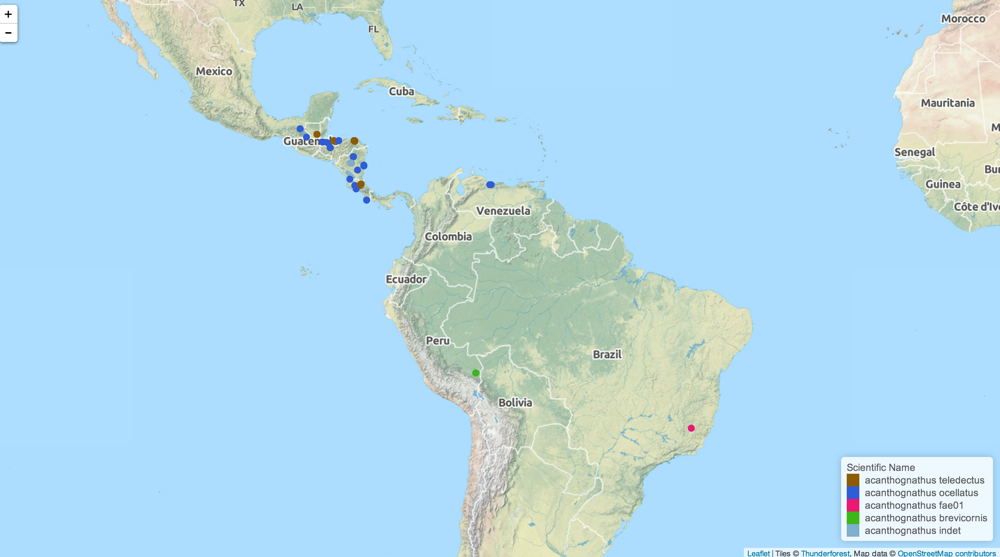

[AntWeb](http://www.antweb.org/) is a repository that boasts a wealth of natural history data, digital images, and specimen records on ant species from a large community of museum curators.

<section id="installation">

## Installation

A stable version of the package (`0.6.1`) is now available on CRAN.


```r
install.packages("AntWeb")
```

or you can install the latest development version.


```r
library("devtools")
install_github("ropensci/AntWeb")
```

<section id="usage">

## Usage


### Searching through the database

As with most of our packages, there are several ways to search through an API. In the case of AntWeb, you can search by a genus or full species name or by other taxonomic ranks like sub-phylum.

To obtain data on any taxonomic group, you can make a request using the `aw_data()` function. It's possible to search easily by a taxonomic rank (e.g. a genus) or by passing a complete scientific name.

__Searching by Genus__

To get data on an ant genus found widely through Central and South America


```r
library("AntWeb")
leaf_cutter_ants  <- aw_data(genus = "acromyrmex")
```

```
## 713 results available for query.
```

```r
leaf_cutter_ants$count
```

```
## [1] 713
```

__Searching by species__

You can request data on any particular species


```r
(acanthognathus_df <- aw_data(scientific_name = "acanthognathus brevicornis"))
```

```
## 2 results available for query.
```

```
## [Total results on the server]: 2 
## [Args]: 
## genus = acanthognathus 
## species = brevicornis 
## [Dataset]: [2 x 16] 
## [Data preview] :
##                                                               url
## 1 http://antweb.org/api/v2/?occurrenceId=CAS:ANTWEB:casent0280684
## 2 http://antweb.org/api/v2/?occurrenceId=CAS:ANTWEB:casent0637708
##   catalogNumber     family  subfamily          genus specificEpithet
## 1 casent0280684 formicidae myrmicinae Acanthognathus     brevicornis
## 2 casent0637708 formicidae myrmicinae Acanthognathus     brevicornis
##              scientific_name typeStatus stateProvince country
## 1 acanthognathus brevicornis                                 
## 2 acanthognathus brevicornis            Madre de Dios        
##   dateIdentified                                        habitat
## 1                                                              
## 2     2013-09-12 Mixed terra firme forest ex sifted leaf litter
##   minimumElevationInMeters geojson.type decimal_latitude decimal_longitude
## 1                                  <NA>             <NA>              <NA>
## 2                      252        point        -13.14142           -69.623
```

You can also limit queries to observation records that have been geoferenced


```r
(acanthognathus_df_geo <- aw_data(genus = "acanthognathus", species = "brevicornis", georeferenced = TRUE))
```

```
## 1 results available for query.
```

```
## [Total results on the server]: 1 
## [Args]: 
## genus = acanthognathus 
## species = brevicornis 
## georeferenced = TRUE 
## [Dataset]: [1 x 16] 
## [Data preview] :
##                                                                url
## 1  http://antweb.org/api/v2/?occurrenceId=CAS:ANTWEB:casent0637708
## NA                                                            <NA>
##    catalogNumber     family  subfamily          genus specificEpithet
## 1  casent0637708 formicidae myrmicinae Acanthognathus     brevicornis
## NA          <NA>       <NA>       <NA>           <NA>            <NA>
##               scientific_name typeStatus stateProvince country
## 1  acanthognathus brevicornis            Madre de Dios        
## NA                       <NA>       <NA>          <NA>    <NA>
##    dateIdentified                                        habitat
## 1      2013-09-12 Mixed terra firme forest ex sifted leaf litter
## NA           <NA>                                           <NA>
##    minimumElevationInMeters geojson.type decimal_latitude
## 1                       252        point        -13.14142
## NA                     <NA>         <NA>             <NA>
##    decimal_longitude
## 1            -69.623
## NA              <NA>
```


It's also possible to search for records around any location by specifying a search radius.

This will search for data on a 2 km radius around that latitude/longitude


```r
data_by_loc <- aw_coords(coord = "37.76,-122.45", r = 2)
```

### Mapping ant specimen data

As with the previous ecoengine package, you can also visualize location data for any set of species. Adding `georeferenced = TRUE` to a data retrieval call will filter out any data points without location information. Once retrieved the data are mapped with the open source [Leaflet.js](http://leafletjs.com/) and pushed to your default browser. Maps and associated `geoJSON` files are also saved to a location specified (or defaults to your `/tmp` folder). This feature is only available on the development version on GitHub (`0.5.2` or greater; see above on how to install) and will be available from CRAN in version `0.6`


```r
acd <- aw_data(genus = "acanthognathus")
aw_map(acd)
```



<section id="citing">

## Citing

To cite `AntWeb` in publications use:

<br>

> 'Karthik Ram' (2014). AntWeb: programmatic interface to the AntWeb. R package version 0.6.1. http://CRAN.R-project.org/package=AntWeb

<section id="license_bugs">

## License and bugs

* License: [CC0](http://creativecommons.org/choose/zero/)
* Report bugs at [our Github repo for AntWeb](https://github.com/AntWeb/issues?state=open)

[Back to top](#top)
