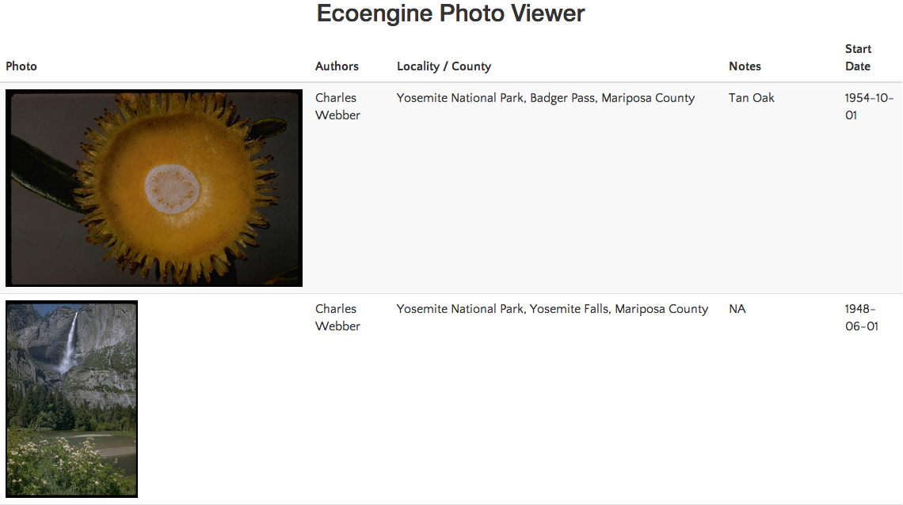
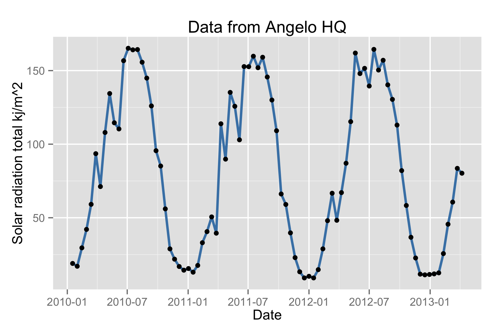

```{r, eval=TRUE, echo=FALSE}
opts_chunk$set(fig.path="../assets/tutorial-images/ecoengine/")
```

The Berkeley Ecoengine ([http://ecoengine.berkeley.edu](http://ecoengine.berkeley.edu)) provides an open API to a wealth of museum data contained in the [Berkeley natural history museums](https://bnhm.berkeley.edu/). This R package provides a programmatic interface to this rich repository of data allowing for the data to be easily analyzed and visualized or brought to bear in other contexts. This vignette provides a brief overview of the package's capabilities. 

The API documentation is available at [http://ecoengine.berkeley.edu/developers/](http://ecoengine.berkeley.edu/developers/). As with most APIs it is possible to query all the available endpoints that are accessible through the API itself. Ecoengine has something similar.

<section id="installation">

```{r, about, echo = FALSE}
suppressPackageStartupMessages(library(ecoengine))
suppressPackageStartupMessages(library(pander))
```

```{r, eval = FALSE}
install.packages("ecoengine")
# or install the development version
devtools::install_github("ropensci/ecoengine")
```
</section>
<section id="usage">

```{r, about_ee_dont, eval = FALSE, tidy = TRUE}
library(ecoengine)
ee_about()
```

```{r, about_ee,  echo = FALSE}
ee_about()
```

## The ecoengine class

The data functions in the package include ones that query obervations, checklists, photos, vegetation records, and a variety of measurements from sensors. These data are all formatted as a common `S3` class called `ecoengine`. The class includes 4 slots.

- [`Total results`] A total result count (not necessarily the results in this particular object but the total number available for a particlar query)
- [`Args`] The arguments  (So a reader can replicate the results or rerun the query using other tools.)  
- [`Type`] The type (`photos`, `observation`, `checklist`, or `sensor`)  
- [`data`] The data. Data are most often coerced into a `data.frame`. To access the data simply use `result_object$data`.  

The default `print` method for the class will summarize the object.

## Notes on downloading large data requests

For the sake of speed, results are paginated at `25` results per page. It is possible to request all pages for any query by specifying `page = all` in any function that retrieves data. However, this option should be used if the request is reasonably sized (`1,000` or fewer records). With larger requests, there is a chance that the query might become interrupted and you could lose any data that may have been partially downloaded. In such cases the recommended practice is to use the returned observations to split the request. You can always check the number of requests you'll need to retreive data for any query by running `ee_pages(obj)` where `obj` is an object of class `ecoengine`.

```{r, pagination, eval = TRUE}
request <- ee_photos(county = "Santa Clara County", quiet = TRUE, progress = FALSE)
# Use quiet to suppress messages. Use progress = FALSE to suppress progress bars which can clutter up documents. 
ee_pages(request)
# Now it's simple to parallelize this request
# You can parallelize across number of cores by passing a vector of pages from 1 through the total available.
```


### Specimen Observations

```{r, obs_counts, echo = FALSE, message = FALSE}
x <- ee_observations(quiet = TRUE, progress = FALSE)
```

The database contains over 2 million records (`r format(x$results, nsmall = 0)` total). Many of these have already been georeferenced. There are two ways to obtain observations. One is to query the database directly based on a partial or exact taxonomic match. For example

```{r, observations_1}
pinus_observations <- ee_observations(scientific_name = "Pinus", page = 1, quiet = TRUE, progress = FALSE)
pinus_observations
```

For additional fields upon which to query, simply look through the help for `?ee_observations`. In addition to narrowing data by taxonomic group, it's also possible to add a bounding box (add argument `bbox`) or request only data that have been georeferenced (set `georeferenced = TRUE`). 


```{r, lynx_data}
lynx_data <- ee_observations(genus = "Lynx",georeferenced = TRUE, quiet = TRUE, progress = FALSE)
lynx_data
# Notice that we only for the first 25 rows.
# But since 795 is not a big request, we can obtain this all in one go.
lynx_data <- ee_observations(genus = "Lynx", georeferenced = TRUE, page = "all", progress = FALSE)
lynx_data
```

__Other search examples__

```{r, other_obs, eval = FALSE}
animalia <- ee_observations(kingdom = "Animalia")
Artemisia <- ee_observations(scientific_name = "Artemisia douglasiana")
asteraceae <- ee_observationss(family = "asteraceae")
vulpes <- ee_observations(genus = "vulpes")
Anas <- ee_observations(scientific_name = "Anas cyanoptera", page = "all")
loons <- ee_observations(scientific_name = "Gavia immer", page = "all")
plantae <- ee_observations(kingdom = "plantae")
# grab first 10 pages (250 results)
plantae <- ee_observations(kingdom = "plantae", page = 1:10)
chordata <- ee_observations(phylum = "chordata")
# Class is clss since the former is a reserved keyword in SQL.
aves <- ee_observations(clss = "aves")
```

__Mapping observations__

The development version of the package includes a new function `ee_map()` that allows users to generate interactive maps from observation queries using Leaflet.js. 

```{r, eval = FALSE}
lynx_data <- ee_observations(genus = "Lynx", georeferenced = TRUE, page = "all", quiet = TRUE)
ee_map(lynx_data)
```


### Photos  

The ecoengine also contains a large number of photos from various sources. It's easy to query the photo database using similar arguments as above. One can search by taxa, location, source, collection and much more.


```{r, photo_count}
photos <- ee_photos(quiet = TRUE, progress = FALSE)
photos
```
The database currently holds `r format(photos$results, nsmall = 0)` photos. Photos can be searched by state province, county, genus, scientific name, authors along with date bounds. For additional options see `?ee_photos`.


#### Searching photos by author

```{r, photos_by_author, tidy = TRUE, width.cutoff = 60, background = '#F7F7F7'}
charles_results <- ee_photos(author = "Charles Webber", quiet = TRUE, progress = FALSE)
charles_results
# Let's examine a couple of rows of the data
charles_results$data[1:2, ]
```
---  

#### Browsing these photos

```{r, browsing_photos, eval = FALSE}
view_photos(charles_results)
```
This will launch your default browser and render a page with thumbnails of all images returned by the search query. You can do this with any `ecoengine` object of type `photos`. Suggestions for improving the photo browser are welcome.




Other photo search examples


```{r, photo_examples, eval = FALSE}
# All the photos in the CDGA collection
all_cdfa <- ee_photos(collection_code = "CDFA", page = "all", progress = FALSE)
# All Racoon pictures
racoons <- ee_photos(scientific_name = "Procyon lotor", quiet = TRUE, progress = FALSE)
```

---  


### Species checklists

There is a wealth of checklists from all the source locations. To get all available checklists from the engine, run: 
  
```{r, checklists}
all_lists  <- ee_checklists()
head(all_lists[, c("footprint", "subject")])
```  
Currently there are `r nrow(all_lists)` lists available. We can drill deeper into any list to get all the available data. We can also narrow our checklist search to groups of interest (see `unique(all_lists$subject)`). For example, to get the list of Spiders:

```{r, checklist_spiders}
spiders  <- ee_checklists(subject = "Spiders")
spiders
```  

Now we can drill deep into each list. For this tutorial I'll just retrieve data from the the two lists returned above.

```{r, checklist_details}
library(plyr)
spider_details <- ldply(spiders$url, checklist_details)
names(spider_details)
unique(spider_details$scientific_name)
```

Our resulting dataset now contains `r length(unique(spider_details$scientific_name))` unique spider species. 


### Sensors

Sensor data come from the [Keck HydroWatch Center](http://nrs.ucop.edu/research/special_projects/Keck_HydroWatchl.htm). 

You'll need a sensor's id to query the data for that particular metric and location. The `ee_list_sensors()` function will give you a condensed list with the location, metric, binning method and most importantly the `sensor_id`. You'll need this id for the data retrieval. 

```{r, sensor_list, eval = FALSE}
head(ee_list_sensors())
```

```{r, echo = FALSE}
head(ee_list_sensors())
```

Let's download solar radiation for the Angelo reserve HQ (sensor_id = `1625`).

```{r, sensor_data}
# First we can grab the list of sensor ids
sensor_ids <- ee_list_sensors()$record
# In this case we just need data for sensor with id 1625
angelo_hq <- sensor_ids[1]
results <- ee_sensor_data(angelo_hq, page = 2, progress = FALSE)
results
```  

Notice that the query returned `r format(results$results, nsmall = 0)` observations but has only retrieved the `25-50` since we requested records for page 2 (and each page by default retrieves `25` records). You can request `page = "all"` but remember that this will make `r format(ceiling(results$results)/25, nsmall =0)` requests. Now we can examine the data itself.

```{r, sensor_results2}
head(results$data)
```

We can also aggregate sensor data for any of the above mentioned sensors. We do this using the `ee_sensor_agg()` function. The function requires a sensor id and how the data should be binned. You can specify hours, minutes, seconds, days, weeks, month, and years. If for example you need the data binned every `15` days, simply add `days = 15` to the call. Once every `10` days and `2` hours would be `ee_sensor_agg(sensor_id = 1625, days = 10, hours = 2)` 

```{r, sensor_aggregations}
stations <- ee_list_sensors()
# This gives you a list to choose from
sensor_df <- ee_sensor_agg(sensor_id = stations[1, c("record")], weeks = 2, progress = FALSE)
sensor_df
head(sensor_df$data)
```  

As with other functions, the results are paginated.  Since we only need `85` records in this case:

```{r, sensor_agg_more}
sensor_df <- ee_sensor_agg(sensor_id = 1625, weeks = 2, page = "all", progress = FALSE)
sensor_df
```

```{r, visualization, echo = TRUE, eval = FALSE}
library(ggplot2)
ggplot(sensor_df$data, aes(begin_date, mean)) + 
geom_line(size = 1, color = "steelblue") + geom_point() + 
theme_gray() + ylab("Solar radiation total kj/m^2") + 
xlab("Date") + ggtitle("Data from Angelo HQ") 
```

```{r, visualization_real, echo = FALSE}
library(ggplot2)
sensor_plot <- ggplot(sensor_df$data, aes(begin_date, mean)) + geom_line(size = 1, color = "steelblue") + theme_gray() + ylab("Solar radiation total kj/m^2") + xlab("Date") + ggtitle("Data from Angelo HQ") + geom_point()
```


### Searching the engine  

The search is elastic by default. One can search for any field in `ee_observations()` across all available resources. For example, 


```{r, search, eval = FALSE}
# The search function runs an automatic elastic search across all resources available through the engine. 
lynx_results <- ee_search(query = "genus:Lynx")
lynx_results[, -3]
# This gives you a breakdown of what's available allowing you dig deeper.
```

```{r, search_print, eval = TRUE, echo = FALSE}
lynx_results <- ee_search(query = "genus:Lynx")
lynx_results[, -3]
```

Similarly it's possible to search through the observations in a detailed manner as well.

```{r, ee_obs_search}
all_lynx_data <- ee_search_obs(query  = "Lynx", page = "all", progress = FALSE)
all_lynx_data
```

---


### Miscellaneous functions

__Footprints__

`ee_footprints()` provides a list of all the footprints.

```{r, footprints_notrun, results = "asis", eval = FALSE, echo = TRUE}
footprints <- ee_footprints()
footprints[, -3] # To keep the table from spilling over
```

```{r, footprints,  echo = FALSE}
footprints <- ee_footprints()
footprints[, -3]
```


__Data sources__

`ee_sources()` provides a list of data sources for the specimens contained in the museum.

```{r, results = "asis", eval = FALSE}
source_list <- ee_sources()
unique(source_list$name)
```

```{r, echo = FALSE}
source_list <- ee_sources()
(data.frame(name = unique(source_list$name)))
```
</section>
<section id="citing">

To cite package `ecoengine` in publications use:

  Karthik Ram (2014). ecoengine: Programmatic interface to the API
  serving UC Berkeley's Natural History Data. R package version 1.3.
  http://CRAN.R-project.org/package=ecoengine

A BibTeX entry for LaTeX users is

```
  @Manual{,
    title = {ecoengine: Programmatic interface to the API serving UC Berkeley's Natural
History Data},
    author = {Karthik Ram},
    year = {2014},
    note = {R package version 1.3},
    url = {http://CRAN.R-project.org/package=ecoengine},
  }
 ```

</section>


<section id="license_bugs">

## License and bugs

* License: [CC0](http://creativecommons.org/choose/zero/)
* Report bugs at [our Github repo for Ecoengine](https://github.com/ecoengine/issues?state=open)

</section>

[Back to top](#top)
