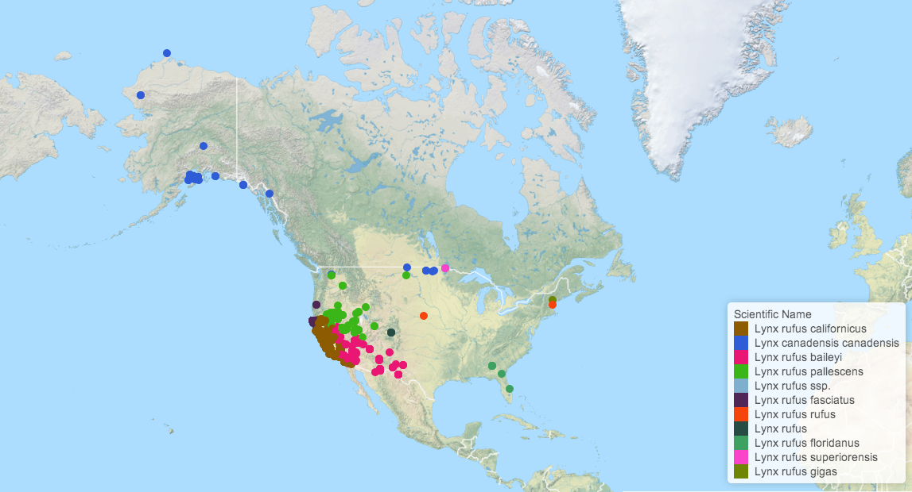
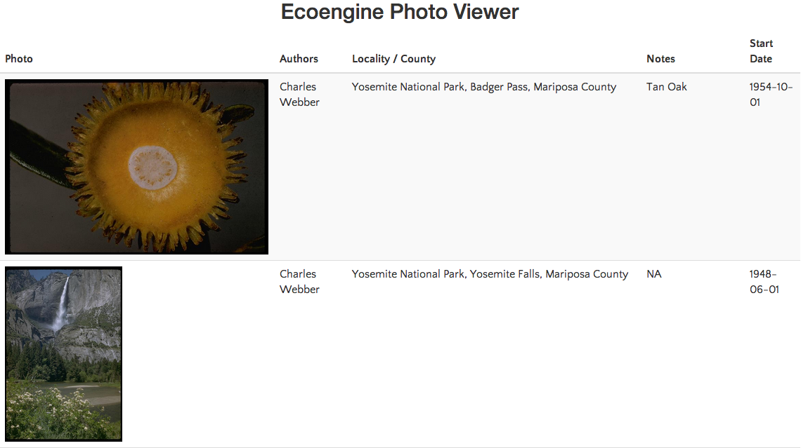
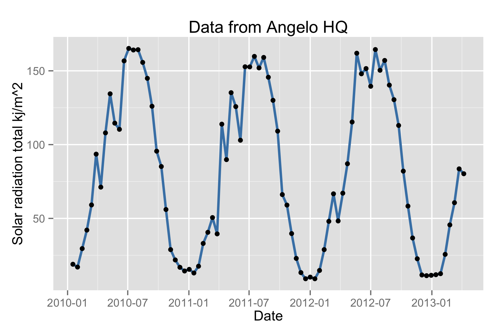

The Berkeley Ecoengine ([http://ecoengine.berkeley.edu](http://ecoengine.berkeley.edu)) provides an open API to a wealth of museum data contained in the [Berkeley natural history museums](https://bnhm.berkeley.edu/). This R package provides a programmatic interface to this rich repository of data allowing for the data to be easily analyzed and visualized or brought to bear in other contexts. This vignette provides a brief overview of the packages capabilities.

The API documentation is available at [http://ecoengine.berkeley.edu/developers/](http://ecoengine.berkeley.edu/developers/). As with most APIs it is possible to query all the available endpoints that are accessible through the API itself. Ecoengine has something similar.

<section id="installation">


```r
install.packages("ecoengine")
# or install the development version
devtools::install_github("ropensci/ecoengine")
```

</section>
<section id="usage">


```r
library(ecoengine)
ee_about()
```


```
##                                  type
## 1  wieslander_vegetation_type_mapping
## 2  wieslander_vegetation_type_mapping
## 3  wieslander_vegetation_type_mapping
## 4  wieslander_vegetation_type_mapping
## 5                                data
## 6                                data
## 7                                data
## 8                                data
## 9                             actions
## 10                          meta-data
## 11                          meta-data
##                                                endpoint
## 1    https://ecoengine.berkeley.edu/api/vtmplots_trees/
## 2          https://ecoengine.berkeley.edu/api/vtmplots/
## 3  https://ecoengine.berkeley.edu/api/vtmplots_brushes/
## 4            https://ecoengine.berkeley.edu/api/vtmveg/
## 5        https://ecoengine.berkeley.edu/api/checklists/
## 6           https://ecoengine.berkeley.edu/api/sensors/
## 7      https://ecoengine.berkeley.edu/api/observations/
## 8            https://ecoengine.berkeley.edu/api/photos/
## 9            https://ecoengine.berkeley.edu/api/search/
## 10       https://ecoengine.berkeley.edu/api/footprints/
## 11          https://ecoengine.berkeley.edu/api/sources/
```

## The ecoengine class

The data functions in the package include ones that query obervations, checklists, photos, vegetation records, and a variety of measurements from sensors. These data are all formatted as a common `S3` class called `ecoengine`. The class includes 4 slots.

- [`Total results`] A total result count (not necessarily the results in this particular object but the total number available for a particlar query)
- [`Args`] The arguments  (So a reader can replicate the results or rerun the query using other tools.)
- [`Type`] The type (`photos`, `observation`, `checklist`, or `sensor`)
- [`data`] The data. Data are most often coerced into a `data.frame`. To access the data simply use `result_object$data`.

The default `print` method for the class will summarize the object.

## Notes on downloading large data requests

For the sake of speed, results are paginated at `25` results per page. It is possible to request all pages for any query by specifying `page = all` in any function that retrieves data. However, this option should be used if the request is reasonably sized (`1,000` or fewer records). With larger requests, there is a chance that the query might become interrupted and you could lose any data that may have been partially downloaded. In such cases the recommended practice is to use the returned observations to split the request. You can always check the number of requests you'll need to retreive data for any query by running `ee_pages(obj)` where `obj` is an object of class `ecoengine`.


```r
request <- ee_photos(county = "Santa Clara County", quiet = TRUE, progress = FALSE)
# Use quiet to suppress messages. Use progress = FALSE to suppress progress bars which can clutter up documents.
ee_pages(request)
```

```
## [1] 1
```

```r
# Now it's simple to parallelize this request
# You can parallelize across number of cores by passing a vector of pages from 1 through the total available.
```


### Specimen Observations


The database contains over 2 million records (2863164 total). Many of these have already been georeferenced. There are two ways to obtain observations. One is to query the database directly based on a partial or exact taxonomic match. For example


```r
pinus_observations <- ee_observations(scientific_name = "Pinus", page = 1, quiet = TRUE, progress = FALSE)
pinus_observations
```

```
## [Total results on the server]: 43363 
## [Args]: 
## country = United States 
## scientific_name = Pinus 
## extra = last_modified 
## georeferenced = FALSE 
## page_size = 1000 
## page = 1 
## [Type]: FeatureCollection 
## [Number of results retrieved]: 1000
```

For additional fields upon which to query, simply look through the help for `?ee_observations`. In addition to narrowing data by taxonomic group, it's also possible to add a bounding box (add argument `bbox`) or request only data that have been georeferenced (set `georeferenced = TRUE`).


```r
lynx_data <- ee_observations(genus = "Lynx",georeferenced = TRUE, quiet = TRUE, progress = FALSE)
lynx_data
```

```
## [Total results on the server]: 701 
## [Args]: 
## country = United States 
## genus = Lynx 
## extra = last_modified 
## georeferenced = True 
## page_size = 1000 
## page = 1 
## [Type]: FeatureCollection 
## [Number of results retrieved]: 701
```

```r
# Notice that we only for the first 25 rows.
# But since 795 is not a big request, we can obtain this all in one go.
lynx_data <- ee_observations(genus = "Lynx", georeferenced = TRUE, page = "all", progress = FALSE)
```

```
## Search contains 701 observations (downloading 1 of 1 pages)
```

```r
lynx_data
```

```
## [Total results on the server]: 701 
## [Args]: 
## country = United States 
## genus = Lynx 
## extra = last_modified 
## georeferenced = True 
## page_size = 1000 
## page = all 
## [Type]: FeatureCollection 
## [Number of results retrieved]: 701
```

__Other search examples__


```r
animalia <- ee_observations(kingdom = "Animalia")
Artemisia <- ee_observations(scientific_name = "Artemisia douglasiana")
asteraceae <- ee_observationss(family = "asteraceae")
vulpes <- ee_observations(genus = "vulpes")
Anas <- ee_observations(scientific_name = "Anas cyanoptera", page = "all")
loons <- ee_observations(scientific_name = "Gavia immer", page = "all")
plantae <- ee_observations(kingdom = "plantae")
# grab first 10 pages (250 results)
plantae <- ee_observations(kingdom = "plantae", page = 1:10)
chordata <- ee_observations(phylum = "chordata")
# Class is clss since the former is a reserved keyword in SQL.
aves <- ee_observations(clss = "aves")
```

__Mapping observations__

The development version of the package includes a new function `ee_map()` that allows users to generate interactive maps from observation queries using Leaflet.js.


```r
lynx_data <- ee_observations(genus = "Lynx", georeferenced = TRUE, page = "all", quiet = TRUE)
ee_map(lynx_data)
```



### Photos

The ecoengine also contains a large number of photos from various sources. It's easy to query the photo database using similar arguments as above. One can search by taxa, location, source, collection and much more.


```r
photos <- ee_photos(quiet = TRUE, progress = FALSE)
photos
```

```
## [Total results on the server]: 60863 
## [Args]: 
## page_size = 1000 
## georeferenced = 0 
## page = 1 
## [Type]: photos 
## [Number of results retrieved]: 1000
```
The database currently holds 60863 photos. Photos can be searched by state province, county, genus, scientific name, authors along with date bounds. For additional options see `?ee_photos`.


#### Searching photos by author


```r
charles_results <- ee_photos(author = "Charles Webber", quiet = TRUE, progress = FALSE)
charles_results
```

```
## [Total results on the server]: 3656 
## [Args]: 
## page_size = 1000 
## authors = Charles Webber 
## georeferenced = FALSE 
## page = 1 
## [Type]: photos 
## [Number of results retrieved]: 1000
```

```r
# Let's examine a couple of rows of the data
charles_results$data[1:2, ]
```

```
##          authors                               locality          county
## 1 Charles Webber    Yosemite National Park, Badger Pass Mariposa County
## 2 Charles Webber Yosemite National Park, Yosemite Falls Mariposa County
##   photog_notes
## 1      Tan Oak
## 2         <NA>
##                                                                                url
## 1 https://ecoengine.berkeley.edu/api/photos/CalPhotos%3A8076%2B3101%2B2933%2B0025/
## 2 https://ecoengine.berkeley.edu/api/photos/CalPhotos%3A8076%2B3101%2B0667%2B0107/
##   begin_date end_date geojson.type   longitude  latitude
## 1       <NA>     <NA>        Point -119.657387 37.663724
## 2       <NA>     <NA>        Point -119.597389 37.753851
##                          record
## 1 CalPhotos:8076+3101+2933+0025
## 2 CalPhotos:8076+3101+0667+0107
##                                                   remote_resource
## 1 http://calphotos.berkeley.edu/cgi/img_query?seq_num=21272&one=T
## 2 http://calphotos.berkeley.edu/cgi/img_query?seq_num=14468&one=T
##   collection_code              scientific_name
## 1      CalAcademy Notholithocarpus densiflorus
## 2      CalAcademy     Rhododendron occidentale
##                                                                                          url
## 1 https://ecoengine.berkeley.edu/api/observations/CalPhotos%3A8076%2B3101%2B2933%2B0025%3A1/
## 2 https://ecoengine.berkeley.edu/api/observations/CalPhotos%3A8076%2B3101%2B0667%2B0107%3A1/
##                                                             media_url
## 1 http://calphotos.berkeley.edu/imgs/512x768/8076_3101/2933/0025.jpeg
## 2 http://calphotos.berkeley.edu/imgs/512x768/8076_3101/0667/0107.jpeg
##                                          source
## 1 https://ecoengine.berkeley.edu/api/sources/9/
## 2 https://ecoengine.berkeley.edu/api/sources/9/
```
---

#### Browsing these photos


```r
view_photos(charles_results)
```
This will launch your default browser and render a page with thumbnails of all images returned by the search query. You can do this with any `ecoengine` object of type `photos`. Suggestions for improving the photo browser are welcome.




Other photo search examples


```r
# All the photos in the CDGA collection
all_cdfa <- ee_photos(collection_code = "CDFA", page = "all", progress = FALSE)
# All Racoon pictures
racoons <- ee_photos(scientific_name = "Procyon lotor", quiet = TRUE, progress = FALSE)
```

---


### Species checklists

There is a wealth of checklists from all the source locations. To get all available checklists from the engine, run:


```r
all_lists  <- ee_checklists()
```

```
## Returning 52 checklists
```

```r
head(all_lists[, c("footprint", "subject")])
```

```
##                                                         footprint
## 1   https://ecoengine.berkeley.edu/api/footprints/angelo-reserve/
## 2   https://ecoengine.berkeley.edu/api/footprints/angelo-reserve/
## 3   https://ecoengine.berkeley.edu/api/footprints/angelo-reserve/
## 4 https://ecoengine.berkeley.edu/api/footprints/hastings-reserve/
## 5   https://ecoengine.berkeley.edu/api/footprints/angelo-reserve/
## 6 https://ecoengine.berkeley.edu/api/footprints/hastings-reserve/
##      subject
## 1    Mammals
## 2     Mosses
## 3    Beetles
## 4    Spiders
## 5 Amphibians
## 6       Ants
```
Currently there are 52 lists available. We can drill deeper into any list to get all the available data. We can also narrow our checklist search to groups of interest (see `unique(all_lists$subject)`). For example, to get the list of Spiders:


```r
spiders  <- ee_checklists(subject = "Spiders")
```

```
## Returning 1 checklists
```

```r
spiders
```

```
##                 record
## 4 bigcb:specieslist:15
##                                                         footprint
## 4 https://ecoengine.berkeley.edu/api/footprints/hastings-reserve/
##                                                                       url
## 4 https://ecoengine.berkeley.edu/api/checklists/bigcb%3Aspecieslist%3A15/
##                                           source subject
## 4 https://ecoengine.berkeley.edu/api/sources/18/ Spiders
```

Now we can drill deep into each list. For this tutorial I'll just retrieve data from the the two lists returned above.


```r
library(plyr)
spider_details <- ldply(spiders$url, checklist_details)
names(spider_details)
```

```
##  [1] "url"                              "observation_type"                
##  [3] "scientific_name"                  "collection_code"                 
##  [5] "institution_code"                 "country"                         
##  [7] "state_province"                   "county"                          
##  [9] "locality"                         "begin_date"                      
## [11] "end_date"                         "kingdom"                         
## [13] "phylum"                           "clss"                            
## [15] "order"                            "family"                          
## [17] "genus"                            "specific_epithet"                
## [19] "infraspecific_epithet"            "source"                          
## [21] "remote_resource"                  "earliest_period_or_lowest_system"
## [23] "latest_period_or_highest_system"
```

```r
unique(spider_details$scientific_name)
```

```
##  [1] "Holocnemus pluchei"        "Oecobius navus"           
##  [3] "Uloborus diversus"         "Neriene litigiosa"        
##  [5] "Theridion "                "Tidarren "                
##  [7] "Dictyna "                  "Mallos "                  
##  [9] "Yorima "                   "Hahnia sanjuanensis"      
## [11] "Cybaeus "                  "Zanomys "                 
## [13] "Anachemmis "               "Titiotus "                
## [15] "Oxyopes scalaris"          "Zora hespera"             
## [17] "Drassinella "              "Phrurotimpus mateonus"    
## [19] "Scotinella "               "Castianeira luctifera"    
## [21] "Meriola californica"       "Drassyllus insularis"     
## [23] "Herpyllus propinquus"      "Micaria utahna"           
## [25] "Trachyzelotes lyonneti"    "Ebo evansae"              
## [27] "Habronattus oregonensis"   "Metaphidippus "           
## [29] "Platycryptus californicus" "Calymmaria "              
## [31] "Frontinella communis"      "Undetermined "            
## [33] "Latrodectus hesperus"
```

Our resulting dataset now contains 33 unique spider species.


### Sensors

Sensor data come from the [Keck HydroWatch Center](http://nrs.ucop.edu/research/special_projects/Keck_HydroWatchl.htm).

You'll need a sensor's id to query the data for that particular metric and location. The `ee_list_sensors()` function will give you a condensed list with the location, metric, binning method and most importantly the `sensor_id`. You'll need this id for the data retrieval.


```r
head(ee_list_sensors())
```


```
##   properties.station_name properties.units    properties.variable
## 1        Angelo Meadow WS   degree celcius             Air Temp C
## 2           Cahto Peak WS   degree celcius             Air Temp C
## 3            Angelo HQ WS   degree celcius             Air Temp C
## 4   Angelo HQ SF Eel Gage   degree celcius             Air Temp C
## 5            Angelo HQ WS         millibar Barometric Pressure mb
## 6        Angelo Meadow WS         millibar Barometric Pressure mb
##              properties.method_name record
## 1 Conversion to 30-minute timesteps      1
## 2 Conversion to 30-minute timesteps      2
## 3 Conversion to 30-minute timesteps      3
## 4 Conversion to 30-minute timesteps      4
## 5 Conversion to 30-minute timesteps      5
## 6 Conversion to 30-minute timesteps      6
```

Let's download solar radiation for the Angelo reserve HQ (sensor_id = `1625`).


```r
library(dplyr)
# First we can grab the list of sensor ids
full_sensor_list %>% 
    select(properties.station_name, properties.record) %>%
    head
```

```
##   properties.station_name properties.record
## 1        Angelo Meadow WS              1602
## 2           Cahto Peak WS              1603
## 3            Angelo HQ WS              1604
## 4   Angelo HQ SF Eel Gage              1606
## 5            Angelo HQ WS              1607
## 6        Angelo Meadow WS              1608
```

```r
# In this case we just need data for sensor with id 1625
angelo_hq <- full_sensor_list[1, ]$properties.record
results <- ee_sensor_data(angelo_hq, page = 2, progress = FALSE)
```

```
## Search contains 98527 records (downloading 1 page(s) of 99)
```

```r
results
```

```
## [Total results on the server]: 98527 
## [Args]: 
## page_size = 1000 
## sensor_id = 1602 
## page = 2 
## [Type]: sensor 
## [Number of results retrieved]: 1000
```

Notice that the query returned 98527 observations but has only retrieved the `25-50` since we requested records for page 2 (and each page by default retrieves `25` records). You can request `page = "all"` but remember that this will make 3941.08 requests. Now we can examine the data itself.


```r
head(results$data)
```

```
##            local_date  value
## 1 2008-05-23 13:30:00 17.580
## 2 2008-05-23 14:00:00 17.925
## 3 2008-05-23 14:30:00 18.505
## 4 2008-05-23 15:00:00 18.505
## 5 2008-05-23 15:30:00 17.925
## 6 2008-05-23 16:00:00 17.690
```

We can also aggregate sensor data for any of the above mentioned sensors. We do this using the `ee_sensor_agg()` function. The function requires a sensor id and how the data should be binned. You can specify hours, minutes, seconds, days, weeks, month, and years. If for example you need the data binned every `15` days, simply add `days = 15` to the call. Once every `10` days and `2` hours would be `ee_sensor_agg(sensor_id = 1625, days = 10, hours = 2)`


```r
stations <- full_sensor_list %>% 
            select(station_name = properties.station_name, record = properties.record)
# This gives you a list to choose from
sensor_df <- ee_sensor_agg(sensor_id = stations[1, ]$record, weeks = 2, progress = FALSE)
```

```
## Search contains 147 records (downloading 1 page(s) of 1)
```

```r
sensor_df
```

```
## [Total results on the server]: 147 
## [Args]: 
## page_size = 1000 
## interval = 2W 
## page = 1 
## [Type]: sensor 
## [Number of results retrieved]: 147
```

```r
head(sensor_df$data)
```

```
## Source: local data frame [6 x 6]
## 
##   begin_date     mean     min    max       sum count
## 1 2008-05-11 10.80444 -2.0180 28.080  5888.423   545
## 2 2008-05-25 15.45394  2.8230 36.110 10385.045   672
## 3 2008-06-08 11.72593  1.7975 24.250  7879.823   672
## 4 2008-06-22 17.45442  3.5065 33.855 11729.369   672
## 5 2008-07-06 17.07472  4.3950 31.805 11474.215   672
## 6 2008-07-20 20.73330  6.7875 40.720 13932.778   672
```

As with other functions, the results are paginated.  Since we only need `85` records in this case:


```r
sensor_df <- ee_sensor_agg(sensor_id = 1625, weeks = 2, page = "all", progress = FALSE)
```

```
## Search contains 94 records (downloading 1 page(s) of 1)
```

```r
sensor_df
```

```
## [Total results on the server]: 94 
## [Args]: 
## page_size = 1000 
## interval = 2W 
## page = all 
## [Type]: sensor 
## [Number of results retrieved]: 94
```


```r
library(ggplot2)
ggplot(sensor_df$data, aes(begin_date, mean)) +
geom_line(size = 1, color = "steelblue") + geom_point() +
theme_gray() + ylab("Solar radiation total kj/m^2") +
xlab("Date") + ggtitle("Data from Angelo HQ")
```




### Searching the engine

The search is elastic by default. One can search for any field in `ee_observations()` across all available resources. For example,


```r
# The search function runs an automatic elastic search across all resources available through the engine.
lynx_results <- ee_search(query = "genus:Lynx")
lynx_results[, -3]
# This gives you a breakdown of what's available allowing you dig deeper.
```


```
##                                         field results
## kingdom                              animalia     787
## state_province.2                   California     469
## state_province.21                      Nevada     105
## state_province.3                       Alaska      82
## state_province.4             British Columbia      47
## state_province.5                      Arizona      36
## state_province.6          Baja California Sur      25
## state_province.7              Baja California      16
## state_province.8                   New Mexico      14
## state_province.9                       Oregon      13
## state_province.10                   Zacatecas      11
## clss                                 mammalia     898
## resource                         Observations     900
## family                                felidae     898
## scientific_name.2     Lynx rufus californicus     391
## scientific_name.21 Lynx canadensis canadensis     137
## scientific_name.3          Lynx rufus baileyi     135
## scientific_name.4       Lynx rufus pallescens     119
## scientific_name.5        Lynx rufus fasciatus      30
## scientific_name.6     Lynx rufus peninsularis      27
## scientific_name.7                  Lynx rufus      18
## scientific_name.8            Lynx rufus rufus      14
## scientific_name.9       Lynx rufus escuinapae      13
## scientific_name.10            Lynx rufus ssp.       4
## phylum                               chordata     900
## genus                                    lynx     900
## order                               carnivora     898
```

Similarly it's possible to search through the observations in a detailed manner as well.


```r
all_lynx_data <- ee_search_obs(query  = "Lynx", page = "all", progress = FALSE)
```

```
## Search contains 992 observations (downloading 1 of 1 pages)
```

```r
all_lynx_data
```

```
## [Total results on the server]: 992 
## [Args]: 
## q = Lynx 
## page_size = 1000 
## page = all 
## [Type]: observations 
## [Number of results retrieved]: 992
```

---


### Miscellaneous functions

__Footprints__

`ee_footprints()` provides a list of all the footprints.


```r
footprints <- ee_footprints()
footprints[, -3] # To keep the table from spilling over
```


```
##                     name
## 1         Angelo Reserve
## 2        Sagehen Reserve
## 3       Hastings Reserve
## 4 Blue Oak Ranch Reserve
##                                                                     url
## 1         https://ecoengine.berkeley.edu/api/footprints/angelo-reserve/
## 2        https://ecoengine.berkeley.edu/api/footprints/sagehen-reserve/
## 3       https://ecoengine.berkeley.edu/api/footprints/hastings-reserve/
## 4 https://ecoengine.berkeley.edu/api/footprints/blue-oak-ranch-reserve/
```


__Data sources__

`ee_sources()` provides a list of data sources for the specimens contained in the museum.


```r
source_list <- ee_sources()
unique(source_list$name)
```


```
##                                 name
## 1                      VTM plot data
## 2              MVZ Herp Observations
## 3                      BIGCB Sensors
## 4  Consortium of California Herbaria
## 5               VTM plot coordinates
## 6         UCMP Vertebrate Collection
## 7              VTM plot data brushes
## 8          MVZ Hildebrand Collection
## 9                    CAS Herpetology
## 10                         CalPhotos
```

</section>
<section id="citing">

To cite package `ecoengine` in publications use:

  Karthik Ram (2014). ecoengine: Programmatic interface to the API
  serving UC Berkeley's Natural History Data. R package version 1.3.
  http://CRAN.R-project.org/package=ecoengine

A BibTeX entry for LaTeX users is

```
  @Manual{,
    title = {ecoengine: Programmatic interface to the API serving UC Berkeley's Natural
History Data},
    author = {Karthik Ram},
    year = {2014},
    note = {R package version 1.3},
    url = {http://CRAN.R-project.org/package=ecoengine},
  }
 ```

</section>


<section id="license_bugs">

## License and bugs

* License: [CC0](http://creativecommons.org/choose/zero/)
* Report bugs at [our Github repo for Ecoengine](https://github.com/ropensci/ecoengine/issues?state=open)

</section>

[Back to top](#top)
