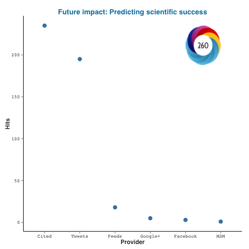

This package provides a way to programmatically retrieve altmetric data from [altmetric.com](http://altmetric.com) for any publication with the appropriate identifer. The package is really simple to use and only has two major functions: One (`altmetrics()`) to download metrics and another (`altmetric_data()`) to extract the data into a `data.frame`. It also includes generic S3 methods to plot/print metrics for any altmetric object.

Questions, features requests and issues should go [here](https://github.com/ropensci/rAltmetric/issues/). General comments to [karthik.ram@gmail.com](mailto:karthik.ram@gmail.com).

<section id="installation">

## Installation


A stable version is available from CRAN. To install


```r
install.packages("rAltmetric")
```


### Development version


```r
# If you don't already have the devtools library, first run
install.packages("devtools")
```


Then install the package


```r
library(devtools)
install_github("rAltmetric", "ropensci")
```


<section id="usage">

## Usage


### Obtaining metrics

There was a recent paper by [Acuna et al](http://www.nature.com/news/2010/100616/full/465860a.html) that received a lot of attention on Twitter. What was the impact of that paper?


```r
library(rAltmetric)
```


```r
acuna <- altmetrics(doi = "10.1038/489201a")
acuna
```

```
## Altmetrics on: "Future impact: Predicting scientific success" with altmetric_id: 958760 published in Nature.
##   provider count
## 1    Feeds     1
## 2    Cited     1
## 3 Accounts     1
```


### Data

To obtain the metrics in tabular form for further processing, run any object of class `altmetric` through `altmetric_data()` to get data that can easily be written to disk as a spreadsheet.


```r
altmetric_data(acuna)
```

```
##                                          title             doi   nlmid
## 2 Future impact: Predicting scientific success 10.1038/489201a 0410462
##              altmetric_jid                issns journal altmetric_id
## 2 4f6fa50a3cf058f610003160 0028-0836,1476-4687,  Nature       958760
##   schema is_oa cited_by_feeds_count cited_by_gplus_count
## 2  1.5.4 FALSE                    1                   NA
##   cited_by_fbwalls_count cited_by_posts_count cited_by_tweeters_count
## 2                     NA                    1                      NA
##   cited_by_accounts_count cited_by_feeds_count.1 cited_by_rdts_count
## 2                       1                      1                  NA
##   cited_by_msm_count cited_by_delicious_count cited_by_forum_count
## 2                 NA                       NA                   NA
##   cited_by_qs_count cited_by_rh_count score mendeley connotea citeulike
## 2                NA                NA 8.192      168        0        18
##                                 url  added_on published_on subjects
## 2 http://dx.doi.org/10.1038/489201a 1.348e+09    1.347e+09 science,
##   scopus_subjects last_updated readers_count
## 2       General,     1.349e+09           186
##                                               details_url
## 2 http://www.altmetric.com/details.php?citation_id=958760
```


You can save these data into a clean spreadsheet format:


```r
acuna_data <- altmetric_data(acuna)
write.csv(acuna_data, file = "acuna_altmetrics.csv")
```


### Visualization

For any altmetric object you can quickly plot the stats with a generic `plot` function. The plot overlays the [altmetric badge and the score](http://api.altmetric.com/embeds.html) on the top right corner. If you prefer a customized plot, create your own with the raw data generated from `almetric_data()`


```r
plot(acuna)
```

 


### Gathering metrics for many DOIs

For a real world use-case, one might want to get metrics on multiple publications. If so, just read them from a spreadsheet and `llply` through them like the example below.

Install `rplos` (v0.3.6) if you don't have it. See [here](https://github.com/ropensci/rplos) for instructions.


```r
library(rplos)
dois <- searchplos(terms = "*:*", fields = "id", toquery = "doc_type:full", 
    start = 0, limit = 75)$id
```


First, let's retrieve the metrics.


```r
library(plyr)
raw_metrics <- lapply(dois, function(x) altmetrics(doi = x))
```


Now let's pull the data together.


```r
metric_data <- ldply(raw_metrics, altmetric_data)
head(metric_data[, c(1:10)])
```

```
##                                                                                                                           title
## 1                Impact of Rotavirus Vaccination on Hospitalisations in Belgium: Comparing Model Predictions with Observed Data
## 2 Effectiveness and Toxicities of Intensity-Modulated Radiotherapy for Patients with Locally Recurrent Nasopharyngeal Carcinoma
## 3 Megafaunal Communities in Rapidly Warming Fjords along the West Antarctic Peninsula: Hotspots of Abundance and Beta Diversity
## 4                                         Why Birds with Deferred Sexual Maturity Are Sedentary on Islands: A Systematic Review
## 5        Cigarette Experimentation and the Population Attributable Fraction for Associated Genetic and Non-Genetic Risk Factors
## 6                                               Individual Differences in Foraging Strategies of Parasitic Sabre-Tooth Blennies
##                            doi     pmid     nlmid            altmetric_jid
## 1 10.1371/journal.pone.0053864 23349754 101285081 4f6fa5313cf058f6100043e3
## 2 10.1371/journal.pone.0073918 24040115 101285081 4f6fa5313cf058f6100043e3
## 3 10.1371/journal.pone.0077917 24312442 101285081 4f6fa5313cf058f6100043e3
## 4 10.1371/journal.pone.0022056 21811559 101285081 4f6fa5313cf058f6100043e3
## 5 10.1371/journal.pone.0053868 23342024 101285081 4f6fa5313cf058f6100043e3
## 6 10.1371/journal.pone.0045998 23029356 101285081 4f6fa5313cf058f6100043e3
##        issns  journal altmetric_id schema is_oa
## 1 1932-6203, PLOS ONE      1186230  1.5.4 FALSE
## 2 1932-6203, PLOS ONE      1742024  1.5.4 FALSE
## 3 1932-6203, PLOS ONE      1953136  1.5.4 FALSE
## 4 1932-6203, PLoS ONE       192420  1.5.4 FALSE
## 5 1932-6203, PLOS ONE      1181019  1.5.4 FALSE
## 6 1932-6203, PLOS ONE       991683  1.5.4 FALSE
```


Finally we save this to a spreadsheet for further analysis/vizualization.


```r
write.csv(metric_data, file = "metric_data.csv")
```


### Further reading
* [Metrics: Do metrics matter?](http://www.nature.com/news/2010/100616/full/465860a.html)
* [The altmetrics manifesto](http://altmetrics.org/manifesto/)


<section id="citing">

## Citing

To cite `rAltmetric` in publications use:

<br>

> Karthik Ram (2012). rAltmetric: Retrieves altmerics data for any published paper from altmetric.com. R package version 0.5. https://github.com/ropensci/rAltmetric

<section id="license_bugs">

## License and bugs

* License: [CC0](http://creativecommons.org/choose/zero/)
* Report bugs at [our Github repo for rAltmetric](https://github.com/ropensci/rAltmetric/issues?state=open)
