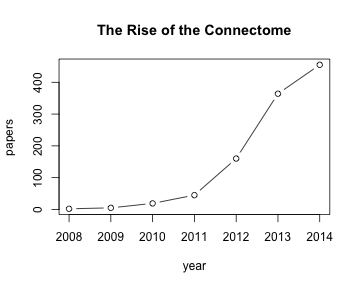

The NCBI shares a _lot_ of data. At the time this document was compiled, there
were 25.6 million papers in [PubMed](http://www.ncbi.nlm.nih.gov/pubmed/),
including 3.8 million full-text records available in [PubMed Central](http://www.ncbi.nlm.nih.gov/pubmed/).
[The NCBI Nucleotide Database](http://www.ncbi.nlm.nih.gov/nuccore) (which includes GenBank) has data for 193.1
million different sequences, and [dbSNP](http://www.ncbi.nlm.nih.gov/snp/) describes
758.7 million different genetic variants. All of these
records can be cross-referenced with the  1.09 million
species in the [NCBI taxonomy](www.ncbi.nlm.nih.gov/taxonomy) or 24.4 thousand disease-associated records
in [OMIM](http://www.ncbi.nlm.nih.gov/omim).


The NCBI makes this data available through a [web interface](http://www.ncbi.nlm.nih.gov/),
an [FTP server](ftp://ftp.ncbi.nlm.nih.gov/) and through a REST API called the
[Entrez Utilities](http://www.ncbi.nlm.nih.gov/books/NBK25500/) (`Eutils` for
short). This package provides functions to use that API, allowing users to
gather and combine data from multiple NCBI databases in the comfort of an R
session or script.

<section id="installation">

## Installation


```r
install.packages("rentrez")
```

Development version on GitHub


```r
install.packages("devtools")
devtools::install_github("ropensci/rentrez")
```

Load


```r
library("rentrez")
```


<section id="usage">

### Getting started with rentrez

To make the most of all the data the NCBI shares you need to know a little about
their databases, the records they contain and the ways you can find those
records. The [NCBI provides extensive documentation for each of their
databases](http://www.ncbi.nlm.nih.gov/home/documentation.shtml) and for the
[EUtils API that `rentrez` takes advantage of](http://www.ncbi.nlm.nih.gov/books/NBK25501/).
There are also some helper functions in `rentrez` that help users learn their
way around the NCBI's databases.

First, you can use `entrez_dbs()` to find the list of available databases:


```r
entrez_dbs()
```

```
#>  [1] "pubmed"          "protein"         "nuccore"        
#>  [4] "nucleotide"      "nucgss"          "nucest"         
#>  [7] "structure"       "genome"          "annotinfo"      
#> [10] "assembly"        "bioproject"      "biosample"      
#> [13] "blastdbinfo"     "books"           "cdd"            
#> [16] "clinvar"         "clone"           "gap"            
#> [19] "gapplus"         "grasp"           "dbvar"          
#> [22] "epigenomics"     "gene"            "gds"            
#> [25] "geoprofiles"     "homologene"      "medgen"         
#> [28] "mesh"            "ncbisearch"      "nlmcatalog"     
#> [31] "omim"            "orgtrack"        "pmc"            
#> [34] "popset"          "probe"           "proteinclusters"
#> [37] "pcassay"         "biosystems"      "pccompound"     
#> [40] "pcsubstance"     "pubmedhealth"    "seqannot"       
#> [43] "snp"             "sra"             "taxonomy"       
#> [46] "unigene"         "gencoll"         "gtr"
```
There is a set of functions with names starting `entrez_db_` that can be used to
gather more information about each of these databases:

**Functions that help you learn about NCBI databases**

| Function name            | Return                                               |
|--------------------------|------------------------------------------------------|
| `entrez_db_summary()`    | Brief description of what the database is            |
| `entrez_db_searchable()` | Set of search terms that can used with this database |
| `entrez_db_links() `     | Set of databases that might contain linked records   |

For instance, we can get a description of the somewhat cryptically named
database 'cdd'...


```r
entrez_db_summary("cdd")
```

```
#>  DbName: cdd
#>  MenuName: Conserved Domains
#>  Description: Conserved Domain Database
#>  DbBuild: Build150814-1106.1
#>  Count: 50648
#>  LastUpdate: 2015/08/14 18:28
```

... or find out which search terms can be used with the Sequence Read Archive (SRA)
database (which contains raw data from sequencing projects):


```r
entrez_db_searchable("sra")
```

```
#> Searchable fields for database 'sra'
#>   ALL 	 All terms from all searchable fields 
#>   UID 	 Unique number assigned to publication 
#>   FILT 	 Limits the records 
#>   ACCN 	 Accession number of sequence 
#>   TITL 	 Words in definition line 
#>   PROP 	 Classification by source qualifiers and molecule type 
#>   WORD 	 Free text associated with record 
#>   ORGN 	 Scientific and common names of organism, and all higher levels of taxonomy 
#>   AUTH 	 Author(s) of publication 
#>   PDAT 	 Date sequence added to GenBank 
#>   MDAT 	 Date of last update 
#>   GPRJ 	 BioProject 
#>   BSPL 	 BioSample
```

Just how these 'helper' functions might be useful will become clearer once
you've started using `rentrez`, so let's get started.

### Searching databases: `entrez_search()`

Very often, the first thing you'll want to do with `rentrez` is search a given
NCBI database to find records that match some keywords. You can do this using
the function `entrez_search()`. In the simplest case you just need to provide a
database name (`db`) and a search term (`term`) so let's search PubMed for
articles about the `R language`:


```r
r_search <- entrez_search(db="pubmed", term="R Language")
```
The object returned by a search acts like a list, and you can get a summary of
its contents by printing it.


```r
r_search
```

```
#> Entrez search result with 8715 hits (object contains 20 IDs and no web_history object)
#>  Search term (as translated):  R[All Fields] AND ("programming languages"[MeSH Te ...
```

There are a few things to note here. First, the NCBI's server has worked out
that we meant R as a programming language, and so included the
['MeSH' term](http://www.ncbi.nlm.nih.gov/mesh) term associated with programming
languages. We'll worry about MeSH terms and other special queries later, for now
just note that you can use this feature to check that your search term was interpreted in the way
you intended. Second, there are many more 'hits' for this search than there
are unique IDs contained in this object. That's because the optional argument
`retmax`, which controls the maximum number of returned values has a default
value of 20.

The IDs are the most important thing returned here. They
allow us to fetch records matching those IDs, gather summary data about them or find
cross-referenced records in other databases. We access the IDs as a vector using the
`$` operator:


```r
r_search$ids
```

```
#>  [1] "26705400" "26704189" "26700576" "26697463" "26696202" "26693648"
#>  [7] "26692761" "26690522" "26689342" "26689275" "26688394" "26685306"
#> [13] "26683041" "26680016" "26679204" "26679102" "26677487" "26673930"
#> [19] "26669460" "26668005"
```

If we want to get more than 20 IDs we can do so by increasing the `ret_max` argument.


```r
another_r_search <- entrez_search(db="pubmed", term="R Language", retmax=40)
another_r_search
```

```
#> Entrez search result with 8715 hits (object contains 40 IDs and no web_history object)
#>  Search term (as translated):  R[All Fields] AND ("programming languages"[MeSH Te ...
```

If we want to get IDs for all of the thousands of records that match this
search, we can use the NCBI's web history feature [described below](#web_history).


#### Building search terms

The EUtils API uses a special syntax to build search terms. You can search a
database against a specific term using the format `query[SEARCH FIELD]`, and
combine multiple such searches using the boolean operators `AND`, `OR` and `NOT`.

For instance, we can find next generation sequence datasets for the (amazing...) ciliate
_Tetrahymena thermophila_ by using the organism ('ORGN') search field:


```r
entrez_search(db="sra",
              term="Tetrahymena thermophila[ORGN]",
              retmax=0)
```

```
#> Entrez search result with 119 hits (object contains 0 IDs and no web_history object)
#>  Search term (as translated):  "Tetrahymena thermophila"[Organism]
```

We can narrow our focus to only those records that have been added recently (using the colon to
specify a range of values):


```r
entrez_search(db="sra",
              term="Tetrahymena thermophila[ORGN] AND 2013:2015[PDAT]",
              retmax=0)
```

```
#> Entrez search result with 75 hits (object contains 0 IDs and no web_history object)
#>  Search term (as translated):  "Tetrahymena thermophila"[Organism] AND 2013[PDAT] ...
```

Or include recent records for either _T. thermophila_ or it's close relative _T.
borealis_ (using parentheses to make ANDs and ORs explicit).


```r
entrez_search(db="sra",
              term="(Tetrahymena thermophila[ORGN] OR Tetrahymena borealis[ORGN]) AND 2013:2015[PDAT]",
              retmax=0)
```

```
#> Entrez search result with 75 hits (object contains 0 IDs and no web_history object)
#>  Search term (as translated):  ("Tetrahymena thermophila"[Organism] OR "Tetrahyme ...
```

The set of search terms available varies between databases. You can get a list
of available terms or any given data base with `entrez_db_searchable()`


```r
entrez_db_searchable("sra")
```

```
#> Searchable fields for database 'sra'
#>   ALL 	 All terms from all searchable fields 
#>   UID 	 Unique number assigned to publication 
#>   FILT 	 Limits the records 
#>   ACCN 	 Accession number of sequence 
#>   TITL 	 Words in definition line 
#>   PROP 	 Classification by source qualifiers and molecule type 
#>   WORD 	 Free text associated with record 
#>   ORGN 	 Scientific and common names of organism, and all higher levels of taxonomy 
#>   AUTH 	 Author(s) of publication 
#>   PDAT 	 Date sequence added to GenBank 
#>   MDAT 	 Date of last update 
#>   GPRJ 	 BioProject 
#>   BSPL 	 BioSample
```

#### Precise queries using MeSH terms

In addition to the search terms described above, the NCBI allows searches using
[Medical Subject Heading (MeSH)](http://www.ncbi.nlm.nih.gov/mesh) terms. These
terms create a 'controlled vocabulary',  and allow users to make very finely
controlled queries of databases.

For instance, if you were interested in reviewing studies on how a class of
anti-malarial drugs called Folic Acid Antagonists work against _Plasmodium vivax_ (a
particular species of malarial parasite), you could use this search:


```r
entrez_search(db   = "pubmed",
              term = "(vivax malaria[MeSH]) AND (folic acid antagonists[MeSH])")
```

```
#> Entrez search result with 11 hits (object contains 11 IDs and no web_history object)
#>  Search term (as translated):  "malaria, vivax"[MeSH Terms] AND "folic acid antag ...
```

The complete set of MeSH terms is available as a database from the NCBI. That
means it is possible to download detailed information about each term and find
the ways in which terms relate to each other using `rentrez`. You can search
for specific terms with `entrez_search(db="mesh", term =...)` and learn about the
results of your search using the tools described below.

#### Advanced counting

As you can see above, the  object returned by `entrez_search()` includes the
number of records matching a given search. This means you can learn a little
about the composition of, or trends in, the records stored in the NCBI's
databases using only the search utility. For instance, let's track the rise of
the scientific buzzword "connectome" in PubMed, programmatically creating
search terms for the `PDAT` field:


```r
search_year <- function(year, term){
    query <- paste(term, "AND (", year, "[PDAT])")
    entrez_search(db="pubmed", term=query, retmax=0)$count
}

year <- 2008:2014
papers <- sapply(year, search_year, term="Connectome", USE.NAMES=FALSE)

plot(year, papers, type='b', main="The Rise of the Connectome")
```



### Finding cross-references : `entrez_link()`:


One of the strengths of the NCBI databases is the degree to which records of one
type are connected to  other records within the NCBI or to external data
sources. The function `entrez_link()` allows users to discover these links
between records.

#### My god, it's full of links

To get an idea of the degree to which records in the NCBI are cross-linked we
can find all NCBI data associated with a single gene (in this case the
Amyloid Beta Precursor gene, the product of which is associated with the
plaques that form in the brains of  Alzheimer's Disease patients).

The function `entrez_link()` can be used to find cross-referenced records. In
the most basic case we need to provide an ID (`id`), the database from which this
ID comes (`dbfrom`) and the name of a database in which to find linked records (`db`).
If we set this last argument to 'all' we can find links in multiple databases:


```r
all_the_links <- entrez_link(dbfrom='gene', id=351, db='all')
all_the_links
```

```
#> elink object with contents:
#>  $links: IDs for linked records from NCBI
#> 
```
Just as with `entrez_search` the returned object behaves like a list, and we can
learn a little about its contents by printing it. In the case, all of the
information is in `links` (and there's a lot of them!):


```r
all_the_links$links
```

```
#> elink result with information from 53 databases:
#>  [1] gene_bioconcepts               gene_bioproject               
#>  [3] gene_biosystems                gene_biosystems_all           
#>  [5] gene_books                     gene_cdd                      
#>  [7] gene_clinvar                   gene_dbvar                    
#>  [9] gene_gene_h3k4me3              gene_gene_neighbors           
#> [11] gene_genereviews               gene_genome                   
#> [13] gene_genome2                   gene_geoprofiles              
#> [15] gene_gtr                       gene_homologene               
#> [17] gene_medgen_diseases           gene_nuccore                  
#> [19] gene_nuccore_mgc               gene_nuccore_pos              
#> [21] gene_nuccore_refseqgene        gene_nuccore_refseqrna        
#> [23] gene_nucest                    gene_nucest_clust             
#> [25] gene_nucleotide                gene_nucleotide_clust         
#> [27] gene_nucleotide_mgc            gene_nucleotide_mgc_url       
#> [29] gene_nucleotide_pos            gene_omim                     
#> [31] gene_pcassay                   gene_pcassay_alltarget_list   
#> [33] gene_pcassay_alltarget_summary gene_pcassay_proteintarget    
#> [35] gene_pcassay_rnai              gene_pcassay_target           
#> [37] gene_pccompound                gene_pcsubstance              
#> [39] gene_pmc                       gene_pmc_nucleotide           
#> [41] gene_probe                     gene_protein                  
#> [43] gene_protein_refseq            gene_pubmed                   
#> [45] gene_pubmed_citedinomim        gene_pubmed_pmc_nucleotide    
#> [47] gene_pubmed_rif                gene_snp                      
#> [49] gene_snp_geneview              gene_structure                
#> [51] gene_taxonomy                  gene_unigene                  
#> [53] gene_varview
```
The names of the list elements are in the format `[source_database]_[linked_database]`
and the elements themselves contain a vector of linked-IDs. So, if we want to
find open access publications associated with this gene we could get linked records
in PubMed Central:


```r
all_the_links$links$gene_pmc[1:10]
```

```
#>  [1] "4528011" "4502972" "4496119" "4476499" "4467552" "4418866" "4410718" "4379859" "4342054"
#> [10] "4337608"
```

Or if were interested in this gene's role in diseases we could find links to OMIM:


```r
all_the_links$links$gene_omim
```

```
#> [1] "605714" "104760" "104300"
```

#### Narrowing our focus

If we know beforehand what sort of links we'd like to find , we can
to use the `db` argument to narrow the focus of a call to `entrez_link`.

For instance, say we are interested in knowing about all of the
RNA transcripts associated with the Amyloid Beta Precursor gene in humans.
Transcript sequences are stored in the nucleotide database (referred
to as `nuccore` in EUtils), so to find transcripts associated with a given gene
we need to set `dbfrom=gene` and `db=nuccore`.


```r
nuc_links <- entrez_link(dbfrom='gene', id=351, db='nuccore')
nuc_links
```

```
#> elink object with contents:
#>  $links: IDs for linked records from NCBI
#> 
```

```r
nuc_links$links
```

```
#> elink result with information from 5 databases:
#> [1] gene_nuccore            gene_nuccore_mgc        gene_nuccore_pos       
#> [4] gene_nuccore_refseqgene gene_nuccore_refseqrna
```
The object we get back contains links to the nucleotide database generally, but
also to special subsets of that database like [refseq](http://www.ncbi.nlm.nih.gov/refseq/).
We can take advantage of this narrower set of links to find IDs that match unique
transcripts from our gene of interest.


```r
nuc_links$links$gene_nuccore_refseqrna
```

```
#>  [1] "324021747" "324021746" "324021739" "324021737" "324021735" "228008405" "228008404"
#>  [8] "228008403" "228008402" "228008401"
```
We can use these ids in calls to `entrez_fetch()` or `entrez_summary()` to learn
more about the transcripts they represent.

#### External links

In addition to finding data within the NCBI, `entrez_link` can turn up
connections to external databases. Perhaps the most interesting example is
finding links to the full text of papers in PubMed. For example, when I wrote
this document the first paper linked to Amyloid Beta Precursor  had a unique ID of
`25500142`. We can find links to the full text of that paper with `entrez_link`
by setting the `cmd` argument to 'llinks':


```r
paper_links <- entrez_link(dbfrom="pubmed", id=25500142, cmd="llinks")
paper_links
```

```
#> elink object with contents:
#>  $linkouts: links to external websites
```

Each element of the `linkouts` object contains information about an external
source of data on this paper:


```r
paper_links$linkouts
```

```
#> $ID_25500142
#> $ID_25500142[[1]]
#> Linkout from Elsevier Science 
#>  $Url: http://linkinghub.elsevier ...
#> 
#> $ID_25500142[[2]]
#> Linkout from Ovid Technologies, Inc. 
#>  $Url: http://ovidsp.ovid.com/ovi ...
#> 
#> $ID_25500142[[3]]
#> Linkout from Genetics Home Reference 
#>  $Url: http://ghr.nlm.nih.gov/gen ...
#> 
#> $ID_25500142[[4]]
#> Linkout from MedlinePlus Health Information 
#>  $Url: https://www.nlm.nih.gov/me ...
#> 
#> $ID_25500142[[5]]
#> Linkout from Mouse Genome Informatics (MGI) 
#>  $Url: http://www.informatics.jax ...
```

Each of those linkout objects contains quite a lot of information, but the URL
is probably the most useful. For that reason, `rentrez` provides the
function `linkout_urls` to make extracting just the URL simple:


```r
linkout_urls(paper_links)
```

```
#> $ID_25500142
#> [1] "http://linkinghub.elsevier.com/retrieve/pii/S0014-4886(14)00393-8"      
#> [2] "http://ovidsp.ovid.com/ovidweb.cgi?T=JS&PAGE=linkout&SEARCH=25500142.ui"
#> [3] "http://ghr.nlm.nih.gov/gene=APP"                                        
#> [4] "https://www.nlm.nih.gov/medlineplus/alzheimersdisease.html"             
#> [5] "http://www.informatics.jax.org/marker/reference/25500142"
```

The full list of options for the `cmd` argument are given in in-line
documentation (`?entrez_link`). If you are interested in finding full text
records for a large number of articles checkout the package
[fulltext](https://github.com/ropensci/fulltext) which makes use of multiple
sources (including the NCBI) to discover the full text articles.

#### Using more than one ID

It is possible to pass more than one ID to `entrez_link()`. By default, doing so
will give you a single elink object containing the complete set of links for
_all_ of the IDs that you specified. So, if you were looking for protein IDs
related to specific genes you could do:


```r
all_links_together  <- entrez_link(db="protein", dbfrom="gene", id=c("93100", "223646"))
all_links_together
```

```
#> elink object with contents:
#>  $links: IDs for linked records from NCBI
#> 
```

```r
all_links_together$links$gene_protein
```

```
#>  [1] "768043930" "767953815" "558472750" "194394158" "166221824" "154936864" "148697547"
#>  [8] "148697546" "119602646" "119602645" "119602644" "119602643" "119602642" "81899807" 
#> [15] "74215266"  "74186774"  "37787317"  "37787309"  "37787307"  "37787305"  "37589273" 
#> [22] "33991172"  "31982089"  "26339824"  "26329351"  "21619615"  "10834676"
```

Although this behaviour might sometimes be useful, it means we've lost track of
which `protein` ID is linked to which `gene` ID. To retain that information we
can set `by_id` to `TRUE`. This gives us a list of elink objects, each once
containing links from a single `gene` ID:


```r
all_links_sep  <- entrez_link(db="protein", dbfrom="gene", id=c("93100", "223646"), by_id=TRUE)
all_links_sep
```

```
#> List of 2 elink objects,each containing
#>   $links: IDs for linked records from NCBI
#> 
```

```r
lapply(all_links_sep, function(x) x$links$gene_protein)
```

```
#> [[1]]
#>  [1] "768043930" "767953815" "558472750" "194394158" "166221824" "154936864" "119602646"
#>  [8] "119602645" "119602644" "119602643" "119602642" "37787309"  "37787307"  "37787305" 
#> [15] "33991172"  "21619615"  "10834676" 
#> 
#> [[2]]
#>  [1] "148697547" "148697546" "81899807"  "74215266"  "74186774"  "37787317"  "37589273" 
#>  [8] "31982089"  "26339824"  "26329351"
```


### Getting summary data: `entrez_summary()`

Having found the unique IDs for some records via `entrez_search` or `entrez_link()`, you are
probably going to want to learn something about them. The `Eutils` API has two
ways to get information about a record. `entrez_fetch()` returns 'full' records
in varying formats and `entrez_summary()` returns less information about each
record, but in relatively simple format. Very often the summary records have the information
you are after, so `rentrez` provides functions to parse and summarise summary
records.


#### The summary record

`entrez_summary()` takes a vector of unique IDs for the samples you want to get
summary information from. Let's start by finding out something about the paper
describing [Taxize](https://github.com/ropensci/taxize), using its PubMed ID:


```r
taxize_summ <- entrez_summary(db="pubmed", id=24555091)
taxize_summ
```

```
#> esummary result with 43 items:
#>  [1] uid               pubdate           epubdate          source            authors          
#>  [6] lastauthor        title             sorttitle         volume            issue            
#> [11] pages             lang              nlmuniqueid       issn              essn             
#> [16] pubtype           recordstatus      pubstatus         articleids        history          
#> [21] references        attributes        pmcrefcount       fulljournalname   elocationid      
#> [26] viewcount         doctype           srccontriblist    booktitle         medium           
#> [31] edition           publisherlocation publishername     srcdate           reportnumber     
#> [36] availablefromurl  locationlabel     doccontriblist    docdate           bookname         
#> [41] chapter           sortpubdate       sortfirstauthor
```

Once again, the object returned by `entrez_summary` behaves like a list, so you can extract
elements using `$`. For instance, we could convert our PubMed ID to another
article identifier...


```r
taxize_summ$articleids
```

```
#>       idtype idtypen                           value
#> 1        doi       3 10.12688/f1000research.2-191.v2
#> 2     pubmed       1                        24555091
#> 3        pmc       8                      PMC3901538
#> 4        eid       8                        24555091
#> 5        rid       8                        24563765
#> 6    version       8                               2
#> 7 version-id       8                               2
#> 8      pmcid       5             pmc-id: PMC3901538;
```
...or see how many times the article has been cited in PubMed Central papers


```r
taxize_summ$pmcrefcount
```

```
#> [1] 4
```

#### Dealing with many records

If you give `entrez_summary()` a vector with more than one ID you'll get a
list of summary records back. Let's get those _Plasmodium vivax_ papers we found
in the `entrez_search()` section back, and fetch some summary data on each paper:


```r
vivax_search <- entrez_search(db = "pubmed",
                              term = "(vivax malaria[MeSH]) AND (folic acid antagonists[MeSH])")
multi_summs <- entrez_summary(db="pubmed", id=vivax_search$ids)
```

`rentrez` provides a helper function, `extract_from_esummary()` that takes one
or more elements from every summary record in one of these lists. Here it is
working with one...


```r
extract_from_esummary(multi_summs, "fulljournalname")
```

```
#>                                                                          24145518 
#>                                           "Antimicrobial agents and chemotherapy" 
#>                                                                          24007534 
#>                                                                 "Malaria journal" 
#>                                                                          23230341 
#>                                              "The Korean journal of parasitology" 
#>                                                                          23043980 
#>                                                       "Experimental parasitology" 
#>                                                                          20810806 
#>                           "The American journal of tropical medicine and hygiene" 
#>                                                                          20412783 
#>                                                                    "Acta tropica" 
#>                                                                          19597012 
#>                                                   "Clinical microbiology reviews" 
#>                                                                          17556611 
#>                           "The American journal of tropical medicine and hygiene" 
#>                                                                          17519409 
#>                                                                            "JAMA" 
#>                                                                          17368986 
#>                                                          "Trends in parasitology" 
#>                                                                          12374849 
#> "Proceedings of the National Academy of Sciences of the United States of America"
```
... and several elements:


```r
date_and_cite <- extract_from_esummary(multi_summs, c("pubdate", "pmcrefcount",  "title"))
knitr::kable(head(t(date_and_cite)), row.names=FALSE)
```


|pubdate    |pmcrefcount |title                                                                                                                                                                     |
|:----------|:-----------|:-------------------------------------------------------------------------------------------------------------------------------------------------------------------------|
|2014       |2           |Prevalence of polymorphisms in antifolate drug resistance molecular marker genes pvdhfr and pvdhps in clinical isolates of Plasmodium vivax from Kolkata, India.          |
|2013 Sep 5 |2           |Prevalence and patterns of antifolate and chloroquine drug resistance markers in Plasmodium vivax across Pakistan.                                                        |
|2012 Dec   |9           |Prevalence of drug resistance-associated gene mutations in Plasmodium vivax in Central China.                                                                             |
|2012 Dec   |6           |Novel mutations in the antifolate drug resistance marker genes among Plasmodium vivax isolates exhibiting severe manifestations.                                          |
|2010 Sep   |11          |Mutations in the antifolate-resistance-associated genes dihydrofolate reductase and dihydropteroate synthase in Plasmodium vivax isolates from malaria-endemic countries. |
|2010 Sep   |4           |Plasmodium vivax in the Democratic Republic of East Timor: Parasite prevalence and antifolate resistance-associated mutations.                                            |

### Fetching full records: `entrez_fetch()`

As useful as the summary records are, sometimes they just don't have the
information that you need. If you want a complete representation of a record you
can use `entrez_fetch`, using the argument `rettype` to specify the format you'd
like the record in.

#### Fetch DNA sequences in fasta format

Let's extend the example given in the `entrez_link()` section about finding
transcript for a given gene. This time we will fetch cDNA sequences of those
transcripts.We can start by repeating the steps in the earlier example
to get nucleotide IDs for refseq transcripts of two genes:


```r
gene_ids <- c(351, 11647)
linked_seq_ids <- entrez_link(dbfrom="gene", id=gene_ids, db="nuccore")
linked_transripts <- linked_seq_ids$links$gene_nuccore_refseqrna
head(linked_transripts)
```

```
#> [1] "755509222" "755509221" "755509220" "568930486" "563317858" "563317856"
```

Now we can get our sequences with `entrez_fetch`, setting `rettype` to "fasta"
(the list of formats available for [each database is give in this table](http://www.ncbi.nlm.nih.gov/books/NBK25499/table/chapter4.T._valid_values_of__retmode_and/)):


```r
all_recs <- entrez_fetch(db="nuccore", id=linked_transripts, rettype="fasta")
class(all_recs)
```

```
#> [1] "character"
```

```r
nchar(all_recs)
```

```
#> [1] 55525
```

Congratulations, now you have a really huge character vector! Rather than
printing all those thousands of bases we can take a peak at the top of the file:


```r
cat(strwrap(substr(all_recs, 1, 500)), sep="\n")
```

```
#> >gi|755509222|ref|XM_006538499.2| PREDICTED: Mus musculus alkaline phosphatase,
#> liver/bone/kidney (Alpl), transcript variant X3, mRNA
#> CCGGGTGACTGCAGAGGATCGGAACGTCAATTAACGTCAATTAACATCTGACGCTGCCCCCCCCCCCCTC
#> TTCCCACCATCTGGGCTCCAGCGAGGGACGAATCTCAGGGTACACCATGATCTCACCATTTTTAGTACTG
#> GCCATCGGCACCTGCCTTACCAACTCTTTTGTGCCAGAGAAAGAGAGAGACCCCAGTTACTGGCGACAGC
#> AAGCCCAAGAGACCTTGAAAAATGCCCTGAAACTCCAAAAGCTCAACACCAATGTAGCCAAGAATGTCAT
#> CATGTTCCTGGGAGATGGTATGGGCGTCTCCACAGTAACCGCTGCCCGAATCCTTAAGGGCCAGCTACAC CACAACACGGG
```

If we wanted to use these sequences in some other application we could write them
to file:

```r
write(all_recs, file="my_transcripts.fasta")
```

Alternatively, if you want to use them  within an R session
we could write them to a  temporary file then read that. In this case I'm using `read.dna()` from the
pylogenetics package ape (but not executing the code block in this vignette, so
you don't have to install that package):

```r
temp <- tempfile()
write(all_recs, temp)
parsed_recs <- ape::read.dna(all_recs, temp)
```

#### Fetch a parsed XML document

Most of the NCBI's databases can return records in XML format. In additional to
downloading the text-representation of these files, `entrez_fetch()` can return
objects parsed by the `XML` package. As an example, we can check out the  Taxonomy
database's record for (did I mention they are amazing....) _Tetrahymena
thermophila_, specifying we want the result to be parsed by setting
`parsed=TRUE`:


```r
Tt <- entrez_search(db="taxonomy", term="(Tetrahymena thermophila[ORGN]) AND Species[RANK]")
tax_rec <- entrez_fetch(db="taxonomy", id=Tt$ids, rettype="xml", parsed=TRUE)
class(tax_rec)
```

```
#> [1] "XMLInternalDocument" "XMLAbstractDocument"
```

The package XML (which you have if you have installed `rentrez`) provides
functions to get information from these files. For relatively simple records
like this one you can use `XML::xmlToList`:


```r
tax_list <- XML::xmlToList(tax_rec)
tax_list$Taxon$GeneticCode
```

```
#> $GCId
#> [1] "6"
#> 
#> $GCName
#> [1] "Ciliate Nuclear; Dasycladacean Nuclear; Hexamita Nuclear"
```

For more complex records, which generate deeply-nested lists, you can use
[XPath expressions](https://en.wikipedia.org/wiki/XPath) along with the function
`XML::xpathSApply` or the extraction operatord `[` and `[[` to extract specific parts of the
file. For instance, we can get the scientific name of each taxon in _T.
thermophila_'s lineage by specifying a path through the XML


```r
tt_lineage <- tax_rec["//LineageEx/Taxon/ScientificName"]
tt_lineage[1:4]
```

```
#> [[1]]
#> <ScientificName>cellular organisms</ScientificName> 
#> 
#> [[2]]
#> <ScientificName>Eukaryota</ScientificName> 
#> 
#> [[3]]
#> <ScientificName>Alveolata</ScientificName> 
#> 
#> [[4]]
#> <ScientificName>Ciliophora</ScientificName>
```

As the name suggests, `XML::xpathSApply()` is a counterpart of base R's
`sapply`, and can be used to apply a function to
nodes in an XML object. A particularly useful function to apply is `XML::xmlValue`,
which returns the content of the node:


```r
XML::xpathSApply(tax_rec, "//LineageEx/Taxon/ScientificName", XML::xmlValue)
```

```
#>  [1] "cellular organisms" "Eukaryota"          "Alveolata"          "Ciliophora"        
#>  [5] "Intramacronucleata" "Oligohymenophorea"  "Hymenostomatida"    "Tetrahymenina"     
#>  [9] "Tetrahymenidae"     "Tetrahymena"
```
There are a few more complex examples of using `XPath` [on the rentrez wiki](https://github.com/ropensci/rentrez/wiki)

<a name="web_history"></a>

### Using NCBI's Web History features

When you are dealing with very large queries it can be time  consuming to pass
long vectors of unique IDs to and from the NCBI. To avoid this problem, the NCBI
provides a feature called "web history" which allows users to store IDs on the
NCBI servers then refer to them in future calls.

#### Post a set of IDs to the NCBI for later use: `entrez_post()`

If you have a list of many NCBI IDs that you want to use later on, you can post
them to the NCBI's severs. In order to provide a brief example, I'm going to post just one
ID, the `omim` identifier for asthma:


```r
upload <- entrez_post(db="omim", id=600807)
upload
```

```
#> Web history object (QueryKey = 1, WebEnv = NCID_1_75431...)
```
The NCBI sends you back some information you can use to refer to the posted IDs.
In `rentrez`, that information is represented as a `web_history` object.

#### Get a `web_history` object from `entrez_search` or `entrez_link()`

In addition to directly uploading IDs to the NCBI, you can use the web history
features with `entrez_search` and `entrez_link`. For instance, imagine you wanted to
find all of the sequences of the widely-studied gene COI from all snails
(which are members of the taxonomic group Gastropoda):


```r
entrez_search(db="nuccore", term="COI[Gene] AND Gastropoda[ORGN]")
```

```
#> Entrez search result with 56539 hits (object contains 20 IDs and no web_history object)
#>  Search term (as translated):  COI[Gene] AND "Gastropoda"[Organism]
```

That's a lot of sequences! If you really wanted to download all of these it
would be a good idea to save all those IDs to the server by setting
`use_history` to `TRUE` (note you now get a `web_history` object along with your
normal search result):


```r
snail_coi <- entrez_search(db="nuccore", term="COI[Gene] AND Gastropoda[ORGN]", use_history=TRUE)
snail_coi
```

```
#> Entrez search result with 56539 hits (object contains 20 IDs and a web_history object)
#>  Search term (as translated):  COI[Gene] AND "Gastropoda"[Organism]
```

```r
snail_coi$web_history
```

```
#> Web history object (QueryKey = 1, WebEnv = NCID_1_50542...)
```

Similarity, `entrez_link()` can return `web_history` objects by using the `cmd`
`neighbor_history`. Let's find SNPs associated with asthma (using the `omim` ID
mentioned above):


```r
asthma_snps <- entrez_link(dbfrom="omim", db="snp", cmd="neighbor_history", id=600807)
asthma_snps$web_histories
```

```
#> $omim_snp
#> Web history object (QueryKey = 1, WebEnv = NCID_1_50542...)
#> 
#> $omim_snp_genegenotype
#> Web history object (QueryKey = 2, WebEnv = NCID_1_50542...)
#> 
#> $omim_snp_geneview
#> Web history object (QueryKey = 3, WebEnv = NCID_1_50542...)
```

As you can see, instead of returning lists of IDs for each linked database (as
it would be default), `entrez_link()` now  returns a list of web_histories.

#### Use a `web_history` object

Once you have those IDs stored on the NCBI's servers, you are going to want to
do something with them. The functions `entrez_fetch()` `entrez_summary()` and
`entrez_link()` can all use `web_history` objects in exactly the same way they
use IDs.

So, we could repeat the last example (finding SNPs linked to asthma), but this
time using the ID we uploaded earlier


```r
asthma_snps <- entrez_link(dbfrom="omim", db="snp", cmd="neighbor_history", web_history=upload)
asthma_snps
```

```
#> elink object with contents:
#>  $web_histories: Objects containing web history information
```

... then summarize each linked SNP using `entrez_summary()`:


```r
snp_summ <- entrez_summary(db="snp", web_history=asthma_snps$web_histories$omim_snp)
knitr::kable(extract_from_esummary(snp_summ, c("chr", "fxn_class", "global_maf")))
```


|           |11079657       |2786098        |1031772                 |1031771       |545659              |
|:----------|:--------------|:--------------|:-----------------------|:-------------|:-------------------|
|chr        |17             |1              |2                       |2             |11                  |
|fxn_class  |intron-variant |intron-variant |downstream-variant-500B |              |utr-variant-3-prime |
|global_maf |A=0.4295/2151  |T=0.1569/786   |G=0.2131/1067           |T=0.2582/1293 |C=0.3419/1712       |

If you really wanted to you could also use `web_history` objects to download all those thousands of COI sequences.
When downloading large sets of data, it is a good idea to take advantage of the
arguments `retmax` and `restart` to split the request up into smaller chunks.
For instance, we could get the first 200 sequences in 50-sequence chunks:

(note: this code block is not executed as part of the vignette to save time and bandwidth):


```r
for( seq_start in seq(1,200,50)){
    recs <- entrez_fetch(db="nuccore", web_history=snail_coi$web_history,
                         rettype="fasta", retmax=50, retstart=seq_start)
    cat(recs, file="snail_coi.fasta", append=TRUE)
    cat(seq_start+49, "sequences downloaded\r")
}
```

### What next ?

This tutorial has introduced you to the core functions of `rentrez`, there are
almost limitless ways that you could put them together. [Check out the wiki](https://github.com/ropensci/rentrez/wiki)
for more specific examples, and be sure to read the inline-documentation for
each function. If you run into problem with rentrez, or just need help with the
package and `Eutils` please contact us by opening an issue at the [github
repository](https://github.com/ropensci/rentrez/issues)

<section id="citing">

## Citing

To cite `rentrez` in publications use:

<br>

> David Winter (2015). rentrez: Entrez in R. R package version 1.0.0. https://github.com/ropensci/rentrez

<section id="license_bugs">

## License and bugs

* License: [MIT](http://opensource.org/licenses/MIT)
* Report bugs at [our Github repo for rentrez](https://github.com/ropensci/rentrez/issues?state=open)
