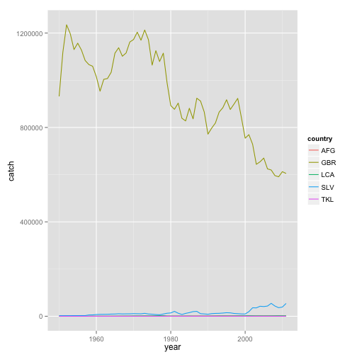

This package provides programmatic access to the [openfisheries](http://openfisheries.org/) [API](http://openfisheries.org/api-info).

Open Fisheries is a platform that aggregates global fishery data and currently offers global fish capture landings from 1950 onwards (more data coming soon). Read more about that effort [here](http://openfisheries.org/about).

<section id="installation">

## Installation


```r
install.packages("rfisheries")
```


<section id="usage">

## Usage

Package currently provides three basic functions. Landings data can be obtained by calling `landings()`


```r
library(rfisheries)
head(of_landings())
```

```
##      catch year
## 1 19233982 1950
## 2 21685025 1951
## 3 23645195 1952
## 4 24063731 1953
## 5 25974046 1954
## 6 27496847 1955
```


To get country specific data, provide a iso3c country code


```r
head(of_landings(country = "USA"))
```

```
##     catch year country
## 1 2629961 1950     USA
## 2 2452312 1951     USA
## 3 2472565 1952     USA
## 4 2534099 1953     USA
## 5 2596039 1954     USA
## 6 2621021 1955     USA
```


To get species specific landings, provide the correct a3 code for the required species.


```r
head(of_landings(species = "SKJ"))
```

```
##    catch year species
## 1 163250 1950     SKJ
## 2 187816 1951     SKJ
## 3 159553 1952     SKJ
## 4 166714 1953     SKJ
## 5 213505 1954     SKJ
## 6 192035 1955     SKJ
```


If you don't have know the correct species or country codes, you can get a complete list with the following two functions.

```r
head( species_codes() )

         scientific_name   taxocode a3_code isscaap
1     Petromyzon marinus 1020100101     LAU      25
2   Lampetra fluviatilis 1020100201     LAR      25
3    Lampetra tridentata 1020100202     LAO      25
4 Ichthyomyzon unicuspis 1020100401     LAY      25
5    Eudontomyzon mariae 1020100501     LAF      25
6      Geotria australis 1020100701     LAE      25
             english_name
1             Sea lamprey
2           River lamprey
3         Pacific lamprey
4          Silver lamprey
5 Ukrainian brook lamprey
6         Pouched lamprey
```

Similarly you can get a full list of country codes


```r
head(of_country_codes())
```

```
##          country iso3c
## 1    Afghanistan   AFG
## 2        Albania   ALB
## 3        Algeria   DZA
## 4 American Samoa   ASM
## 5        Andorra   AND
## 6         Angola   AGO
```


Example: Compare landings from multiple countries


```r
library(plyr)
countries <- of_country_codes()
# let's take a small subset, say 5 random countries
c_list <- countries[sample(nrow(countries), 5),]$iso3c
# and grab landings data for these countries
results <- ldply(c_list, function(x) {
    df <- of_landings(country = x)
    df$country  <-  x
    df
})
```


You can easily compare these results


```r
library(ggplot2)
ggplot(results, aes(year, catch, group = country, color = country)) +
  geom_line()
```

 


Similarly you can get landings data for multiple species. As the API evolves, we'll update the package.


<section id="citing">

## Citing

To cite `rfisheries` in publications use:

<br>

> Karthik Ram, Carl Boettiger and Andrew Dyck (2013). rfisheries: R interface for fisheries data. R package version 0.1. http://www.github.com/ropensci/rfisheries

<section id="license_bugs">

## License and bugs

* License: [CC0](http://creativecommons.org/choose/zero/)
* Report bugs at [our Github repo for rfisheries](https://github.com/ropensci/rfisheries/issues?state=open)
