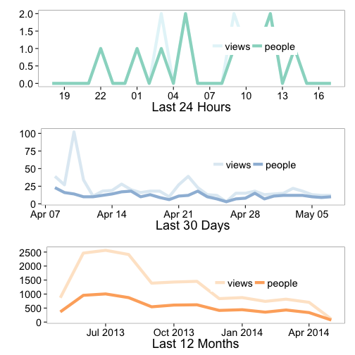

`rgauges` is an R wrapper to the gaug.es API for website analytics.

### Gaug.es API docs

See the Gaug.es API documentation here [http://get.gaug.es/documentation/](http://get.gaug.es/documentation/)

### Authentication

Get your own API key in your Gaug.es 'My Account' page and put in your .Rprofile file under the name 'GaugesKey' or some other name (you can specify `keyname` in function calls - but if you put in as 'GaugesKey' you're all set and don't need to bother with the `keyname` parameter).


<section id="installation">

## Installation


More stable version from CRAN


```r
install.packages("rgauges")
```

Development version from Github


```r
install.packages("devtools")
library(devtools)
install_github("rgauges", "ropensci")
```

Load


```r
library(rgauges)
```

<section id="usage">

## Usage


#### Your info


```r
gs_me()
```

```
## $user
## $user$id
## [1] "4eddbafb613f5d5139000001"
## 
## $user$email
## [1] "myrmecocystus@gmail.com"
## 
## $user$name
## [1] "Scott Chamberlain"
## 
## $user$first_name
## [1] "Scott"
## 
## $user$last_name
## [1] "Chamberlain"
## 
## $user$urls
## $user$urls$self
## [1] "https://secure.gaug.es/me"
## 
## $user$urls$gauges
## [1] "https://secure.gaug.es/gauges"
## 
## $user$urls$clients
## [1] "https://secure.gaug.es/clients"
```

##### Traffic


```r
gs_traffic(id='4efd83a6f5a1f5158a000004')
```

```
## $metadata
## $metadata$date
## [1] "2014-05-07"
## 
## $metadata$views
## [1] 106
## 
## $metadata$people
## [1] 72
## 
## $metadata$urls
## $metadata$urls$older
## [1] "https://secure.gaug.es/gauges/4efd83a6f5a1f5158a000004/traffic?date=2014-04-01"
## 
## $metadata$urls$newer
## NULL
## 
## 
## 
## $data
##         date views people
## 1 2014-05-01    14     11
## 2 2014-05-02    15     12
## 3 2014-05-03    22     12
## 4 2014-05-04    18     12
## 5 2014-05-05    13     10
## 6 2014-05-06    12      9
## 7 2014-05-07    12     10
```

#### Screen/browser information


```r
gs_reso(id='4efd83a6f5a1f5158a000004')
```

```
## $browser_height
##   title views
## 1   600    50
## 2   900    23
## 3   480    19
## 4   768    12
## 5  1024     2
## 
## $browser_width
##   title views
## 1  1280    31
## 2  1024    26
## 3  1600    22
## 4   800     8
## 5  1440     8
## 6   480     6
## 7   320     5
## 8  2000     0
## 
## $screen_width
##   title views
## 1  1280    37
## 2  1600    30
## 3  1440    10
## 4  1024     9
## 5   480     7
## 6   800     7
## 7   320     3
## 8  2000     3
```

#### Visualize traffic data

You'll need to load ggplot2


```r
library(ggplot2)
out <- gs_gauge_detail(id='4efd83a6f5a1f5158a000004')
vis_gauge(out)
```

```
## Using time as id variables
## Using date as id variables
## Using date as id variables
```

 

```
## NULL
```

<section id="citing">

## Citing

To cite `rgauges` in publications use:

<br>

> Scott Chamberlain and Karthik Ram (2014). rgauges: R wrapper to Gaug.es API. R package version 0.2.0. https://github.com/ropensci/rgauges

<section id="license_bugs">

## License and bugs

* License: [MIT](http://opensource.org/licenses/MIT)
* Report bugs at [our Github repo for rgauges](https://github.com/ropensci/rgauges/issues?state=open)
