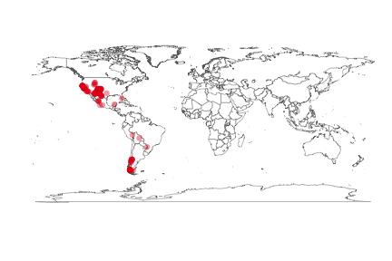

Seach and retrieve data from the Global Biodiverity Information Facilty (GBIF)

`rgbif` is an R package to search and retrieve data from the Global Biodiverity Information Facilty (GBIF). `rgbif` wraps R code around the [GBIF API][gbifapi] to allow you to talk to GBIF from R.

********************

<section id="installation">

## Installation

Install `rgbif` from CRAN for more stable version


```r
install.packages("rgbif")
```

Or from Github for the development version


```r
devtools::install_github("ropensci/rgbif")
```

Load rgbif


```r
library("rgbif")
```

********************

<section id="usage">

## Usage

## Number of occurrences

Search by type of record, all observational in this case


```r
occ_count(basisOfRecord='OBSERVATION')
#> [1] 97116011
```

Records for **Puma concolor** with lat/long data (georeferened) only. Note that `hasCoordinate` in `occ_search()` is the same as `georeferenced` in `occ_count()`.


```r
occ_count(taxonKey=2435099, georeferenced=TRUE)
#> [1] 2764
```

All georeferenced records in GBIF


```r
occ_count(georeferenced=TRUE)
#> [1] 562783703
```

Records from Denmark


```r
denmark_code <- isocodes[grep("Denmark", isocodes$name), "code"]
occ_count(country=denmark_code)
#> [1] 9670913
```

Number of records in a particular dataset


```r
occ_count(datasetKey='9e7ea106-0bf8-4087-bb61-dfe4f29e0f17')
#> [1] 4591
```

All records from 2012


```r
occ_count(year=2012)
#> [1] 39254838
```

Records for a particular dataset, and only for preserved specimens


```r
occ_count(datasetKey='e707e6da-e143-445d-b41d-529c4a777e8b', basisOfRecord='OBSERVATION')
#> [1] 2120907
```

## Search for taxon names

Get possible values to be used in taxonomic rank arguments in functions


```r
taxrank()
#> [1] "kingdom"       "phylum"        "class"         "order"        
#> [5] "family"        "genus"         "species"       "infraspecific"
```

`name_lookup()` does full text search of name usages covering the scientific and vernacular name, the species description, distribution and the entire classification across all name usages of all or some checklists. Results are ordered by relevance as this search usually returns a lot of results.

By default `name_lookup()` returns five slots of information: meta, data, facets, hierarchies, and names. hierarchies and names elements are named by their matching GBIF key in the `data.frame` in the data slot.


```r
out <- name_lookup(query='mammalia')
```


```r
names(out)
#> [1] "meta"        "data"        "facets"      "hierarchies" "names"
```


```r
out$meta
#>   offset limit endOfRecords  count
#> 1      0   100        FALSE 122809
```


```r
head(out$data)
#>         key                 scientificName                           datasetKey parentKey   parent
#> 1 101961729 Mammalia (awaiting allocation) 714c64e3-2dc1-4bb7-91e4-54be5af4da12 101961726 Mammalia
#> 2 100375341                       Mammalia 16c3f9cb-4b19-4553-ac8e-ebb90003aa02        NA     <NA>
#> 3 101961726 Mammalia (awaiting allocation) 714c64e3-2dc1-4bb7-91e4-54be5af4da12 101959399 Mammalia
#> 4 113391223        Mammalia Linnaeus, 1758 cbb6498e-8927-405a-916b-576d00a6289b 113301736 Chordata
#> 5       359        Mammalia Linnaeus, 1758 d7dddbf4-2cf0-4f39-9b2a-bb099caae36c        44 Chordata
#> 6 100348839         Mammalia Linnaeus 1758 16c3f9cb-4b19-4553-ac8e-ebb90003aa02 100347572 Chordata
#>    kingdom   phylum    order   family kingdomKey phylumKey  classKey  orderKey familyKey canonicalName
#> 1 Animalia Chordata Mammalia Mammalia  101859873 101946562 101959399 101961726 101961729      Mammalia
#> 2     <NA>     <NA>     <NA>     <NA>         NA        NA 100375341        NA        NA      Mammalia
#> 3 Animalia Chordata Mammalia     <NA>  101859873 101946562 101959399 101961726        NA      Mammalia
#> 4 Animalia Chordata     <NA>     <NA>  112707351 113301736 113391223        NA        NA      Mammalia
#> 5 Animalia Chordata     <NA>     <NA>          1        44       359        NA        NA      Mammalia
#> 6     <NA> Chordata     <NA>     <NA>         NA 100347572 100348839        NA        NA      Mammalia
#>       authorship   nameType taxonomicStatus   rank numDescendants numOccurrences habitats
#> 1                   NO_NAME        ACCEPTED FAMILY            138              0     <NA>
#> 2                SCIENTIFIC            <NA>  CLASS              0              0     <NA>
#> 3                   NO_NAME        ACCEPTED  ORDER            139              0     <NA>
#> 4 Linnaeus, 1758 SCIENTIFIC            <NA>  CLASS           3477              0     <NA>
#> 5 Linnaeus, 1758 SCIENTIFIC        ACCEPTED  CLASS          30001              0   MARINE
#> 6 Linnaeus, 1758 SCIENTIFIC            <NA>  CLASS              0              0     <NA>
#>   nomenclaturalStatus threatStatuses synonym    class nubKey extinct
#> 1                <NA>             NA   FALSE Mammalia     NA      NA
#> 2                <NA>             NA   FALSE Mammalia    359    TRUE
#> 3                <NA>             NA   FALSE Mammalia     NA      NA
#> 4                <NA>             NA   FALSE Mammalia    359      NA
#> 5                <NA>             NA   FALSE Mammalia    359   FALSE
#> 6                <NA>             NA   FALSE Mammalia    359      NA
#>                                                                                                                                                                                                                      publishedIn
#> 1                                                                                                                                                                                                                           <NA>
#> 2                                                                                                                                                                                                                           <NA>
#> 3                                                                                                                                                                                                                           <NA>
#> 4                                                                                                                                                                                                                           <NA>
#> 5 Linnaeus, C. (1758). Systema Naturae per regna tria naturae, secundum classes, ordines, genera, species, cum characteribus, differentiis, synonymis, locis. Editio decima, reformata. Laurentius Salvius: Holmiae. ii, 824 pp.
#> 6                                                                                                                                                                                                                           <NA>
#>                               accordingTo taxonID species speciesKey acceptedKey accepted genus
#> 1                                    <NA>    <NA>    <NA>         NA          NA     <NA>  <NA>
#> 2                                    <NA>    <NA>    <NA>         NA          NA     <NA>  <NA>
#> 3                                    <NA>    <NA>    <NA>         NA          NA     <NA>  <NA>
#> 4                                    <NA>    <NA>    <NA>         NA          NA     <NA>  <NA>
#> 5 The Catalogue of Life, 3rd January 2011    <NA>    <NA>         NA          NA     <NA>  <NA>
#> 6                                    <NA>    <NA>    <NA>         NA          NA     <NA>  <NA>
#>   genusKey
#> 1       NA
#> 2       NA
#> 3       NA
#> 4       NA
#> 5       NA
#> 6       NA
```


```r
out$facets
#> NULL
```


```r
out$hierarchies[1:2]
#> $`101961729`
#>     rankkey     name
#> 1 101859873 Animalia
#> 2 101946562 Chordata
#> 3 101959399 Mammalia
#> 4 101961726 Mammalia
#> 
#> $`101961726`
#>     rankkey     name
#> 1 101859873 Animalia
#> 2 101946562 Chordata
#> 3 101959399 Mammalia
```


```r
out$names[2]
#> $`113391223`
#>   vernacularName language
#> 1        Mammals      eng
```

Search for a genus


```r
head(name_lookup(query='Cnaemidophorus', rank="genus", return="data"))
#>         key                  scientificName                           datasetKey  nubKey parentKey
#> 1 113100610 Cnaemidophorus Wallengren, 1862 cbb6498e-8927-405a-916b-576d00a6289b 1858636 113099670
#> 2   1858636 Cnaemidophorus Wallengren, 1862 d7dddbf4-2cf0-4f39-9b2a-bb099caae36c 1858636      8863
#> 3 100555508 Cnaemidophorus Wallengren, 1862 16c3f9cb-4b19-4553-ac8e-ebb90003aa02 1858636 100555506
#> 4 110531263                  Cnaemidophorus 7ddf754f-d193-4cc9-b351-99906754a03b 1858636 110531096
#> 5 113100606                  Cnaemidophorus cbb6498e-8927-405a-916b-576d00a6289b 1858636 113099670
#> 6 113212699                  Cnaemidophorus cbb6498e-8927-405a-916b-576d00a6289b 1858636 113212683
#>          parent  kingdom     phylum       order        family          genus kingdomKey phylumKey
#> 1 Pterophoridae Animalia Arthropoda Lepidoptera Pterophoridae Cnaemidophorus  112707351 112710199
#> 2 Pterophoridae Animalia Arthropoda Lepidoptera Pterophoridae Cnaemidophorus          1        54
#> 3 Pterophoridae     <NA>       <NA> Lepidoptera Pterophoridae Cnaemidophorus         NA        NA
#> 4 Pterophoridae Animalia Arthropoda Lepidoptera Pterophoridae Cnaemidophorus  109354902 109380340
#> 5 Pterophoridae Animalia Arthropoda Lepidoptera Pterophoridae Cnaemidophorus  112707351 112710199
#> 6 Pterophoridae Animalia Arthropoda Lepidoptera Pterophoridae Cnaemidophorus  112707351 113188372
#>    classKey  orderKey familyKey  genusKey  canonicalName       authorship   nameType  rank
#> 1 112780522 112876893 113099670 113100610 Cnaemidophorus Wallengren, 1862 SCIENTIFIC GENUS
#> 2       216       797      8863   1858636 Cnaemidophorus Wallengren, 1862 SCIENTIFIC GENUS
#> 3        NA 100555505 100555506 100555508 Cnaemidophorus Wallengren, 1862 SCIENTIFIC GENUS
#> 4 109498964 110368094 110531096 110531263 Cnaemidophorus                  SCIENTIFIC GENUS
#> 5 112780522 112876893 113099670 113100606 Cnaemidophorus                  SCIENTIFIC GENUS
#> 6 113191312 113197877 113212683 113212699 Cnaemidophorus                  SCIENTIFIC GENUS
#>   numDescendants numOccurrences habitats nomenclaturalStatus threatStatuses synonym   class
#> 1              2              0       NA                  NA             NA   FALSE Insecta
#> 2              4              0       NA                  NA             NA   FALSE Insecta
#> 3              0              0       NA                  NA             NA   FALSE    <NA>
#> 4              2              0       NA                  NA             NA   FALSE Insecta
#> 5              1              0       NA                  NA             NA   FALSE Insecta
#> 6              1              0       NA                  NA             NA   FALSE Insecta
#>                                               publishedIn    accordingTo taxonomicStatus extinct
#> 1                                                    <NA>           <NA>            <NA>      NA
#> 2 K. svenska VetenskAkad. Handl. , (N. F. ) 3, no. 7, 10. Fauna Europaea        ACCEPTED   FALSE
#> 3                                                    <NA>           <NA>            <NA>      NA
#> 4                                                    <NA>           <NA>            <NA>      NA
#> 5                                                    <NA>           <NA>        ACCEPTED      NA
#> 6                                                    <NA>           <NA>        ACCEPTED      NA
#>   taxonID acceptedKey accepted
#> 1    <NA>          NA     <NA>
#> 2    <NA>          NA     <NA>
#> 3    <NA>          NA     <NA>
#> 4    <NA>          NA     <NA>
#> 5    <NA>          NA     <NA>
#> 6    <NA>          NA     <NA>
```

Search for the class mammalia


```r
head(name_lookup(query='mammalia', return = 'data'))
#>         key                 scientificName                           datasetKey parentKey   parent
#> 1 101961729 Mammalia (awaiting allocation) 714c64e3-2dc1-4bb7-91e4-54be5af4da12 101961726 Mammalia
#> 2 100375341                       Mammalia 16c3f9cb-4b19-4553-ac8e-ebb90003aa02        NA     <NA>
#> 3 101961726 Mammalia (awaiting allocation) 714c64e3-2dc1-4bb7-91e4-54be5af4da12 101959399 Mammalia
#> 4 113391223        Mammalia Linnaeus, 1758 cbb6498e-8927-405a-916b-576d00a6289b 113301736 Chordata
#> 5       359        Mammalia Linnaeus, 1758 d7dddbf4-2cf0-4f39-9b2a-bb099caae36c        44 Chordata
#> 6 100348839         Mammalia Linnaeus 1758 16c3f9cb-4b19-4553-ac8e-ebb90003aa02 100347572 Chordata
#>    kingdom   phylum    order   family kingdomKey phylumKey  classKey  orderKey familyKey canonicalName
#> 1 Animalia Chordata Mammalia Mammalia  101859873 101946562 101959399 101961726 101961729      Mammalia
#> 2     <NA>     <NA>     <NA>     <NA>         NA        NA 100375341        NA        NA      Mammalia
#> 3 Animalia Chordata Mammalia     <NA>  101859873 101946562 101959399 101961726        NA      Mammalia
#> 4 Animalia Chordata     <NA>     <NA>  112707351 113301736 113391223        NA        NA      Mammalia
#> 5 Animalia Chordata     <NA>     <NA>          1        44       359        NA        NA      Mammalia
#> 6     <NA> Chordata     <NA>     <NA>         NA 100347572 100348839        NA        NA      Mammalia
#>       authorship   nameType taxonomicStatus   rank numDescendants numOccurrences habitats
#> 1                   NO_NAME        ACCEPTED FAMILY            138              0     <NA>
#> 2                SCIENTIFIC            <NA>  CLASS              0              0     <NA>
#> 3                   NO_NAME        ACCEPTED  ORDER            139              0     <NA>
#> 4 Linnaeus, 1758 SCIENTIFIC            <NA>  CLASS           3477              0     <NA>
#> 5 Linnaeus, 1758 SCIENTIFIC        ACCEPTED  CLASS          30001              0   MARINE
#> 6 Linnaeus, 1758 SCIENTIFIC            <NA>  CLASS              0              0     <NA>
#>   nomenclaturalStatus threatStatuses synonym    class nubKey extinct
#> 1                <NA>             NA   FALSE Mammalia     NA      NA
#> 2                <NA>             NA   FALSE Mammalia    359    TRUE
#> 3                <NA>             NA   FALSE Mammalia     NA      NA
#> 4                <NA>             NA   FALSE Mammalia    359      NA
#> 5                <NA>             NA   FALSE Mammalia    359   FALSE
#> 6                <NA>             NA   FALSE Mammalia    359      NA
#>                                                                                                                                                                                                                      publishedIn
#> 1                                                                                                                                                                                                                           <NA>
#> 2                                                                                                                                                                                                                           <NA>
#> 3                                                                                                                                                                                                                           <NA>
#> 4                                                                                                                                                                                                                           <NA>
#> 5 Linnaeus, C. (1758). Systema Naturae per regna tria naturae, secundum classes, ordines, genera, species, cum characteribus, differentiis, synonymis, locis. Editio decima, reformata. Laurentius Salvius: Holmiae. ii, 824 pp.
#> 6                                                                                                                                                                                                                           <NA>
#>                               accordingTo taxonID species speciesKey acceptedKey accepted genus
#> 1                                    <NA>    <NA>    <NA>         NA          NA     <NA>  <NA>
#> 2                                    <NA>    <NA>    <NA>         NA          NA     <NA>  <NA>
#> 3                                    <NA>    <NA>    <NA>         NA          NA     <NA>  <NA>
#> 4                                    <NA>    <NA>    <NA>         NA          NA     <NA>  <NA>
#> 5 The Catalogue of Life, 3rd January 2011    <NA>    <NA>         NA          NA     <NA>  <NA>
#> 6                                    <NA>    <NA>    <NA>         NA          NA     <NA>  <NA>
#>   genusKey
#> 1       NA
#> 2       NA
#> 3       NA
#> 4       NA
#> 5       NA
#> 6       NA
```

Look up the species Helianthus annuus


```r
head(name_lookup(query = 'Helianthus annuus', rank="species", return = 'data'))
#>         key                             scientificName                           datasetKey  nubKey
#> 1 113584542                       Helianthus annuus L. cbb6498e-8927-405a-916b-576d00a6289b 3119195
#> 2   3119195                       Helianthus annuus L. d7dddbf4-2cf0-4f39-9b2a-bb099caae36c 3119195
#> 3 100336353                       Helianthus annuus L. 16c3f9cb-4b19-4553-ac8e-ebb90003aa02 3119195
#> 4 103340289                          Helianthus annuus fab88965-e69d-4491-a04d-e3198b626e52 3119195
#> 5 114910965                          Helianthus annuus ee2aac07-de9a-47a2-b828-37430d537633 3119195
#> 6 102912762 'Helianthus annuus' fasciation phytoplasma fab88965-e69d-4491-a04d-e3198b626e52 3119195
#>   parentKey                    parent       kingdom             order             family      genus
#> 1 113584540                Helianthus       Plantae         Asterales         Asteraceae Helianthus
#> 2   3119134                Helianthus       Plantae         Asterales         Asteraceae Helianthus
#> 3 100336352                Helianthus       Plantae         Asterales         Asteraceae Helianthus
#> 4 103340270                Helianthus Viridiplantae         Asterales         Asteraceae Helianthus
#> 5 114910964                Helianthus       Plantae         Asterales         Asteraceae Helianthus
#> 6 102912523 unclassified phytoplasmas          <NA> Acholeplasmatales Acholeplasmataceae Candidatus
#>             species kingdomKey  orderKey familyKey  genusKey speciesKey     canonicalName authorship
#> 1 Helianthus annuus  113551056 113580333 113580355 113584540  113584542 Helianthus annuus         L.
#> 2 Helianthus annuus          6       414      3065   3119134    3119195 Helianthus annuus         L.
#> 3 Helianthus annuus  100325740 100336278 100336349 100336352  100336353 Helianthus annuus         L.
#> 4 Helianthus annuus  102974832 103311652 103311763 103340270  103340289 Helianthus annuus           
#> 5 Helianthus annuus  114906846 114910800 114910801 114910964  114910965 Helianthus annuus       <NA>
#> 6 Helianthus annuus         NA 102911070 102911072 102911169  102912762 Helianthus annuus           
#>     nameType    rank numDescendants numOccurrences    habitats nomenclaturalStatus threatStatuses
#> 1 SCIENTIFIC SPECIES              0              0        <NA>                <NA>             NA
#> 2 SCIENTIFIC SPECIES             36              0 TERRESTRIAL                <NA>             NA
#> 3 SCIENTIFIC SPECIES              0              0        <NA>                <NA>             NA
#> 4 SCIENTIFIC SPECIES              2              0        <NA>                <NA>             NA
#> 5 SCIENTIFIC SPECIES              0              0        <NA>                <NA>             NA
#> 6 SCIENTIFIC SPECIES              0              0        <NA>                <NA>             NA
#>   synonym basionymKey                                  basionym        phylum phylumKey  classKey
#> 1   FALSE          NA                                      <NA>          <NA>        NA        NA
#> 2   FALSE     3119205 Helianthus lenticularis Douglas ex Lindl. Magnoliophyta        49       220
#> 3   FALSE          NA                                      <NA>          <NA>        NA 100328106
#> 4   FALSE          NA                                      <NA>  Streptophyta 102986054        NA
#> 5   FALSE          NA                                      <NA>  Tracheophyta 114909436 114910720
#> 6   FALSE          NA                                      <NA>   Tenericutes 102911063 102911065
#>           publishedIn                             accordingTo taxonomicStatus extinct         class
#> 1                <NA>                                    <NA>            <NA>      NA          <NA>
#> 2 Sp. pl. 2:904. 1753 Integrated Taxonomic Information System        ACCEPTED   FALSE Magnoliopsida
#> 3                <NA>                                    <NA>            <NA>      NA Magnoliopsida
#> 4                <NA>                                    <NA>            <NA>      NA          <NA>
#> 5                <NA>                                    <NA>            <NA>      NA Magnoliopsida
#> 6                <NA>                                    <NA>            <NA>      NA    Mollicutes
#>                       taxonID acceptedKey accepted
#> 1                        <NA>          NA     <NA>
#> 2                        <NA>          NA     <NA>
#> 3                        <NA>          NA     <NA>
#> 4                        <NA>          NA     <NA>
#> 5 http://eol.org/pages/468106          NA     <NA>
#> 6                        <NA>          NA     <NA>
```

The function `name_usage()` works with lots of different name endpoints in GBIF, listed at [http://www.gbif.org/developer/species#nameUsages](http://www.gbif.org/developer/species#nameUsages).


```r
library("plyr")
out <- name_usage(key=3119195, language="FRENCH", data='vernacularNames')
head(out$data)
#>     vernacularName language                                         source sourceTaxonKey preferred
#> 1      Sonnenblume      deu                                  GRIN Taxonomy      101321447        NA
#> 2          alizeti      swa                                  GRIN Taxonomy      101321447        NA
#> 3 annual sunflower      eng Integrated Taxonomic Information System (ITIS)      102234356        NA
#> 4 common sunflower                                           NCBI Taxonomy      103340289        NA
#> 5 common sunflower      eng Integrated Taxonomic Information System (ITIS)      102234356        NA
#> 6          girasol      spa                                  GRIN Taxonomy      101321447        NA
```

The function `name_backbone()` is used to search against the GBIF backbone taxonomy


```r
name_backbone(name='Helianthus', rank='genus', kingdom='plants')
#> $usageKey
#> [1] 3119134
#> 
#> $scientificName
#> [1] "Helianthus L."
#> 
#> $canonicalName
#> [1] "Helianthus"
#> 
#> $rank
#> [1] "GENUS"
#> 
#> $status
#> [1] "ACCEPTED"
#> 
#> $confidence
#> [1] 97
#> 
#> $matchType
#> [1] "EXACT"
#> 
#> $kingdom
#> [1] "Plantae"
#> 
#> $phylum
#> [1] "Magnoliophyta"
#> 
#> $order
#> [1] "Asterales"
#> 
#> $family
#> [1] "Asteraceae"
#> 
#> $genus
#> [1] "Helianthus"
#> 
#> $kingdomKey
#> [1] 6
#> 
#> $phylumKey
#> [1] 49
#> 
#> $classKey
#> [1] 220
#> 
#> $orderKey
#> [1] 414
#> 
#> $familyKey
#> [1] 3065
#> 
#> $genusKey
#> [1] 3119134
#> 
#> $synonym
#> [1] FALSE
#> 
#> $class
#> [1] "Magnoliopsida"
```

The function `name_suggest()` is optimized for speed, and gives back suggested names based on query parameters.


```r
head( name_suggest(q='Puma concolor') )
#>       key             canonicalName       rank
#> 1 2435099             Puma concolor    SPECIES
#> 2 6164604  Puma concolor stanleyana SUBSPECIES
#> 3 6164610 Puma concolor hippolestes SUBSPECIES
#> 4 6164591 Puma concolor kaibabensis SUBSPECIES
#> 5 6164618      Puma concolor browni SUBSPECIES
#> 6 6164613   Puma concolor schorgeri SUBSPECIES
```


## Single occurrence records

Get data for a single occurrence. Note that data is returned as a list, with slots for metadata and data, or as a hierarchy, or just data.

Just data


```r
occ_get(key=766766824, return='data')
#>              name       key decimalLatitude decimalLongitude        issues
#> 1 Corvus monedula 766766824         59.4568          17.9054 depunl,gass84
```

Just taxonomic hierarchy


```r
occ_get(key=766766824, return='hier')
#>              name     key    rank
#> 1        Animalia       1 kingdom
#> 2        Chordata      44  phylum
#> 3            Aves     212   class
#> 4   Passeriformes     729   order
#> 5        Corvidae    5235  family
#> 6          Corvus 2482468   genus
#> 7 Corvus monedula 2482473 species
```

All data, or leave return parameter blank


```r
occ_get(key=766766824, return='all')
#> $hierarchy
#>              name     key    rank
#> 1        Animalia       1 kingdom
#> 2        Chordata      44  phylum
#> 3            Aves     212   class
#> 4   Passeriformes     729   order
#> 5        Corvidae    5235  family
#> 6          Corvus 2482468   genus
#> 7 Corvus monedula 2482473 species
#> 
#> $media
#> list()
#> 
#> $data
#>              name       key decimalLatitude decimalLongitude        issues
#> 1 Corvus monedula 766766824         59.4568          17.9054 depunl,gass84
```

Get many occurrences. `occ_get` is vectorized


```r
occ_get(key=c(766766824, 101010, 240713150, 855998194), return='data')
#>                  name       key decimalLatitude decimalLongitude         issues
#> 1     Corvus monedula 766766824         59.4568          17.9054  depunl,gass84
#> 2 Platydoras costatus    101010         -4.3500         -70.0667 cucdmis,gass84
#> 3            Pelosina 240713150        -77.5667         163.5830 cdround,gass84
#> 4    Sciurus vulgaris 855998194         58.4068          12.0438  depunl,gass84
```


## Search for occurrences

By default `occ_search()` returns a `dplyr` like output summary in which the data printed expands based on how much data is returned, and the size of your window. You can search by scientific name:


```r
occ_search(scientificName = "Ursus americanus", limit = 20)
#> Records found [7484] 
#> Records returned [20] 
#> No. unique hierarchies [1] 
#> No. media records [19] 
#> Args [scientificName=Ursus americanus, limit=20, offset=0, fields=all] 
#> First 10 rows of data
#> 
#>                name        key decimalLatitude decimalLongitude              issues
#> 1  Ursus americanus 1065590124        38.36662        -79.68283 cdround,cudc,gass84
#> 2  Ursus americanus 1065588899        35.73304        -82.42028 cdround,cudc,gass84
#> 3  Ursus americanus 1065611122        43.94883        -72.77432 cdround,cudc,gass84
#> 4  Ursus americanus 1098894889        23.66893        -99.09625 cdround,cudc,gass84
#> 5  Ursus americanus 1088908315        43.86464        -72.34617 cdround,cudc,gass84
#> 6  Ursus americanus 1088932238        32.65219       -108.53674 cdround,cudc,gass84
#> 7  Ursus americanus 1132403409        40.13240       -123.82900 cdround,cudc,gass84
#> 8  Ursus americanus 1088923534        36.93018        -78.25027 cdround,cudc,gass84
#> 9  Ursus americanus 1088932273        32.65237       -108.53691 cdround,cudc,gass84
#> 10 Ursus americanus 1211969637        43.50321        -72.43548 cdround,cudc,gass84
#> ..              ...        ...             ...              ...                 ...
#> Variables not shown: datasetKey (chr), publishingOrgKey (chr), publishingCountry (chr), protocol
#>      (chr), lastCrawled (chr), lastParsed (chr), extensions (chr), basisOfRecord (chr), taxonKey
#>      (int), kingdomKey (int), phylumKey (int), classKey (int), orderKey (int), familyKey (int),
#>      genusKey (int), speciesKey (int), scientificName (chr), kingdom (chr), phylum (chr), order (chr),
#>      family (chr), genus (chr), species (chr), genericName (chr), specificEpithet (chr), taxonRank
#>      (chr), dateIdentified (chr), year (int), month (int), day (int), eventDate (chr), modified (chr),
#>      lastInterpreted (chr), references (chr), identifiers (chr), facts (chr), relations (chr),
#>      geodeticDatum (chr), class (chr), countryCode (chr), country (chr), rightsHolder (chr),
#>      identifier (chr), verbatimEventDate (chr), datasetName (chr), gbifID (chr), collectionCode (chr),
#>      occurrenceID (chr), taxonID (chr), catalogNumber (chr), recordedBy (chr),
#>      http...unknown.org.occurrenceDetails (chr), institutionCode (chr), rights (chr), eventTime (chr),
#>      occurrenceRemarks (chr), identificationID (chr), verbatimLocality (chr), infraspecificEpithet
#>      (chr), informationWithheld (chr)
```

Or to be more precise, you can search for names first, make sure you have the right name, then pass the GBIF key to the `occ_search()` function:


```r
key <- name_suggest(q='Helianthus annuus', rank='species')$key[1]
occ_search(taxonKey=key, limit=20)
#> Records found [21652] 
#> Records returned [20] 
#> No. unique hierarchies [1] 
#> No. media records [14] 
#> Args [taxonKey=3119195, limit=20, offset=0, fields=all] 
#> First 10 rows of data
#> 
#>                 name        key decimalLatitude decimalLongitude                issues
#> 1  Helianthus annuus 1143516596        35.42767       -105.06884   cdround,cudc,gass84
#> 2  Helianthus annuus 1095851641         0.00000          0.00000 cucdmis,gass84,zerocd
#> 3  Helianthus annuus 1088900309        33.95239       -117.32011           cudc,gass84
#> 4  Helianthus annuus 1088944416        26.20518        -98.26725   cdround,cudc,gass84
#> 5  Helianthus annuus 1135523136        33.96709       -117.99769   cdround,cudc,gass84
#> 6  Helianthus annuus 1135826959              NA               NA                      
#> 7  Helianthus annuus 1092889645         1.27617        103.79136   cdround,cudc,gass84
#> 8  Helianthus annuus 1092901911        30.22344        -97.95281   cdround,cudc,gass84
#> 9  Helianthus annuus 1135523412        33.96787       -118.00016   cdround,cudc,gass84
#> 10 Helianthus annuus 1090389390        59.96150         17.71060    cudc,depunl,gass84
#> ..               ...        ...             ...              ...                   ...
#> Variables not shown: datasetKey (chr), publishingOrgKey (chr), publishingCountry (chr), protocol
#>      (chr), lastCrawled (chr), lastParsed (chr), extensions (chr), basisOfRecord (chr), taxonKey
#>      (int), kingdomKey (int), phylumKey (int), classKey (int), orderKey (int), familyKey (int),
#>      genusKey (int), speciesKey (int), scientificName (chr), kingdom (chr), phylum (chr), order (chr),
#>      family (chr), genus (chr), species (chr), genericName (chr), specificEpithet (chr), taxonRank
#>      (chr), dateIdentified (chr), year (int), month (int), day (int), eventDate (chr), modified (chr),
#>      lastInterpreted (chr), references (chr), identifiers (chr), facts (chr), relations (chr),
#>      geodeticDatum (chr), class (chr), countryCode (chr), country (chr), rightsHolder (chr),
#>      identifier (chr), verbatimEventDate (chr), datasetName (chr), gbifID (chr), collectionCode (chr),
#>      verbatimLocality (chr), occurrenceID (chr), taxonID (chr), catalogNumber (chr), recordedBy (chr),
#>      http...unknown.org.occurrenceDetails (chr), institutionCode (chr), rights (chr),
#>      occurrenceRemarks (chr), identificationID (chr), elevation (dbl), elevationAccuracy (dbl),
#>      stateProvince (chr), recordNumber (chr), locality (chr), municipality (chr), language (chr), type
#>      (chr), ownerInstitutionCode (chr), identifiedBy (chr), eventTime (chr), informationWithheld
#>      (chr), coordinateAccuracy (dbl), depth (dbl), depthAccuracy (dbl), county (chr)
```

Like many functions in `rgbif`, you can choose what to return with the `return` parameter, here, just returning the metadata:


```r
occ_search(taxonKey=key, return='meta')
#>   offset limit endOfRecords count
#> 1    300   200        FALSE 21652
```

You can choose what fields to return. This isn't passed on to the API query to GBIF as they don't allow that, but we filter out the columns before we give the data back to you.


```r
occ_search(scientificName = "Ursus americanus", fields=c('name','basisOfRecord','protocol'), limit = 20)
#> Records found [7484] 
#> Records returned [20] 
#> No. unique hierarchies [1] 
#> No. media records [19] 
#> Args [scientificName=Ursus americanus, limit=20, offset=0, fields=name,basisOfRecord,protocol] 
#> First 10 rows of data
#> 
#>                name    protocol     basisOfRecord
#> 1  Ursus americanus DWC_ARCHIVE HUMAN_OBSERVATION
#> 2  Ursus americanus DWC_ARCHIVE HUMAN_OBSERVATION
#> 3  Ursus americanus DWC_ARCHIVE HUMAN_OBSERVATION
#> 4  Ursus americanus DWC_ARCHIVE HUMAN_OBSERVATION
#> 5  Ursus americanus DWC_ARCHIVE HUMAN_OBSERVATION
#> 6  Ursus americanus DWC_ARCHIVE HUMAN_OBSERVATION
#> 7  Ursus americanus DWC_ARCHIVE HUMAN_OBSERVATION
#> 8  Ursus americanus DWC_ARCHIVE HUMAN_OBSERVATION
#> 9  Ursus americanus DWC_ARCHIVE HUMAN_OBSERVATION
#> 10 Ursus americanus DWC_ARCHIVE HUMAN_OBSERVATION
#> ..              ...         ...               ...
```

Most parameters are vectorized, so you can pass in more than one value:


```r
splist <- c('Cyanocitta stelleri', 'Junco hyemalis', 'Aix sponsa')
keys <- sapply(splist, function(x) name_suggest(x)$key[1], USE.NAMES=FALSE)
occ_search(taxonKey=keys, limit=5)
#> Occ. found [2482598 (455679), 2492010 (2469925), 2498387 (777289)] 
#> Occ. returned [2482598 (5), 2492010 (5), 2498387 (5)] 
#> No. unique hierarchies [2482598 (1), 2492010 (1), 2498387 (1)] 
#> No. media records [2482598 (5), 2492010 (5), 2498387 (3)] 
#> Args [taxonKey=2482598,2492010,2498387, limit=5, offset=0, fields=all] 
#> First 10 rows of data from 2482598
#> 
#>                  name        key decimalLatitude decimalLongitude              issues
#> 1 Cyanocitta stelleri 1212002236        49.18573        -123.9761 cdround,cudc,gass84
#> 2 Cyanocitta stelleri 1052604494        37.76975        -122.4715 cdround,cudc,gass84
#> 3 Cyanocitta stelleri 1065588311        37.26200        -122.3271 cdround,cudc,gass84
#> 4 Cyanocitta stelleri 1065590449        37.50713        -122.4818 cdround,cudc,gass84
#> 5 Cyanocitta stelleri 1065601214        37.41080        -122.2617 cdround,cudc,gass84
#> Variables not shown: datasetKey (chr), publishingOrgKey (chr), publishingCountry (chr), protocol
#>      (chr), lastCrawled (chr), lastParsed (chr), extensions (chr), basisOfRecord (chr), taxonKey
#>      (int), kingdomKey (int), phylumKey (int), classKey (int), orderKey (int), familyKey (int),
#>      genusKey (int), speciesKey (int), scientificName (chr), kingdom (chr), phylum (chr), order (chr),
#>      family (chr), genus (chr), species (chr), genericName (chr), specificEpithet (chr), taxonRank
#>      (chr), dateIdentified (chr), year (int), month (int), day (int), eventDate (chr), modified (chr),
#>      lastInterpreted (chr), references (chr), identifiers (chr), facts (chr), relations (chr),
#>      geodeticDatum (chr), class (chr), countryCode (chr), country (chr), rightsHolder (chr),
#>      identifier (chr), verbatimEventDate (chr), datasetName (chr), gbifID (chr), collectionCode (chr),
#>      verbatimLocality (chr), occurrenceID (chr), taxonID (chr), catalogNumber (chr), recordedBy (chr),
#>      http...unknown.org.occurrenceDetails (chr), institutionCode (chr), rights (chr), eventTime (chr),
#>      identificationID (chr), occurrenceRemarks (chr)
```


********************

## Maps

Static map using the ggplot2 package. Make a map of *Puma concolor* occurrences.


```r
key <- name_backbone(name='Puma concolor')$speciesKey
dat <- occ_search(taxonKey=key, return='data', limit=300)
gbifmap(dat)
```

 

<section id="citing">

## Citing

To cite `rgbif` in publications use:

<br>

> Scott Chamberlain, Carl Boettiger, Karthik Ram, Vijay Barve and Dan Mcglinn (2015). rgbif: Interface to the Global Biodiversity Information Facility API. R package version 0.9.0 https://github.com/ropensci/rgbif

<section id="license_bugs">

## License and bugs

* License: [MIT](http://opensource.org/licenses/MIT)
* Report bugs at [our Github repo for rgbif](https://github.com/ropensci/rgbif/issues?state=open)

[Back to top](#top)

[gbifapi]: http://data.gbif.org/tutorial/services
