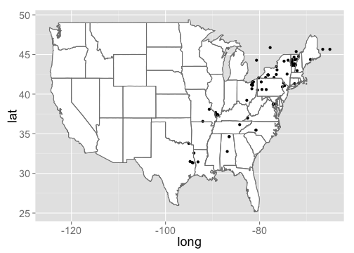

`rinat` is an R wrapper for iNaturalist APIs for accessing the observations. The Detailed documentation of API is available on [iNaturlaist website](http://www.inaturalist.org/pages/api+reference) and is part of our larger species occurence searching packages [SPOCC](http://github.com/ropensci/spocc)

<section id="installation">

## Installation

Install the development version using `install_github` within Hadley's [devtools](https://github.com/hadley/devtools) package.


```r
install.packages("devtools")
require(devtools)

install_github("rinat", "ropensci")
library(rinat)
```


Load the package


```r
library(rinat)
```

<section id="usage">

## Usage


### Get observations

__Searching__

_Fuzzy search_

You can search for observations by either common or latin name.  It will search the entire iNaturalist entry, so the search below will return all entries that mention Monarch butterflies, not just entries for Monarchs.


```r
butterflies <- get_inat_obs(query="Monarch Butterfly")
head(butterflies[,c(4:6)])
```


Another use for a fuzzy search is searching for a common name or habitat, e.g. searching for all observations that might happen in a vernal pool.  We can then see all the species names found.

```r
vp_obs <- get_inat_obs(query="vernal pool")
head(vp_obs$Species.guess)
```

```
## [1] Juncus bufonius                    Coyote-thistle                    
## [3] Navarretia leucocephala pauciflora needleleaf navarretia             
## [5] Wood frog                          Burning bush                      
## 154 Levels:  Alismataceae Ambystoma Ambystoma maculatum ... Yellow Starthistle (Centaurea solstitialis)
```


_Taxon query_
To return only records for a specific species or taxonomic group, use the taxon option.


```r
## Return just observations in the family Plecoptera
stone_flies <- get_inat_obs(taxon="Plecoptera")

## Return just Monarch Butterfly records
just_butterflies <- get_inat_obs(taxon="Danaus plexippus")
```


_Bounding box search_

You can also search within a bounding box by giving a simple set of coordinates.

Search by area


```r
bounds <- c(38.44047,-125,40.86652,-121.837)
deer <- get_inat_obs(query="Mule Deer", bounds=bounds)
```

__Other functions__


_Get information and observations by project_

You can get all the observations for a project if you know it's ID or name as an intaturalist slug

Just get info about a project


```r
vt_crows <- get_inat_obs_project("crows-in-vermont", type="info", raw=FALSE)
```

```
## 25  Records
## 0
```

Now get all the observations for that project


```r
vt_crows_obs <- get_inat_obs_project(vt_crows$id, type="observations")
```

```
## 25  Records
## 0-100
```

```r
head(vt_crows_obs[,c(1:4)])
```

```
##       Id Species.guess       Scientific.name   Common.name
## 1 192132 American Crow Corvus brachyrhynchos American Crow
## 2 192169 American Crow Corvus brachyrhynchos American Crow
## 3 192191 American Crow Corvus brachyrhynchos American Crow
## 4 183154 American Crow Corvus brachyrhynchos American Crow
## 5 183364 American Crow Corvus brachyrhynchos American Crow
## 6 183130 American Crow Corvus brachyrhynchos American Crow
```


_Get observation details_

Detailed information about a specific observation can be retrieved by observation ID.  The easiest way to get the ID is from a more general search.


```r
m_obs <- get_inat_obs(query="Monarch Butterfly")
head(get_inat_obs_id(m_obs$Id[1]))
```

```
## $captive
## [1] FALSE
## 
## $comments_count
## [1] 0
## 
## $community_taxon_id
## [1] 48662
## 
## $created_at
## [1] "2014-05-19T05:29:28-07:00"
## 
## $delta
## [1] FALSE
## 
## $description
## [1] ""
```

_Get all observations by user_

If you just want all the observations by a user you can download all their observations by user ID.  A word of warning though, this can be quite large (easily into the 1000's)


```r
m_obs <- get_inat_obs(query="Monarch Butterfly")
head(get_inat_obs_user(as.character(m_obs$User.login[1]),maxresults=20))[,1:5]
```

```
##       Scientific.name                  Datetime Description
## 1     Eudocimus albus 2014-05-05 08:42:00 +0000            
## 2          Ardea alba 2014-05-05 08:42:00 +0000            
## 3       Egretta thula 2014-05-05 08:42:00 +0000            
## 4     Tringa flavipes 2014-05-05 08:43:00 +0000            
## 5   Gallinula galeata 2014-05-05 09:23:00 +0000            
## 6 Phalaropus tricolor 2014-05-05 09:24:00 +0000            
##                       Place.guess Latitude
## 1 Highway 35 ditch, Rockport area    27.99
## 2 Highway 35 ditch, Rockport area    27.99
## 3 Highway 35 ditch, Rockport area    27.99
## 4 Highway 35 ditch, Rockport area    27.99
## 5    Port Aransas Nature Preserve    27.83
## 6    Port Aransas Nature Preserve    27.83
```

_Stats by taxa_

Basic statistics are available for taxa counts by date, date range, place ID (numeric ID), or user ID (string)

By date


```r
(counts <- get_inat_taxon_stats(date="2010-06-14"))
```

```
## $total
## [1] 49
## 
## $species_counts
##   count taxon.id             taxon.name taxon.rank taxon.rank_level
## 1     1    58564        Boloria bellona    species               10
## 2     1    81746   Necrophila americana    species               10
## 3     1    17009          Sayornis saya    species               10
## 4     1    24422 Ptychohyla spinipollex    species               10
## 5     1    11935    Tachycineta bicolor    species               10
##   taxon.default_name.created_at taxon.default_name.id
## 1     2010-04-01T15:12:20-04:00                 92809
## 2     2011-10-22T07:37:44-04:00                211685
## 3     2008-03-12T23:33:21-04:00                 20375
## 4     2008-03-17T20:43:27-04:00                 29116
## 5     2008-03-12T23:10:45-04:00                 14831
##   taxon.default_name.is_valid taxon.default_name.lexicon
## 1                        TRUE                    English
## 2                        TRUE                    English
## 3                        TRUE                    English
## 4                        TRUE           Scientific Names
## 5                        TRUE                    English
##   taxon.default_name.name taxon.default_name.taxon_id
## 1       meadow fritillary                       58564
## 2 American Carrion Beetle                       81746
## 3            Say's Phoebe                       17009
## 4  Ptychohyla spinipollex                       24422
## 5            Tree Swallow                       11935
##   taxon.default_name.updated_at
## 1     2010-04-01T15:12:20-04:00
## 2     2011-10-22T07:37:44-04:00
## 3     2008-03-12T23:33:21-04:00
## 4     2008-03-17T20:43:27-04:00
## 5     2008-03-12T23:10:45-04:00
##                                                  taxon.image_url
## 1 http://farm4.staticflickr.com/3137/4563715160_60ea310ff4_s.jpg
## 2 http://farm5.staticflickr.com/4013/4658689710_1a534b47ef_s.jpg
## 3 http://farm4.staticflickr.com/3382/3333991507_7fa8dfa600_s.jpg
## 4 http://farm5.staticflickr.com/4093/4769499547_523a426857_s.jpg
## 5   http://farm1.staticflickr.com/177/435466650_1ea6cb197e_s.jpg
##   taxon.iconic_taxon_name taxon.conservation_status_name
## 1                 Insecta                           <NA>
## 2                 Insecta                           <NA>
## 3                    Aves                  least_concern
## 4                Amphibia                     endangered
## 5                    Aves                  least_concern
## 
## $rank_counts
## $rank_counts$subspecies
## [1] 1
## 
## $rank_counts$variety
## [1] 1
## 
## $rank_counts$genus
## [1] 3
## 
## $rank_counts$species
## [1] 44
```

By place_ID


```r
vt_crows <- get_inat_obs_project("crows-in-vermont", type="info", raw=FALSE)
```

```
## 25  Records
## 0
```

```r
place_counts <- get_inat_taxon_stats(place = vt_crows$place_id)
place_counts$total
```

```
## [1] 3863
```

_Stats by user_

Similar statistics can be gotten for users.  The same input parameters can be used, but results are the top five users by species count and observation count.

By date


```r
counts <- get_inat_user_stats(date="2010-06-14")
counts$most_observations$user[,c(1:3)]
```

```
##       id                     login                 name
## 1   9706                greglasley          Greg Lasley
## 2  10285                   finatic            BJ Stacey
## 3    357                 annetanne                     
## 4   3403                    davidr              David R
## 5  10946                 cgcbosque                 <NA>
## 6  18056                  plantman                 <NA>
## 7    873                  tapbirds            Scott Cox
## 8    382                   tsoleau                     
## 9   2619                  asnyder5                 <NA>
## 10  1000                      muir            Matt Muir
## 11  3926                 pmikejack                     
## 12 31399                sacagewea2          Sue Wetmore
## 13  9560        dianaterryhibbitts Diana-Terry Hibbitts
## 14  4857           c_michael_hogan      c michael hogan
## 15 11831                   halbyte                     
## 16 13467            paulalongshore          Paula~Koala
## 17  5239                  marcellc                     
## 18   129 captain_fantastica_malone                     
## 19 20727                 ciovarnat       Ignacio Vargas
## 20 10612                     zieak       Ryan McFarland
## 21 16823                  jnstuart      James N. Stuart
## 22  2048                    josiah      Josiah Townsend
## 23    10                       jam                     
## 24 10299                summermule            L Pittman
## 25 13167                   arleigh     Arleigh Birchler
```

By place_ID


```r
vt_crows <- get_inat_obs_project("crows-in-vermont", type="info",raw=FALSE)
```

```
## 25  Records
## 0
```

```r
place_counts <- get_inat_user_stats(place = vt_crows$place_id)
head(place_counts$most_species$user[,c(1:3)])
```

```
##      id        login           name
## 1 12610 susanelliott  Susan Elliott
## 2 11792    kylejones     Kyle Jones
## 3 12045     larry522 Larry Clarfeld
## 4   317  kpmcfarland Kent McFarland
## 5  2179      charlie   Charlie Hohn
## 6  3847       rpayne      Ron Payne
```

### Mapping

Basic maps can be created as well to quickly visualize search results.  Maps can either be plotted automatically `plot = TRUE` or simply return a ggplot2 object with `plot = FALSE`.  This works well with single species data, but more complicated plots are best made from scratch.

Map salamanders in the genuse Ambystoma


```r
m_obs <- get_inat_obs(taxon="Ambystoma maculatum")
salamander_map <- inat_map(m_obs,plot=FALSE)
```

Now we can modify the returned map


```r
salamander_map +
  borders("state") +
  theme_grey(base_size = 18)
```

```
## Warning: Removed 3 rows containing missing values (geom_point).
```




<section id="citing">

## Citing

To cite `rinat` in publications use:

<br>

> Vijay Barve and Edmund Hart (2014). rinat: Access iNaturalist data through APIs. R package version 0.1.1.

<section id="license_bugs">

## License and bugs

* License: [MIT](http://opensource.org/licenses/MIT)
* Report bugs at [our Github repo for rinat](https://github.com/ropensci/rinat/issues?state=open)

[Back to top](#top)
