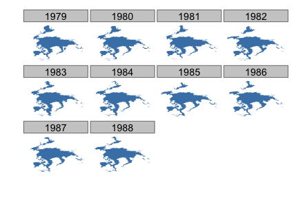

```{r, eval=TRUE, echo=FALSE}
knitr::opts_chunk$set(fig.path="../assets/tutorial-images/rnoaa/", fig.width=6, fig.height=4)
```

<section id="installation">

## Installation


Install and load `rnoaa` into the R session. Stable version from CRAN

```{r installcran, eval=FALSE}
install.packages("rnoaa")
```

Or development version from Github:

```{r installgh, eval=FALSE}
install.packages("devtools")
devtools::install_github("rnoaa", "ropensci")
```

```{r load, message=FALSE, warning=FALSE}
library('rnoaa')
library('plyr')
```

__Note__ that NOAA buoy data requires `netcdf`, and the `ncdf4` R package, which doesn't work well on Windows. Thus, we put functions to interact with that data into a different branch `buoy`. Install that version by doing

```{r installbuoy, eval=FALSE}
devtools::install_github("rnoaa", "ropensci", ref="buoy")
library('rnoaa')
```

<section id="usage">

## Usage

## National Climatic Data Center (NCDC) data

### Get info on a station by specifying a datasetid, locationid, and stationid

```{r two, message=FALSE, warning=FALSE, cache=FALSE}
ncdc_stations(datasetid='GHCND', locationid='FIPS:12017', stationid='GHCND:USC00084289')
```

### Search for data and get a data.frame

```{r three, message=FALSE, warning=FALSE, cache=FALSE}
out <- ncdc(datasetid='NORMAL_DLY', datatypeid='dly-tmax-normal', startdate = '2010-05-01', enddate = '2010-05-10')
```

See a data.frame

```{r four, message=FALSE, warning=FALSE, cache=FALSE}
out$data
```

### Plot data, super simple, but it's a start

```{r six, message=FALSE, warning=FALSE, cache=FALSE}
out <- ncdc(datasetid='NORMAL_DLY', stationid='GHCND:USW00014895', datatypeid='dly-tmax-normal', startdate = '2010-01-01', enddate = '2010-12-10', limit = 300)
ncdc_plot(out)
```

Note that the x-axis tick text is not readable, but see futher down in tutorial for how to adjust that.

### More on plotting

#### Example 1

Search for data first, then plot

```{r}
out <- ncdc(datasetid='GHCND', stationid='GHCND:USW00014895', datatypeid='PRCP', startdate = '2010-05-01', enddate = '2010-10-31', limit=500)
```

Default plot

```{r}
ncdc_plot(out)
```

Create 14 day breaks

```{r}
ncdc_plot(out, breaks="14 days")
```

One month breaks

```{r}
ncdc_plot(out, breaks="1 month", dateformat="%d/%m")
```

#### Example 2

Search for data

```{r}
out2 <- ncdc(datasetid='GHCND', stationid='GHCND:USW00014895', datatypeid='PRCP', startdate = '2010-05-01', enddate = '2010-05-03', limit=100)
```

Make a plot, with 6 hour breaks, and date format with only hour

```{r}
ncdc_plot(out2, breaks="6 hours", dateformat="%H")
```

### Combine many calls to noaa function

Search for two sets of data

```{r}
out1 <- ncdc(datasetid='GHCND', stationid='GHCND:USW00014895', datatypeid='PRCP', startdate = '2010-03-01', enddate = '2010-05-31', limit=500)

out2 <- ncdc(datasetid='GHCND', stationid='GHCND:USW00014895', datatypeid='PRCP', startdate = '2010-09-01', enddate = '2010-10-31', limit=500)
```

Then combine with a call to `ncdc_combine`

```{r}
df <- ncdc_combine(out1, out2)
head(df[[1]]); tail(df[[1]])
```

Then plot - the default passing in the combined plot plots the data together. In this case it looks kind of weird since a straight line combines two distant dates.

```{r}
ncdc_plot(df)
```

But we can pass in each separately, which uses `facet_wrap` in `ggplot2` to plot each set of data in its own panel.

```{r}
ncdc_plot(out1, out2, breaks="45 days")
```

### ERDDAP data


#### Passing the datasetid without fields gives all columns back

```{r oneone}
out <- erddap_data(datasetid='erdCalCOFIfshsiz')
nrow(out)
```

#### Pass time constraints

```{r twotwo}
head(erddap_data(datasetid='erdCalCOFIfshsiz', 'time>=2001-07-07', 'time<=2001-07-08')[,c(1:4)])
```

#### Pass in fields (i.e., columns to retrieve) & time constraints

```{r threethree}
head(erddap_data(datasetid='erdCalCOFIfshsiz', fields=c('longitude','latitude','fish_size','itis_tsn'), 'time>=2001-07-07','time<=2001-07-10'))
```

```{r}
head(erddap_data(datasetid='erdCinpKfmBT', fields=c('latitude','longitude',
   'Aplysia_californica_Mean_Density','Muricea_californica_Mean_Density'),
   'time>=2007-06-24','time<=2007-07-01'))
```

#### An example workflow

Search for data

```{r}
(out <- erddap_search(query='fish size'))
```

Using a datasetid, search for information on a datasetid

```{r}
id <- out$info$dataset_id[1]
erddap_info(datasetid=id)$variables
```

Get data from the dataset

```{r}
head(erddap_data(datasetid = id, fields = c('latitude','longitude','scientific_name')))
```


### Severe Weather Data Inventory (SWDI) data

#### Search for nx3tvs data from 5 May 2006 to 6 May 2006

```{r}
swdi(dataset='nx3tvs', startdate='20060505', enddate='20060506')
```

#### Use an id

```{r}
out <- swdi(dataset='warn', startdate='20060506', enddate='20060507', id=533623)
list(out$meta, head(out$data), head(out$shape))
```

#### Get all 'plsr' within the bounding box (-91,30,-90,31)

```{r}
swdi(dataset='plsr', startdate='20060505', enddate='20060510', bbox=c(-91,30,-90,31))
```


### Sea ice data

#### Map all years for April only for North pole

```{r seaice, message=FALSE, warning=FALSE, eval=FALSE}
urls <- seaiceeurls(mo='Apr', pole='N')[1:10]
out <- lapply(urls, seaice)
names(out) <- seq(1979,1988,1)
df <- ldply(out)
library('ggplot2')
ggplot(df, aes(long, lat, group=group)) +
  geom_polygon(fill="steelblue") +
  theme_ice() +
  facet_wrap(~ .id)
```



<section id="citing">

## Citing

To cite `rnoaa` in publications use:

<br>

> Hart Edmund, Scott Chamberlain and Karthik Ram (2014). rnoaa: NOAA climate data from R. R package version 0.2.0. https://github.com/ropensci/rnoaa

<section id="license_bugs">

## License and bugs

* License: [MIT](http://opensource.org/licenses/MIT)
* Report bugs at [our Github repo for rnoaa](https://github.com/ropensci/rnoaa/issues?state=open)

[Back to top](#top)
