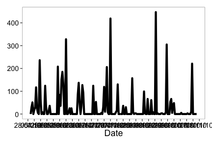
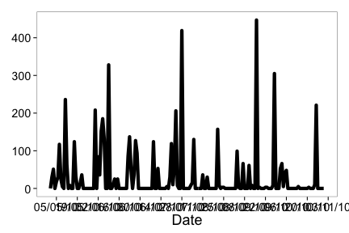
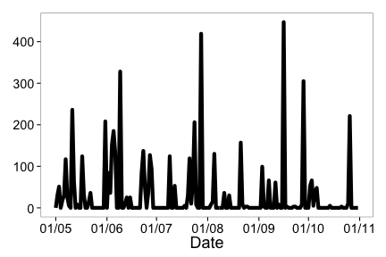
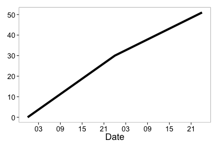
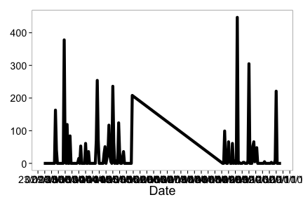
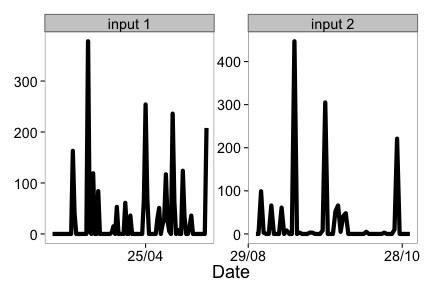

<section id="installation">

## Installation


Install and load `rnoaa` into the R session.


```r
library("devtools")
devtools::install_github("rnoaa", "ropensci")
```


```r
library("rnoaa")
library("plyr")
```

<br>

<section id="usage">

## Usage

Get info on a station by specifying a datasetid, locationid, and stationid


```r
noaa_stations(datasetid = "GHCND", locationid = "FIPS:12017", stationid = "GHCND:USC00084289")
```

```
## $meta
## NULL
##
## $data
##                  id                  name datacoverage    mindate
## 1 GHCND:USC00084289 INVERNESS 3 SE, FL US            1 1899-02-01
##      maxdate
## 1 2014-04-22
##
## attr(,"class")
## [1] "noaa_stations"
```

<br>
Search for data and get a data.frame or list


```r
out <- noaa(datasetid = "GHCND", stationid = "GHCND:USW00014895", startdate = "2013-10-01",
    enddate = "2013-12-01")
```


See a data.frame


```r
out$data
```

```
##              station value attributes datatype                date
## 1  GHCND:USW00014895    29       ,,W,     AWND 2013-10-01T00:00:00
## 2  GHCND:USW00014895     0   ,,W,2400     PRCP 2013-10-01T00:00:00
## 3  GHCND:USW00014895     0       ,,W,     SNOW 2013-10-01T00:00:00
## 4  GHCND:USW00014895     0       ,,W,     SNWD 2013-10-01T00:00:00
## 5  GHCND:USW00014895   250   ,,W,2400     TMAX 2013-10-01T00:00:00
## 6  GHCND:USW00014895   133   ,,W,2400     TMIN 2013-10-01T00:00:00
## 7  GHCND:USW00014895   210       ,,W,     WDF2 2013-10-01T00:00:00
## 8  GHCND:USW00014895   230       ,,W,     WDF5 2013-10-01T00:00:00
## 9  GHCND:USW00014895    76       ,,W,     WSF2 2013-10-01T00:00:00
## 10 GHCND:USW00014895    94       ,,W,     WSF5 2013-10-01T00:00:00
## 11 GHCND:USW00014895    26       ,,W,     AWND 2013-10-02T00:00:00
## 12 GHCND:USW00014895     0   ,,W,2400     PRCP 2013-10-02T00:00:00
## 13 GHCND:USW00014895     0       ,,W,     SNOW 2013-10-02T00:00:00
## 14 GHCND:USW00014895     0       ,,W,     SNWD 2013-10-02T00:00:00
## 15 GHCND:USW00014895   278   ,,W,2400     TMAX 2013-10-02T00:00:00
## 16 GHCND:USW00014895   144   ,,W,2400     TMIN 2013-10-02T00:00:00
## 17 GHCND:USW00014895   250       ,,W,     WDF2 2013-10-02T00:00:00
## 18 GHCND:USW00014895   270       ,,W,     WDF5 2013-10-02T00:00:00
## 19 GHCND:USW00014895    58       ,,W,     WSF2 2013-10-02T00:00:00
## 20 GHCND:USW00014895    72       ,,W,     WSF5 2013-10-02T00:00:00
## 21 GHCND:USW00014895    31       ,,W,     AWND 2013-10-03T00:00:00
## 22 GHCND:USW00014895   391   ,,W,2400     PRCP 2013-10-03T00:00:00
## 23 GHCND:USW00014895     0       ,,W,     SNOW 2013-10-03T00:00:00
## 24 GHCND:USW00014895     0       ,,W,     SNWD 2013-10-03T00:00:00
## 25 GHCND:USW00014895   261   ,,W,2400     TMAX 2013-10-03T00:00:00
```


Plotting

Example 1

Search for data first, then plot


```r
out <- noaa(datasetid = "GHCND", stationid = "GHCND:USW00014895", datatypeid = "PRCP",
    startdate = "2010-05-01", enddate = "2010-10-31", limit = 500)
```


Default plot


```r
noaa_plot(out)
```




Create 14 day breaks


```r
noaa_plot(out, breaks = "14 days")
```




One month breaks


```r
noaa_plot(out, breaks = "1 month", dateformat = "%d/%m")
```



<br>
Example 2

Search for data


```r
out2 <- noaa(datasetid = "GHCND", stationid = "GHCND:USW00014895", datatypeid = "PRCP",
    startdate = "2010-05-01", enddate = "2010-05-03", limit = 100)
```


Make a plot, with 6 hour breaks, and date format with only hour


```r
noaa_plot(out2, breaks = "6 hours", dateformat = "%H")
```



<br>
Combine many calls to noaa function

Search for two sets of data


```r
out1 <- noaa(datasetid = "GHCND", stationid = "GHCND:USW00014895", datatypeid = "PRCP",
    startdate = "2010-03-01", enddate = "2010-05-31", limit = 500)

out2 <- noaa(datasetid = "GHCND", stationid = "GHCND:USW00014895", datatypeid = "PRCP",
    startdate = "2010-09-01", enddate = "2010-10-31", limit = 500)
```


Then combine with a call to `noaa_combine`


```r
df <- noaa_combine(out1, out2)
head(df[[1]])
```

```
##             station value attributes datatype                date
## 1 GHCND:USW00014895     0  T,,0,2400     PRCP 2010-03-01T00:00:00
## 2 GHCND:USW00014895     0  T,,0,2400     PRCP 2010-03-02T00:00:00
## 3 GHCND:USW00014895     0  T,,0,2400     PRCP 2010-03-03T00:00:00
## 4 GHCND:USW00014895     0   ,,0,2400     PRCP 2010-03-04T00:00:00
## 5 GHCND:USW00014895     0   ,,0,2400     PRCP 2010-03-05T00:00:00
## 6 GHCND:USW00014895     0   ,,0,2400     PRCP 2010-03-06T00:00:00
```

```r
tail(df[[1]])
```

```
##               station value attributes datatype                date
## 148 GHCND:USW00014895   221   ,,0,2400     PRCP 2010-10-26T00:00:00
## 149 GHCND:USW00014895     0   ,,0,2400     PRCP 2010-10-27T00:00:00
## 150 GHCND:USW00014895     0  T,,0,2400     PRCP 2010-10-28T00:00:00
## 151 GHCND:USW00014895     0  T,,0,2400     PRCP 2010-10-29T00:00:00
## 152 GHCND:USW00014895     0   ,,0,2400     PRCP 2010-10-30T00:00:00
## 153 GHCND:USW00014895     0   ,,0,2400     PRCP 2010-10-31T00:00:00
```


Then plot - the default passing in the combined plot plots the data together. In this case it looks kind of weird since a straight line combines two distant dates.


```r
noaa_plot(df)
```




But we can pass in each separately, which uses `facet_wrap` in `ggplot2` to plot each set of data in its own panel.


```r
noaa_plot(out1, out2, breaks = "60 days", dateformat = "%d/%m")
```




<section id="citing">

## Citing

To cite `rnoaa` in publications use:

<br>

> Hart Edmund, Scott Chamberlain and Karthik Ram (2014). rnoaa: NOAA climate data from R. R package version 0.1.2. https://github.com/ropensci/rnoaa

<section id="license_bugs">

## License and bugs

* License: [MIT](http://opensource.org/licenses/MIT)
* Report bugs at [our Github repo for rnoaa](https://github.com/ropensci/rnoaa/issues?state=open)

[Back to top](#top)
