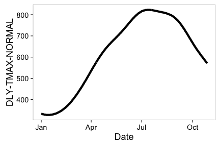
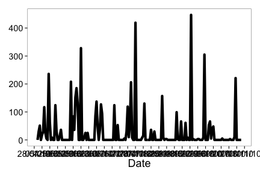
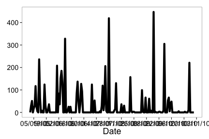
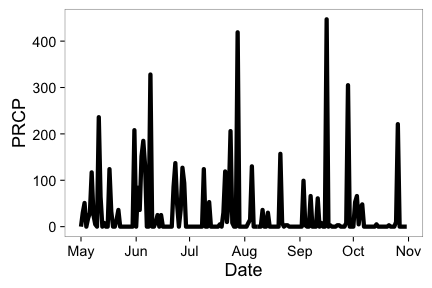
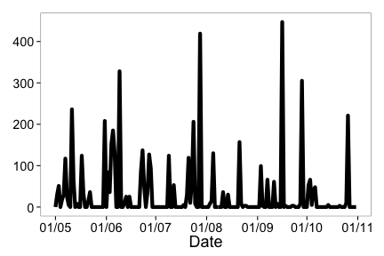
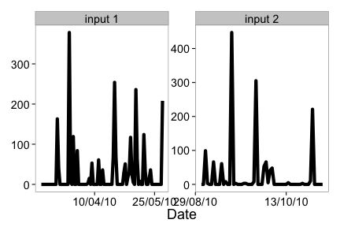

<section id="installation">

## Installation


Install and load `rnoaa` into the R session. Stable version from CRAN


```r
install.packages("rnoaa")
```

Or development version from Github:


```r
install.packages("devtools")
devtools::install_github("rnoaa", "ropensci")
```


```r
library('rnoaa')
library('plyr')
```

__Note__ that NOAA buoy data requires `netcdf`, and the `ncdf4` R package, which doesn't work well on Windows. Thus, we put functions to interact with that data into a different branch `buoy`. Install that version by doing


```r
devtools::install_github("rnoaa", "ropensci", ref="buoy")
library('rnoaa')
```

<section id="usage">

## Usage

## National Climatic Data Center (NCDC) data

### Get info on a station by specifying a datasetid, locationid, and stationid


```r
ncdc_stations(datasetid='GHCND', locationid='FIPS:12017', stationid='GHCND:USC00084289')
```

```
## $meta
## NULL
## 
## $data
##                  id elevation                  name elevationUnit
## 1 GHCND:USC00084289      12.2 INVERNESS 3 SE, FL US        METERS
##   datacoverage longitude    mindate latitude    maxdate
## 1            1  -82.3126 1899-02-01  28.8029 2014-12-20
## 
## attr(,"class")
## [1] "ncdc_stations"
```

### Search for data and get a data.frame


```r
out <- ncdc(datasetid='NORMAL_DLY', datatypeid='dly-tmax-normal', startdate = '2010-05-01', enddate = '2010-05-10')
```

See a data.frame


```r
out$data
```

```
##              station value        datatype                date fl_c
## 1  GHCND:AQW00061705   869 DLY-TMAX-NORMAL 2010-05-01T00:00:00    C
## 2  GHCND:CAW00064757   607 DLY-TMAX-NORMAL 2010-05-01T00:00:00    Q
## 3  GHCND:CQC00914080   840 DLY-TMAX-NORMAL 2010-05-01T00:00:00    R
## 4  GHCND:CQC00914801   858 DLY-TMAX-NORMAL 2010-05-01T00:00:00    R
## 5  GHCND:FMC00914395   876 DLY-TMAX-NORMAL 2010-05-01T00:00:00    P
## 6  GHCND:FMC00914419   885 DLY-TMAX-NORMAL 2010-05-01T00:00:00    P
## 7  GHCND:FMC00914446   885 DLY-TMAX-NORMAL 2010-05-01T00:00:00    P
## 8  GHCND:FMC00914482   868 DLY-TMAX-NORMAL 2010-05-01T00:00:00    R
## 9  GHCND:FMC00914720   899 DLY-TMAX-NORMAL 2010-05-01T00:00:00    R
## 10 GHCND:FMC00914761   897 DLY-TMAX-NORMAL 2010-05-01T00:00:00    P
## 11 GHCND:FMC00914831   870 DLY-TMAX-NORMAL 2010-05-01T00:00:00    P
## 12 GHCND:FMC00914892   883 DLY-TMAX-NORMAL 2010-05-01T00:00:00    P
## 13 GHCND:FMC00914898   875 DLY-TMAX-NORMAL 2010-05-01T00:00:00    P
## 14 GHCND:FMC00914911   885 DLY-TMAX-NORMAL 2010-05-01T00:00:00    P
## 15 GHCND:FMW00040308   888 DLY-TMAX-NORMAL 2010-05-01T00:00:00    S
## 16 GHCND:FMW00040504   879 DLY-TMAX-NORMAL 2010-05-01T00:00:00    C
## 17 GHCND:FMW00040505   867 DLY-TMAX-NORMAL 2010-05-01T00:00:00    S
## 18 GHCND:GQC00914025   852 DLY-TMAX-NORMAL 2010-05-01T00:00:00    P
## 19 GHCND:GQW00041415   877 DLY-TMAX-NORMAL 2010-05-01T00:00:00    C
## 20 GHCND:JQW00021603   852 DLY-TMAX-NORMAL 2010-05-01T00:00:00    P
## 21 GHCND:PSC00914519   883 DLY-TMAX-NORMAL 2010-05-01T00:00:00    P
## 22 GHCND:PSC00914712   840 DLY-TMAX-NORMAL 2010-05-01T00:00:00    P
## 23 GHCND:PSW00040309   879 DLY-TMAX-NORMAL 2010-05-01T00:00:00    S
## 24 GHCND:RMW00040604   867 DLY-TMAX-NORMAL 2010-05-01T00:00:00    S
## 25 GHCND:RMW00040710   863 DLY-TMAX-NORMAL 2010-05-01T00:00:00    C
```

### Plot data, super simple, but it's a start


```r
out <- ncdc(datasetid='NORMAL_DLY', stationid='GHCND:USW00014895', datatypeid='dly-tmax-normal', startdate = '2010-01-01', enddate = '2010-12-10', limit = 300)
ncdc_plot(out)
```

 

Note that the x-axis tick text is not readable, but see futher down in tutorial for how to adjust that.

### More on plotting

#### Example 1

Search for data first, then plot


```r
out <- ncdc(datasetid='GHCND', stationid='GHCND:USW00014895', datatypeid='PRCP', startdate = '2010-05-01', enddate = '2010-10-31', limit=500)
```

Default plot


```r
ncdc_plot(out)
```

 

Create 14 day breaks


```r
ncdc_plot(out, breaks="14 days")
```

 

One month breaks


```r
ncdc_plot(out, breaks="1 month", dateformat="%d/%m")
```

 

#### Example 2

Search for data


```r
out2 <- ncdc(datasetid='GHCND', stationid='GHCND:USW00014895', datatypeid='PRCP', startdate = '2010-05-01', enddate = '2010-05-03', limit=100)
```

Make a plot, with 6 hour breaks, and date format with only hour


```r
ncdc_plot(out2, breaks="6 hours", dateformat="%H")
```

 

### Combine many calls to noaa function

Search for two sets of data


```r
out1 <- ncdc(datasetid='GHCND', stationid='GHCND:USW00014895', datatypeid='PRCP', startdate = '2010-03-01', enddate = '2010-05-31', limit=500)

out2 <- ncdc(datasetid='GHCND', stationid='GHCND:USW00014895', datatypeid='PRCP', startdate = '2010-09-01', enddate = '2010-10-31', limit=500)
```

Then combine with a call to `ncdc_combine`


```r
df <- ncdc_combine(out1, out2)
head(df[[1]]); tail(df[[1]])
```

```
##             station value datatype                date fl_m fl_q fl_so
## 1 GHCND:USW00014895     0     PRCP 2010-03-01T00:00:00    T          0
## 2 GHCND:USW00014895     0     PRCP 2010-03-02T00:00:00    T          0
## 3 GHCND:USW00014895     0     PRCP 2010-03-03T00:00:00    T          0
## 4 GHCND:USW00014895     0     PRCP 2010-03-04T00:00:00               0
## 5 GHCND:USW00014895     0     PRCP 2010-03-05T00:00:00               0
## 6 GHCND:USW00014895     0     PRCP 2010-03-06T00:00:00               0
##   fl_t
## 1 2400
## 2 2400
## 3 2400
## 4 2400
## 5 2400
## 6 2400
```

```
##               station value datatype                date fl_m fl_q fl_so
## 148 GHCND:USW00014895   221     PRCP 2010-10-26T00:00:00               0
## 149 GHCND:USW00014895     0     PRCP 2010-10-27T00:00:00               0
## 150 GHCND:USW00014895     0     PRCP 2010-10-28T00:00:00    T          0
## 151 GHCND:USW00014895     0     PRCP 2010-10-29T00:00:00    T          0
## 152 GHCND:USW00014895     0     PRCP 2010-10-30T00:00:00               0
## 153 GHCND:USW00014895     0     PRCP 2010-10-31T00:00:00               0
##     fl_t
## 148 2400
## 149 2400
## 150 2400
## 151 2400
## 152 2400
## 153 2400
```

Then plot - the default passing in the combined plot plots the data together. In this case it looks kind of weird since a straight line combines two distant dates.


```r
ncdc_plot(df)
```

 

But we can pass in each separately, which uses `facet_wrap` in `ggplot2` to plot each set of data in its own panel.


```r
ncdc_plot(out1, out2, breaks="45 days")
```

 

## ERDDAP data


### Passing the datasetid without fields gives all columns back


```r
erddap_table('erdCalCOFIfshsiz')
```

```
## <NOAA ERDDAP tabledap> erdCalCOFIfshsiz
##    Path: [/Users/sacmac/.rnoaa/erddap/f18cc75d8bf5ca831a96f42486a7bd5d.csv]
##    Last updated: [2014-12-19 15:47:55]
##    File size:    [4.6 MB]
##    Dimensions:   [20939 X 24]
## 
##    cruise               ship ship_code order_occupied   tow_type net_type
## 2  199104 DAVID STARR JORDAN        JD              1 MOCNESS_1m       M1
## 3  199104 DAVID STARR JORDAN        JD              2 MOCNESS_1m       M1
## 4  199104 DAVID STARR JORDAN        JD              2 MOCNESS_1m       M1
## 5  199104 DAVID STARR JORDAN        JD              2 MOCNESS_1m       M1
## 6  199104 DAVID STARR JORDAN        JD              4 MOCNESS_1m       M1
## 7  199104 DAVID STARR JORDAN        JD              5 MOCNESS_1m       M1
## 8  199104 DAVID STARR JORDAN        JD              6 MOCNESS_1m       M1
## 9  199104 DAVID STARR JORDAN        JD              7 MOCNESS_1m       M1
## 10 199104 DAVID STARR JORDAN        JD             11 MOCNESS_1m       M1
## 11 199104 DAVID STARR JORDAN        JD             32 MOCNESS_1m       M1
## ..    ...                ...       ...            ...        ...      ...
## Variables not shown: tow_number (int), net_location (chr),
##      standard_haul_factor (dbl), volume_sampled (chr), percent_sorted
##      (chr), sample_quality (dbl), latitude (chr), longitude (chr), line
##      (dbl), station (dbl), time (chr), scientific_name (chr), common_name
##      (chr), itis_tsn (int), calcofi_species_code (int), fish_size (chr),
##      fish_count (dbl), fish_1000m3 (chr)
```

### Pass time constraints


```r
erddap_table('erdCalCOFIfshsiz', 'time>=2001-07-07', 'time<=2001-07-08')
```

```
## <NOAA ERDDAP tabledap> erdCalCOFIfshsiz
##    Path: [/Users/sacmac/.rnoaa/erddap/9e5119eb5c8ed63b9619be1367b0344c.csv]
##    Last updated: [2014-12-19 18:07:32]
##    File size:    [0.05 MB]
##    Dimensions:   [217 X 24]
## 
##    cruise               ship ship_code order_occupied    tow_type net_type
## 2  200106 DAVID STARR JORDAN        JD             43 MOCNESS_10m       M2
## 3  200106 DAVID STARR JORDAN        JD             43 MOCNESS_10m       M2
## 4  200106 DAVID STARR JORDAN        JD             43 MOCNESS_10m       M2
## 5  200106 DAVID STARR JORDAN        JD             43 MOCNESS_10m       M2
## 6  200106 DAVID STARR JORDAN        JD             43 MOCNESS_10m       M2
## 7  200106 DAVID STARR JORDAN        JD             43 MOCNESS_10m       M2
## 8  200106 DAVID STARR JORDAN        JD             43 MOCNESS_10m       M2
## 9  200106 DAVID STARR JORDAN        JD             43 MOCNESS_10m       M2
## 10 200106 DAVID STARR JORDAN        JD             43 MOCNESS_10m       M2
## 11 200106 DAVID STARR JORDAN        JD             43 MOCNESS_10m       M2
## ..    ...                ...       ...            ...         ...      ...
## Variables not shown: tow_number (int), net_location (chr),
##      standard_haul_factor (dbl), volume_sampled (chr), percent_sorted
##      (chr), sample_quality (dbl), latitude (chr), longitude (chr), line
##      (dbl), station (dbl), time (chr), scientific_name (chr), common_name
##      (chr), itis_tsn (int), calcofi_species_code (int), fish_size (chr),
##      fish_count (dbl), fish_1000m3 (chr)
```

### Pass in fields (i.e., columns to retrieve) & time constraints


```r
erddap_table('erdCalCOFIfshsiz', fields=c('longitude','latitude','fish_size','itis_tsn'), 'time>=2001-07-07','time<=2001-07-10')
```

```
## <NOAA ERDDAP tabledap> erdCalCOFIfshsiz
##    Path: [/Users/sacmac/.rnoaa/erddap/7b04d4ddfe4ad3540ec6213129fa050c.csv]
##    Last updated: [2014-12-19 18:07:47]
##    File size:    [0.02 MB]
##    Dimensions:   [558 X 4]
## 
##     longitude  latitude fish_size itis_tsn
## 2     -118.26    33.255      22.9   623745
## 3     -118.26    33.255      22.9   623745
## 4  -118.10667 32.738335      31.5   623625
## 5  -118.10667 32.738335      48.3   623625
## 6  -118.10667 32.738335      15.5   162221
## 7  -118.10667 32.738335      16.3   162221
## 8  -118.10667 32.738335      17.8   162221
## 9  -118.10667 32.738335      18.2   162221
## 10 -118.10667 32.738335      19.2   162221
## 11 -118.10667 32.738335      20.0   162221
## ..        ...       ...       ...      ...
```


```r
erddap_table('erdCinpKfmBT', fields=c('latitude','longitude',
   'Aplysia_californica_Mean_Density','Muricea_californica_Mean_Density'),
   'time>=2007-06-24','time<=2007-07-01')
```

```
## <NOAA ERDDAP tabledap> erdCinpKfmBT
##    Path: [/Users/sacmac/.rnoaa/erddap/681451f3fee8ee9e426012609975a89e.csv]
##    Last updated: [2014-12-19 18:08:22]
##    File size:    [1.49 KB]
##    Dimensions:   [37 X 4]
## 
##            latitude         longitude Aplysia_californica_Mean_Density
## 2              34.0 -119.416666666667                      0.009722223
## 3              34.0 -119.383333333333                              0.0
## 4              34.0 -119.366666666667                              0.0
## 5              34.0 -119.383333333333                             0.16
## 6              34.0 -119.416666666667                             0.03
## 7  34.0166666666667           -119.35                              0.0
## 8              34.0           -119.35                      0.008333334
## 9              33.0 -118.533333333333                              NaN
## 10            32.95 -118.533333333333                              NaN
## 11             32.8            -118.4                              NaN
## ..              ...               ...                              ...
## Variables not shown: Muricea_californica_Mean_Density (chr)
```

### An example workflow

Search for data


```r
(out <- erddap_search('size'))
```

```
## 6 results, showing first 20 
##                                                            title
## 6                NOAA Global Coral Bleaching Monitoring Products
## 7             Coawst 4 use, Best Time Series [time][eta_u][xi_u]
## 8             Coawst 4 use, Best Time Series [time][eta_v][xi_v]
## 9  Coawst 4 use, Best Time Series [time][s_rho][eta_rho][xi_rho]
## 10  Coawst 4 use, Best Time Series [time][Nbed][eta_rho][xi_rho]
## 12        Coawst 4 use, Best Time Series [time][eta_rho][xi_rho]
##             dataset_id
## 6             NOAA_DHW
## 7  whoi_61c3_0b5d_cd61
## 8  whoi_62d0_9d64_c8ff
## 9  whoi_7dd7_db97_4bbe
## 10 whoi_a4fb_2c9c_16a7
## 12 whoi_ed12_89ce_9592
```

Or, list datasets


```r
tdp <- erddap_datasets('table')
```


```r
id <- as.character(tdp$Dataset.ID[8])
erddap_info(id)$variables
```

```
##               variable_name data_type     actual_range
## 1                      cndc     float                 
## 2             cndc_adjusted     float                 
## 3       cndc_adjusted_error     float                 
## 4          cndc_adjusted_qc     float                 
## 5                   cndc_qc     float                 
## 6                      doxy     float                 
## 7             doxy_adjusted     float                 
## 8       doxy_adjusted_error     float                 
## 9          doxy_adjusted_qc     float                 
## 10                  doxy_qc     float                 
## 11                       id       int                 
## 12                 latitude     float      -90.0, 90.0
## 13                longitude     float       0.0, 360.0
## 14                     pres     float                 
## 15            pres_adjusted     float                 
## 16      pres_adjusted_error     float                 
## 17         pres_adjusted_qc     float                 
## 18                  pres_qc     float                 
## 19                     psal     float                 
## 20            psal_adjusted     float                 
## 21      psal_adjusted_error     float                 
## 22         psal_adjusted_qc     float                 
## 23                  psal_qc     float                 
## 24                     temp     float                 
## 25            temp_adjusted     float                 
## 26      temp_adjusted_error     float                 
## 27         temp_adjusted_qc     float                 
## 28                temp_doxy     float                 
## 29       temp_doxy_adjusted     float                 
## 30 temp_doxy_adjusted_error     float                 
## 31    temp_doxy_adjusted_qc     float                 
## 32             temp_doxy_qc     float                 
## 33                  temp_qc     float                 
## 34                     time    double 8.1048066E8, NaN
```

Get data from the dataset


```r
erddap_table(id, fields = c('latitude','longitude'))
```

```
## <NOAA ERDDAP tabledap> apdrcArgoAll
##    Path: [/Users/sacmac/.rnoaa/erddap/7b238871e478bf43df2e1f703e6e85e5.csv]
##    Last updated: [2014-12-19 18:15:39]
##    File size:    [0.07 MB]
##    Dimensions:   [5000 X 2]
## 
##    latitude longitude
## 2    49.868   215.335
## 3    50.023    215.47
## 4    50.115   215.676
## 5    50.156   215.676
## 6    50.132   215.601
## 7      50.1   215.544
## 8    50.158   215.582
## 9    50.278   215.585
## 10   50.417   215.702
## 11   50.548   215.779
## ..      ...       ...
```


## Severe Weather Data Inventory (SWDI) data

### Search for nx3tvs data from 5 May 2006 to 6 May 2006


```r
swdi(dataset='nx3tvs', startdate='20060505', enddate='20060506')
```

```
## $meta
## $meta$totalCount
## [1] 25
## 
## $meta$totalTimeInSeconds
## [1] 0.02
## 
## 
## $data
##                   ztime wsr_id cell_id cell_type range azimuth max_shear
## 1  2006-05-05T00:05:50Z   KBMX      Q0       TVS     7     217       403
## 2  2006-05-05T00:10:02Z   KBMX      Q0       TVS     5     208       421
## 3  2006-05-05T00:12:34Z   KSJT      P2       TVS    49     106        17
## 4  2006-05-05T00:17:31Z   KSJT      B4       TVS    40     297        25
## 5  2006-05-05T00:29:13Z   KMAF      H4       TVS    53     333        34
## 6  2006-05-05T00:31:25Z   KLBB      N0       TVS    51     241        24
## 7  2006-05-05T00:33:25Z   KMAF      H4       TVS    52     334        46
## 8  2006-05-05T00:37:37Z   KMAF      H4       TVS    50     334        34
## 9  2006-05-05T00:41:51Z   KMAF      H4       TVS    51     335        29
## 10 2006-05-05T00:44:33Z   KLBB      N0       TVS    46     245        35
## 11 2006-05-05T00:46:03Z   KMAF      H4       TVS    49     335        41
## 12 2006-05-05T00:48:55Z   KLBB      N0       TVS    44     246        44
## 13 2006-05-05T00:50:16Z   KMAF      H4       TVS    49     337        33
## 14 2006-05-05T00:54:29Z   KMAF      H4       TVS    47     337        42
## 15 2006-05-05T00:57:42Z   KLBB      N0       TVS    41     251        46
## 16 2006-05-05T00:58:41Z   KMAF      H4       TVS    46     340        29
## 17 2006-05-05T01:02:04Z   KLBB      N0       TVS    39     251        42
## 18 2006-05-05T01:02:53Z   KMAF      H4       TVS    46     339        35
## 19 2006-05-05T01:02:53Z   KMAF      H4       TVS    50     338        27
## 20 2006-05-05T01:06:26Z   KLBB      N0       TVS    36     251        31
## 21 2006-05-05T01:07:06Z   KMAF      F5       TVS    45     342        44
## 22 2006-05-05T01:10:48Z   KLBB      N0       TVS    36     256        37
## 23 2006-05-05T01:11:18Z   KMAF      F5       TVS    45     343        39
## 24 2006-05-05T01:15:30Z   KMAF      F5       TVS    44     344        30
## 25 2006-05-05T01:15:30Z   KMAF      H4       TVS    49     341        26
##    mxdv
## 1   116
## 2   120
## 3    52
## 4    62
## 5   111
## 6    78
## 7   145
## 8   107
## 9    91
## 10  100
## 11  127
## 12  121
## 13   98
## 14  126
## 15  117
## 16   85
## 17  102
## 18  101
## 19   84
## 20   70
## 21  120
## 22   83
## 23  108
## 24   78
## 25   81
## 
## $shape
##                                         shape
## 1  POINT (-86.8535716274277 33.0786326913943)
## 2  POINT (-86.8165772540846 33.0982820681588)
## 3  POINT (-99.5771091971025 31.1421609654838)
## 4   POINT (-101.188161700093 31.672392833416)
## 5  POINT (-102.664426480293 32.7306917937698)
## 6   POINT (-102.70047613441 33.2380072329615)
## 7    POINT (-102.6393683028 32.7226656893341)
## 8  POINT (-102.621904684258 32.6927081076156)
## 9   POINT (-102.614794815627 32.714139844846)
## 10 POINT (-102.643380529494 33.3266446067682)
## 11 POINT (-102.597961935071 32.6839260102062)
## 12 POINT (-102.613894688178 33.3526192273658)
## 13 POINT (-102.567153417051 32.6956373348052)
## 14  POINT (-102.551596970251 32.664939580306)
## 15 POINT (-102.586119971014 33.4287323151248)
## 16 POINT (-102.499638479193 32.6644438090742)
## 17   POINT (-102.5485490063 33.4398330734778)
## 18  POINT (-102.51446954228 32.6597119240996)
## 19 POINT (-102.559031583693 32.7166090376869)
## 20 POINT (-102.492174522228 33.4564626989719)
## 21 POINT (-102.463540844324 32.6573739036181)
## 22 POINT (-102.510349454162 33.5066366303981)
## 23 POINT (-102.448763863447 32.6613484943994)
## 24   POINT (-102.42842159557 32.649061124799)
## 25 POINT (-102.504158884526 32.7162751126854)
## 
## attr(,"class")
## [1] "swdi"
```

### Use an id


```r
out <- swdi(dataset='warn', startdate='20060506', enddate='20060507', id=533623)
list(out$meta, head(out$data), head(out$shape))
```

```
## [[1]]
## [[1]]$totalCount
## [1] 25
## 
## [[1]]$totalTimeInSeconds
## [1] 1.085
## 
## 
## [[2]]
##            ztime_start            ztime_end     id         warningtype
## 1 2006-05-05T22:53:00Z 2006-05-06T00:00:00Z 397428 SEVERE THUNDERSTORM
## 2 2006-05-05T22:55:00Z 2006-05-06T00:00:00Z 397429 SEVERE THUNDERSTORM
## 3 2006-05-05T22:55:00Z 2006-05-06T00:00:00Z 397430 SEVERE THUNDERSTORM
## 4 2006-05-05T22:57:00Z 2006-05-06T00:00:00Z 397431 SEVERE THUNDERSTORM
## 5 2006-05-05T23:03:00Z 2006-05-06T00:00:00Z 397434 SEVERE THUNDERSTORM
## 6 2006-05-05T23:14:00Z 2006-05-06T00:15:00Z 397437 SEVERE THUNDERSTORM
##   issuewfo messageid
## 1     KLCH    052252
## 2     KLUB    052256
## 3     KLUB    052256
## 4     KMAF    052258
## 5     KMAF    052305
## 6     KLUB    052315
## 
## [[3]]
##                                                                                                                                                          shape
## 1                                                                             POLYGON ((-93.27 30.38, -93.29 30.18, -93.02 30.18, -93.04 30.37, -93.27 30.38))
## 2                                                                        POLYGON ((-101.93 34.74, -101.96 34.35, -101.48 34.42, -101.49 34.74, -101.93 34.74))
## 3                POLYGON ((-100.36 33.03, -99.99 33.3, -99.99 33.39, -100.28 33.39, -100.5 33.18, -100.51 33.02, -100.45 32.97, -100.37 33.03, -100.36 33.03))
## 4                                            POLYGON ((-102.8 30.74, -102.78 30.57, -102.15 30.61, -102.15 30.66, -101.92 30.68, -102.07 30.83, -102.8 30.74))
## 5                                                                        POLYGON ((-103.02 32.94, -103.03 32.66, -102.21 32.53, -102.22 32.95, -103.02 32.94))
## 6 POLYGON ((-101.6 33.32, -101.57 33.31, -101.57 33.51, -101.65 33.51, -101.66 33.5, -101.75 33.5, -101.77 33.49, -101.84 33.49, -101.84 33.32, -101.6 33.32))
```

### Get all 'plsr' within the bounding box (-91,30,-90,31)


```r
swdi(dataset='plsr', startdate='20060505', enddate='20060510', bbox=c(-91,30,-90,31))
```

```
## $meta
## $meta$totalCount
## [1] 5
## 
## $meta$totalTimeInSeconds
## [1] 0.255
## 
## 
## $data
##                  ztime     id        event magnitude            city
## 1 2006-05-09T02:20:00Z 427540         HAIL         1    5 E KENTWOOD
## 2 2006-05-09T02:40:00Z 427536         HAIL         1    MOUNT HERMAN
## 3 2006-05-09T02:40:00Z 427537 TSTM WND DMG     -9999    MOUNT HERMAN
## 4 2006-05-09T03:00:00Z 427199         HAIL         0     FRANKLINTON
## 5 2006-05-09T03:17:00Z 427200      TORNADO     -9999 5 S FRANKLINTON
##       county state          source
## 1 TANGIPAHOA    LA TRAINED SPOTTER
## 2 WASHINGTON    LA TRAINED SPOTTER
## 3 WASHINGTON    LA TRAINED SPOTTER
## 4 WASHINGTON    LA   AMATEUR RADIO
## 5 WASHINGTON    LA LAW ENFORCEMENT
## 
## $shape
##                  shape
## 1 POINT (-90.43 30.93)
## 2  POINT (-90.3 30.96)
## 3  POINT (-90.3 30.96)
## 4 POINT (-90.14 30.85)
## 5 POINT (-90.14 30.78)
## 
## attr(,"class")
## [1] "swdi"
```


## Sea ice data

### Map all years for April only for North pole


```r
urls <- seaiceeurls(mo='Apr', pole='N')[1:10]
out <- lapply(urls, seaice)
names(out) <- seq(1979,1988,1)
df <- ldply(out)
library('ggplot2')
ggplot(df, aes(long, lat, group=group)) +
  geom_polygon(fill="steelblue") +
  theme_ice() +
  facet_wrap(~ .id)
```


## IBTrACS storm data

Get NOAA wind storm tabular data, metadata, or shp files from International Best Track Archive for Climate Stewardship (IBTrACS). See http://www.ncdc.noaa.gov/ibtracs/index.php?name=numbering for more.

### Metadata

There are two datasets stored in the package. By default `storm_meta()` gives metadata describing columns of the datasets returned.


```r
head( storm_meta() )
```

```
##   Column_number Column_name units Shapefile_pt_flag
## 1             1  Serial_Num   N/A                 1
## 2             2      Season  Year                 1
## 3             3         Num     #                 1
## 4             4       Basin    BB                 1
## 5             5   Sub_basin    BB                 1
## 6             6        Name   N/A                 1
##   Shapefile_pt_attribute_name shapefile_att_type shapefile_att_len
## 1                  Serial_Num                  7                13
## 2                      Season                  3                 4
## 3                         Num                  3                 5
## 4                       Basin                  7                 3
## 5                   Sub_basin                  7                 3
## 6                        Name                  7                57
##   shapefile_att_prc
## 1                 0
## 2                 0
## 3                 0
## 4                 0
## 5                 0
## 6                 0
```

Or you can get back a dataset of storm names, including storm ids and their names.


```r
head( storm_meta("storm_names") )
```

```
##              id                name
## 1 1842298N11080   NOT NAMED(td9636)
## 2 1845336N10074   NOT NAMED(td9636)
## 3 1848011S09079   NOT NAMED(td9636)
## 4 1848011S09080 XXXX848003(reunion)
## 5 1848011S15057 XXXX848002(reunion)
## 6 1848011S16057   NOT NAMED(td9636)
```

### Tabular data

You can get tabular data for basins, storms, or years, (or all data). `storm_data()` and the next function `storm_shp()` figure out what files to get, and gets them from an ftp server, and saves them to your machine. Do let us know if you have any problems with paths on your machine, and we'll fix 'em. The result from `storm_data()` is a `dplyr`-like data.frame with a easy summary that makes large datasets easy to view. 

First, by basin (one of EP, NA, NI, SA, SI, SP, or WP)


```r
storm_data(year=1941)
#> <path>~/.rnoaa/storms/year/Year.1941.ibtracs_all.v03r06.csv
#> 
#> <NOAA Storm Data>
#> Size: 1766 X 195
#> 
#>       serial_num season num basin sub_basin      name            iso_time nature latitude
#> 1  1940215S18149   1941   1    SP        EA NOT NAMED 1940-08-01 12:00:00     NR     -999
#> 2  1940215S18149   1941   1    SP        EA NOT NAMED 1940-08-01 18:00:00     NR     -999
#> 3  1940215S18149   1941   1    SP        EA NOT NAMED 1940-08-02 00:00:00     NR     -999
#> 4  1940215S18149   1941   1    SP        EA NOT NAMED 1940-08-02 06:00:00     NR     -999
#> 5  1940215S18149   1941   1    SP        EA NOT NAMED 1940-08-02 12:00:00     NR     -999
#> 6  1940215S18149   1941   1    SP        EA NOT NAMED 1940-08-02 18:00:00     NR     -999
#> 7  1940215S18149   1941   1    SP        EA NOT NAMED 1940-08-03 00:00:00     NR     -999
#> 8  1940215S18149   1941   1    SP        EA NOT NAMED 1940-08-03 06:00:00     NR     -999
#> 9  1940215S18149   1941   1    SP        EA NOT NAMED 1940-08-03 12:00:00     NR     -999
#> 10 1940215S18149   1941   1    SP        EA NOT NAMED 1940-08-03 18:00:00     NR     -999
#> ..           ...    ... ...   ...       ...       ...                 ...    ...      ...
#> Variables not shown: longitude (dbl), wind.wmo. (dbl), pres.wmo. (dbl), center (chr),
#>      wind.wmo..percentile (dbl), pres.wmo..percentile (dbl), track_type (chr),
#>      latitude_for_mapping (dbl), longitude_for_mapping (dbl), current.basin (chr), hurdat_atl_lat
#>      (dbl), hurdat_atl_lon (dbl), hurdat_atl_grade (dbl), hurdat_atl_wind (dbl), hurdat_atl_pres
#>      (dbl), td9636_lat (dbl), td9636_lon (dbl), td9636_grade (dbl), td9636_wind (dbl),
```

<section id="citing">

## Citing

To cite `rnoaa` in publications use:

<br>

> Scott Chamberlain, Hart Edmund, and Karthik Ram (2014). rnoaa: NOAA climate data from R. R package version 0.3.3. https://github.com/ropensci/rnoaa

<section id="license_bugs">

## License and bugs

* License: [MIT](http://opensource.org/licenses/MIT)
* Report bugs at [our Github repo for rnoaa](https://github.com/ropensci/rnoaa/issues?state=open)

[Back to top](#top)
