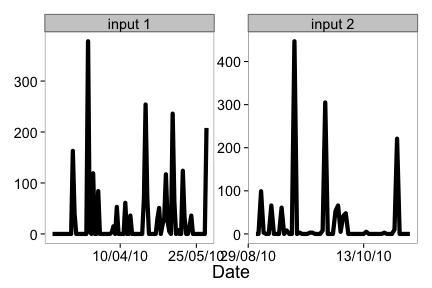

<section id="installation">

## Installation


Install and load `rnoaa` into the R session. Stable version from CRAN


```r
install.packages("rnoaa")
```

Or development version from Github:


```r
install.packages("devtools")
devtools::install_github("rnoaa", "ropensci")
```


```r
library('rnoaa')
library('plyr')
```

__Note__ that NOAA buoy data requires `netcdf`, and the `ncdf4` R package, which doesn't work well on Windows. Thus, we put functions to interact with that data into a different branch `buoy`. Install that version by doing


```r
devtools::install_github("rnoaa", "ropensci", ref="buoy")
library('rnoaa')
```

<section id="usage">

## Usage

## National Climatic Data Center (NCDC) data

### Get info on a station by specifying a datasetid, locationid, and stationid


```r
ncdc_stations(datasetid='GHCND', locationid='FIPS:12017', stationid='GHCND:USC00084289')
```

```
## $meta
## NULL
## 
## $data
##                  id elevation                  name elevationUnit
## 1 GHCND:USC00084289      12.2 INVERNESS 3 SE, FL US        METERS
##   datacoverage longitude    mindate latitude    maxdate
## 1            1    -82.31 1899-02-01     28.8 2014-08-05
## 
## attr(,"class")
## [1] "ncdc_stations"
```

### Search for data and get a data.frame


```r
out <- ncdc(datasetid='NORMAL_DLY', datatypeid='dly-tmax-normal', startdate = '2010-05-01', enddate = '2010-05-10')
```

See a data.frame


```r
out$data
```

```
##              station value        datatype                date fl_c
## 1  GHCND:AQW00061705   869 DLY-TMAX-NORMAL 2010-05-01T00:00:00    C
## 2  GHCND:CAW00064757   607 DLY-TMAX-NORMAL 2010-05-01T00:00:00    Q
## 3  GHCND:CQC00914080   840 DLY-TMAX-NORMAL 2010-05-01T00:00:00    R
## 4  GHCND:CQC00914801   858 DLY-TMAX-NORMAL 2010-05-01T00:00:00    R
## 5  GHCND:FMC00914395   876 DLY-TMAX-NORMAL 2010-05-01T00:00:00    P
## 6  GHCND:FMC00914419   885 DLY-TMAX-NORMAL 2010-05-01T00:00:00    P
## 7  GHCND:FMC00914446   885 DLY-TMAX-NORMAL 2010-05-01T00:00:00    P
## 8  GHCND:FMC00914482   868 DLY-TMAX-NORMAL 2010-05-01T00:00:00    R
## 9  GHCND:FMC00914720   899 DLY-TMAX-NORMAL 2010-05-01T00:00:00    R
## 10 GHCND:FMC00914761   897 DLY-TMAX-NORMAL 2010-05-01T00:00:00    P
## 11 GHCND:FMC00914831   870 DLY-TMAX-NORMAL 2010-05-01T00:00:00    P
## 12 GHCND:FMC00914892   883 DLY-TMAX-NORMAL 2010-05-01T00:00:00    P
## 13 GHCND:FMC00914898   875 DLY-TMAX-NORMAL 2010-05-01T00:00:00    P
## 14 GHCND:FMC00914911   885 DLY-TMAX-NORMAL 2010-05-01T00:00:00    P
## 15 GHCND:FMW00040308   888 DLY-TMAX-NORMAL 2010-05-01T00:00:00    S
## 16 GHCND:FMW00040504   879 DLY-TMAX-NORMAL 2010-05-01T00:00:00    C
## 17 GHCND:FMW00040505   867 DLY-TMAX-NORMAL 2010-05-01T00:00:00    S
## 18 GHCND:GQC00914025   852 DLY-TMAX-NORMAL 2010-05-01T00:00:00    P
## 19 GHCND:GQW00041415   877 DLY-TMAX-NORMAL 2010-05-01T00:00:00    C
## 20 GHCND:JQW00021603   852 DLY-TMAX-NORMAL 2010-05-01T00:00:00    P
## 21 GHCND:PSC00914519   883 DLY-TMAX-NORMAL 2010-05-01T00:00:00    P
## 22 GHCND:PSC00914712   840 DLY-TMAX-NORMAL 2010-05-01T00:00:00    P
## 23 GHCND:PSW00040309   879 DLY-TMAX-NORMAL 2010-05-01T00:00:00    S
## 24 GHCND:RMW00040604   867 DLY-TMAX-NORMAL 2010-05-01T00:00:00    S
## 25 GHCND:RMW00040710   863 DLY-TMAX-NORMAL 2010-05-01T00:00:00    C
```

### Plot data, super simple, but it's a start


```r
out <- ncdc(datasetid='NORMAL_DLY', stationid='GHCND:USW00014895', datatypeid='dly-tmax-normal', startdate = '2010-01-01', enddate = '2010-12-10', limit = 300)
ncdc_plot(out)
```

 

Note that the x-axis tick text is not readable, but see futher down in tutorial for how to adjust that. 

### More on plotting

#### Example 1

Search for data first, then plot


```r
out <- ncdc(datasetid='GHCND', stationid='GHCND:USW00014895', datatypeid='PRCP', startdate = '2010-05-01', enddate = '2010-10-31', limit=500)
```

Default plot


```r
ncdc_plot(out)
```

 

Create 14 day breaks


```r
ncdc_plot(out, breaks="14 days")
```

 

One month breaks


```r
ncdc_plot(out, breaks="1 month", dateformat="%d/%m")
```

 

#### Example 2

Search for data


```r
out2 <- ncdc(datasetid='GHCND', stationid='GHCND:USW00014895', datatypeid='PRCP', startdate = '2010-05-01', enddate = '2010-05-03', limit=100)
```

Make a plot, with 6 hour breaks, and date format with only hour


```r
ncdc_plot(out2, breaks="6 hours", dateformat="%H")
```

 

### Combine many calls to noaa function

Search for two sets of data


```r
out1 <- ncdc(datasetid='GHCND', stationid='GHCND:USW00014895', datatypeid='PRCP', startdate = '2010-03-01', enddate = '2010-05-31', limit=500)

out2 <- ncdc(datasetid='GHCND', stationid='GHCND:USW00014895', datatypeid='PRCP', startdate = '2010-09-01', enddate = '2010-10-31', limit=500)
```

Then combine with a call to `ncdc_combine`


```r
df <- ncdc_combine(out1, out2)
head(df[[1]]); tail(df[[1]])
```

```
##             station value datatype                date fl_m fl_q fl_so
## 1 GHCND:USW00014895     0     PRCP 2010-03-01T00:00:00    T          0
## 2 GHCND:USW00014895     0     PRCP 2010-03-02T00:00:00    T          0
## 3 GHCND:USW00014895     0     PRCP 2010-03-03T00:00:00    T          0
## 4 GHCND:USW00014895     0     PRCP 2010-03-04T00:00:00               0
## 5 GHCND:USW00014895     0     PRCP 2010-03-05T00:00:00               0
## 6 GHCND:USW00014895     0     PRCP 2010-03-06T00:00:00               0
##   fl_t
## 1 2400
## 2 2400
## 3 2400
## 4 2400
## 5 2400
## 6 2400
```

```
##               station value datatype                date fl_m fl_q fl_so
## 148 GHCND:USW00014895   221     PRCP 2010-10-26T00:00:00               0
## 149 GHCND:USW00014895     0     PRCP 2010-10-27T00:00:00               0
## 150 GHCND:USW00014895     0     PRCP 2010-10-28T00:00:00    T          0
## 151 GHCND:USW00014895     0     PRCP 2010-10-29T00:00:00    T          0
## 152 GHCND:USW00014895     0     PRCP 2010-10-30T00:00:00               0
## 153 GHCND:USW00014895     0     PRCP 2010-10-31T00:00:00               0
##     fl_t
## 148 2400
## 149 2400
## 150 2400
## 151 2400
## 152 2400
## 153 2400
```

Then plot - the default passing in the combined plot plots the data together. In this case it looks kind of weird since a straight line combines two distant dates.


```r
ncdc_plot(df)
```

 

But we can pass in each separately, which uses `facet_wrap` in `ggplot2` to plot each set of data in its own panel.


```r
ncdc_plot(out1, out2, breaks="45 days")
```

 

### ERDDAP data


#### Passing the datasetid without fields gives all columns back


```r
out <- erddap_data(datasetid='erdCalCOFIfshsiz')
nrow(out)
```

```
## [1] 20939
```

#### Pass time constraints


```r
head(erddap_data(datasetid='erdCalCOFIfshsiz', 'time>=2001-07-07', 'time<=2001-07-08')[,c(1:4)])
```

```
##   cruise               ship ship_code order_occupied
## 2 200106 DAVID STARR JORDAN        JD             43
## 3 200106 DAVID STARR JORDAN        JD             43
## 4 200106 DAVID STARR JORDAN        JD             43
## 5 200106 DAVID STARR JORDAN        JD             43
## 6 200106 DAVID STARR JORDAN        JD             43
## 7 200106 DAVID STARR JORDAN        JD             43
```

#### Pass in fields (i.e., columns to retrieve) & time constraints


```r
head(erddap_data(datasetid='erdCalCOFIfshsiz', fields=c('longitude','latitude','fish_size','itis_tsn'), 'time>=2001-07-07','time<=2001-07-10'))
```

```
##    longitude  latitude fish_size itis_tsn
## 2    -118.26    33.255      22.9   623745
## 3    -118.26    33.255      22.9   623745
## 4 -118.10667 32.738335      31.5   623625
## 5 -118.10667 32.738335      48.3   623625
## 6 -118.10667 32.738335      15.5   162221
## 7 -118.10667 32.738335      16.3   162221
```


```r
head(erddap_data(datasetid='erdCinpKfmBT', fields=c('latitude','longitude',
   'Aplysia_californica_Mean_Density','Muricea_californica_Mean_Density'),
   'time>=2007-06-24','time<=2007-07-01'))
```

```
##           latitude         longitude Aplysia_californica_Mean_Density
## 2             34.0 -119.416666666667                      0.009722223
## 3             34.0 -119.383333333333                              0.0
## 4             34.0 -119.366666666667                              0.0
## 5             34.0 -119.383333333333                             0.16
## 6             34.0 -119.416666666667                             0.03
## 7 34.0166666666667           -119.35                              0.0
##   Muricea_californica_Mean_Density
## 2                             0.01
## 3                     0.0013888889
## 4                              0.0
## 5                             0.01
## 6                             0.04
## 7                              0.0
```

#### An example workflow

Search for data


```r
(out <- erddap_search(query='fish size'))
```

```
## 7 results, showing first 20 
##                                         title          dataset_id
## 1                          CalCOFI Fish Sizes    erdCalCOFIfshsiz
## 2                        CalCOFI Larvae Sizes    erdCalCOFIlrvsiz
## 3                                CalCOFI Tows      erdCalCOFItows
## 4     GLOBEC NEP MOCNESS Plankton (MOC1) Data       erdGlobecMoc1
## 5 GLOBEC NEP Vertical Plankton Tow (VPT) Data        erdGlobecVpt
## 6         CalCOFI Larvae Counts Positive Tows erdCalCOFIlrvcntpos
## 7  OBIS - ARGOS Satellite Tracking of Animals           aadcArgos
```

Using a datasetid, search for information on a datasetid


```r
id <- out$info$dataset_id[1]
erddap_info(datasetid=id)$variables
```

```
##           variable_name data_type           actual_range
## 1  calcofi_species_code       int               19, 1550
## 2           common_name    String                       
## 3                cruise    String                       
## 4           fish_1000m3     float                       
## 5            fish_count     float                       
## 6             fish_size     float                       
## 7              itis_tsn       int                       
## 8              latitude     float         32.515, 38.502
## 9                  line     float             46.6, 93.3
## 10            longitude     float        -128.5, -117.33
## 11         net_location    String                       
## 12             net_type    String                       
## 13       order_occupied       int                       
## 14       percent_sorted     float                       
## 15       sample_quality     float                       
## 16      scientific_name    String                       
## 17                 ship    String                       
## 18            ship_code    String                       
## 19 standard_haul_factor     float                       
## 20              station     float            28.0, 114.9
## 21                 time    double 9.94464E8, 9.9510582E8
## 22           tow_number       int                  2, 10
## 23             tow_type    String                       
## 24       volume_sampled     float
```

Get data from the dataset


```r
head(erddap_data(datasetid = id, fields = c('latitude','longitude','scientific_name')))
```

```
##    latitude  longitude       scientific_name
## 2 35.038334 -120.88333 Microstomus pacificus
## 3  34.97167 -121.02333    Cyclothone signata
## 4  34.97167 -121.02333    Cyclothone signata
## 5  34.97167 -121.02333    Cyclothone signata
## 6  34.97167 -121.02333    Cyclothone signata
## 7  34.97167 -121.02333    Cyclothone signata
```


### Severe Weather Data Inventory (SWDI) data

#### Search for nx3tvs data from 5 May 2006 to 6 May 2006


```r
swdi(dataset='nx3tvs', startdate='20060505', enddate='20060506')
```

```
## $meta
## $meta$totalCount
## [1] 25
## 
## $meta$totalTimeInSeconds
## [1] 0.006
## 
## 
## $data
##                   ztime wsr_id cell_id cell_type range azimuth max_shear
## 1  2006-05-05T00:05:50Z   KBMX      Q0       TVS     7     217       403
## 2  2006-05-05T00:10:02Z   KBMX      Q0       TVS     5     208       421
## 3  2006-05-05T00:12:34Z   KSJT      P2       TVS    49     106        17
## 4  2006-05-05T00:17:31Z   KSJT      B4       TVS    40     297        25
## 5  2006-05-05T00:29:13Z   KMAF      H4       TVS    53     333        34
## 6  2006-05-05T00:31:25Z   KLBB      N0       TVS    51     241        24
## 7  2006-05-05T00:33:25Z   KMAF      H4       TVS    52     334        46
## 8  2006-05-05T00:37:37Z   KMAF      H4       TVS    50     334        34
## 9  2006-05-05T00:41:51Z   KMAF      H4       TVS    51     335        29
## 10 2006-05-05T00:44:33Z   KLBB      N0       TVS    46     245        35
## 11 2006-05-05T00:46:03Z   KMAF      H4       TVS    49     335        41
## 12 2006-05-05T00:48:55Z   KLBB      N0       TVS    44     246        44
## 13 2006-05-05T00:50:16Z   KMAF      H4       TVS    49     337        33
## 14 2006-05-05T00:54:29Z   KMAF      H4       TVS    47     337        42
## 15 2006-05-05T00:57:42Z   KLBB      N0       TVS    41     251        46
## 16 2006-05-05T00:58:41Z   KMAF      H4       TVS    46     340        29
## 17 2006-05-05T01:02:04Z   KLBB      N0       TVS    39     251        42
## 18 2006-05-05T01:02:53Z   KMAF      H4       TVS    46     339        35
## 19 2006-05-05T01:02:53Z   KMAF      H4       TVS    50     338        27
## 20 2006-05-05T01:06:26Z   KLBB      N0       TVS    36     251        31
## 21 2006-05-05T01:07:06Z   KMAF      F5       TVS    45     342        44
## 22 2006-05-05T01:10:48Z   KLBB      N0       TVS    36     256        37
## 23 2006-05-05T01:11:18Z   KMAF      F5       TVS    45     343        39
## 24 2006-05-05T01:15:30Z   KMAF      F5       TVS    44     344        30
## 25 2006-05-05T01:15:30Z   KMAF      H4       TVS    49     341        26
##    mxdv
## 1   116
## 2   120
## 3    52
## 4    62
## 5   111
## 6    78
## 7   145
## 8   107
## 9    91
## 10  100
## 11  127
## 12  121
## 13   98
## 14  126
## 15  117
## 16   85
## 17  102
## 18  101
## 19   84
## 20   70
## 21  120
## 22   83
## 23  108
## 24   78
## 25   81
## 
## $shape
##                                         shape
## 1  POINT (-86.8535716274277 33.0786326913943)
## 2  POINT (-86.8165772540846 33.0982820681588)
## 3  POINT (-99.5771091971025 31.1421609654838)
## 4   POINT (-101.188161700093 31.672392833416)
## 5  POINT (-102.664426480293 32.7306917937698)
## 6   POINT (-102.70047613441 33.2380072329615)
## 7    POINT (-102.6393683028 32.7226656893341)
## 8  POINT (-102.621904684258 32.6927081076156)
## 9   POINT (-102.614794815627 32.714139844846)
## 10 POINT (-102.643380529494 33.3266446067682)
## 11 POINT (-102.597961935071 32.6839260102062)
## 12 POINT (-102.613894688178 33.3526192273658)
## 13 POINT (-102.567153417051 32.6956373348052)
## 14  POINT (-102.551596970251 32.664939580306)
## 15 POINT (-102.586119971014 33.4287323151248)
## 16 POINT (-102.499638479193 32.6644438090742)
## 17   POINT (-102.5485490063 33.4398330734778)
## 18  POINT (-102.51446954228 32.6597119240996)
## 19 POINT (-102.559031583693 32.7166090376869)
## 20 POINT (-102.492174522228 33.4564626989719)
## 21 POINT (-102.463540844324 32.6573739036181)
## 22 POINT (-102.510349454162 33.5066366303981)
## 23 POINT (-102.448763863447 32.6613484943994)
## 24   POINT (-102.42842159557 32.649061124799)
## 25 POINT (-102.504158884526 32.7162751126854)
## 
## attr(,"class")
## [1] "swdi"
```

#### Use an id


```r
out <- swdi(dataset='warn', startdate='20060506', enddate='20060507', id=533623)
list(out$meta, head(out$data), head(out$shape))
```

```
## [[1]]
## [[1]]$totalCount
## [1] 25
## 
## [[1]]$totalTimeInSeconds
## [1] 0.087
## 
## 
## [[2]]
##            ztime_start            ztime_end     id         warningtype
## 1 2006-05-05T22:53:00Z 2006-05-06T00:00:00Z 397428 SEVERE THUNDERSTORM
## 2 2006-05-05T22:55:00Z 2006-05-06T00:00:00Z 397429 SEVERE THUNDERSTORM
## 3 2006-05-05T22:55:00Z 2006-05-06T00:00:00Z 397430 SEVERE THUNDERSTORM
## 4 2006-05-05T22:57:00Z 2006-05-06T00:00:00Z 397431 SEVERE THUNDERSTORM
## 5 2006-05-05T23:03:00Z 2006-05-06T00:00:00Z 397434 SEVERE THUNDERSTORM
## 6 2006-05-05T23:14:00Z 2006-05-06T00:15:00Z 397437 SEVERE THUNDERSTORM
##   issuewfo messageid
## 1     KLCH    052252
## 2     KLUB    052256
## 3     KLUB    052256
## 4     KMAF    052258
## 5     KMAF    052305
## 6     KLUB    052315
## 
## [[3]]
##                                                                                                                                                          shape
## 1                                                                             POLYGON ((-93.27 30.38, -93.29 30.18, -93.02 30.18, -93.04 30.37, -93.27 30.38))
## 2                                                                        POLYGON ((-101.93 34.74, -101.96 34.35, -101.48 34.42, -101.49 34.74, -101.93 34.74))
## 3                POLYGON ((-100.36 33.03, -99.99 33.3, -99.99 33.39, -100.28 33.39, -100.5 33.18, -100.51 33.02, -100.45 32.97, -100.37 33.03, -100.36 33.03))
## 4                                            POLYGON ((-102.8 30.74, -102.78 30.57, -102.15 30.61, -102.15 30.66, -101.92 30.68, -102.07 30.83, -102.8 30.74))
## 5                                                                        POLYGON ((-103.02 32.94, -103.03 32.66, -102.21 32.53, -102.22 32.95, -103.02 32.94))
## 6 POLYGON ((-101.6 33.32, -101.57 33.31, -101.57 33.51, -101.65 33.51, -101.66 33.5, -101.75 33.5, -101.77 33.49, -101.84 33.49, -101.84 33.32, -101.6 33.32))
```

#### Get all 'plsr' within the bounding box (-91,30,-90,31)


```r
swdi(dataset='plsr', startdate='20060505', enddate='20060510', bbox=c(-91,30,-90,31))
```

```
## $meta
## $meta$totalCount
## [1] 5
## 
## $meta$totalTimeInSeconds
## [1] 0.014
## 
## 
## $data
##                  ztime     id        event magnitude            city
## 1 2006-05-09T02:20:00Z 427540         HAIL         1    5 E KENTWOOD
## 2 2006-05-09T02:40:00Z 427536         HAIL         1    MOUNT HERMAN
## 3 2006-05-09T02:40:00Z 427537 TSTM WND DMG     -9999    MOUNT HERMAN
## 4 2006-05-09T03:00:00Z 427199         HAIL         0     FRANKLINTON
## 5 2006-05-09T03:17:00Z 427200      TORNADO     -9999 5 S FRANKLINTON
##       county state          source
## 1 TANGIPAHOA    LA TRAINED SPOTTER
## 2 WASHINGTON    LA TRAINED SPOTTER
## 3 WASHINGTON    LA TRAINED SPOTTER
## 4 WASHINGTON    LA   AMATEUR RADIO
## 5 WASHINGTON    LA LAW ENFORCEMENT
## 
## $shape
##                  shape
## 1 POINT (-90.43 30.93)
## 2  POINT (-90.3 30.96)
## 3  POINT (-90.3 30.96)
## 4 POINT (-90.14 30.85)
## 5 POINT (-90.14 30.78)
## 
## attr(,"class")
## [1] "swdi"
```


### Sea ice data

#### Map all years for April only for North pole


```r
urls <- seaiceeurls(mo='Apr', pole='N')[1:10]
out <- lapply(urls, seaice)
names(out) <- seq(1979,1988,1)
df <- ldply(out)
library('ggplot2')
ggplot(df, aes(long, lat, group=group)) +
  geom_polygon(fill="steelblue") +
  theme_ice() +
  facet_wrap(~ .id)
```


<section id="citing">

## Citing

To cite `rnoaa` in publications use:

<br>

> Hart Edmund, Scott Chamberlain and Karthik Ram (2014). rnoaa: NOAA climate data from R. R package version 0.2.0. https://github.com/ropensci/rnoaa

<section id="license_bugs">

## License and bugs

* License: [MIT](http://opensource.org/licenses/MIT)
* Report bugs at [our Github repo for rnoaa](https://github.com/ropensci/rnoaa/issues?state=open)

[Back to top](#top)
