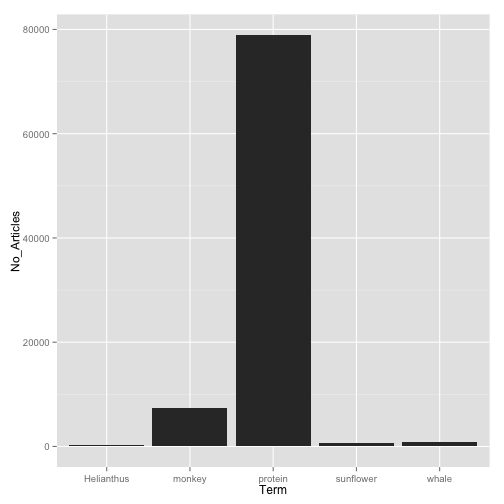
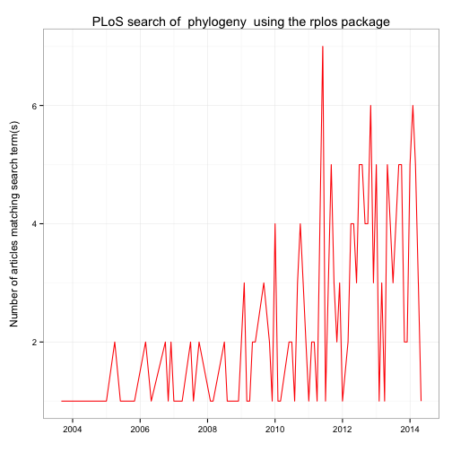
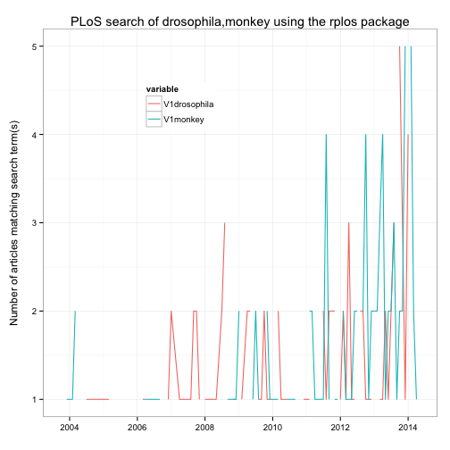

The `rplos` package interacts with the API services of [PLoS](http://www.plos.org/) (Public Library of Science) Journals. In order to use `rplos`, you need to obtain [your own key](http://api.plos.org/registration/) to their API services. Instruction for obtaining and installing keys so they load automatically when you launch R are on our GitHub Wiki page [Installation and use of API keys](https://github.com/ropensci/rOpenSci/wiki/Installation-and-use-of-API-keys).

This tutorial will go through three use cases to demonstrate the kinds
of things possible in `rplos`.

* Search across PLoS papers in various sections of papers
* Search for terms and visualize results as a histogram OR as a plot through time
* Text mining of scientific literature

<section id="installation">

## Installation


```r
install.packages("rplos")
```


```r
library(rplos)
```

<section id="usage">

## Usage

### Search across PLoS papers in various sections of papers

`searchplos` is a general search, and in this case searches for the term
**Helianthus** and returns the DOI's of matching papers


```r
searchplos(terms = "Helianthus", fields = "id", limit = 5)
```

```
                            id
1 10.1371/journal.pone.0057533
2 10.1371/journal.pone.0045899
3 10.1371/journal.pone.0037191
4 10.1371/journal.pone.0051360
5 10.1371/journal.pone.0070347
```

Get only full article DOIs


```r
searchplos(terms="*:*", fields='id', toquery='doc_type:full', start=0, limit=20)
```

```
                             id
1  10.1371/journal.pone.0022949
2  10.1371/journal.pone.0043127
3  10.1371/journal.pone.0043130
4  10.1371/journal.pone.0063109
5  10.1371/journal.pgen.1004031
6  10.1371/journal.pone.0035056
7  10.1371/journal.pone.0067081
8  10.1371/journal.pone.0002872
9  10.1371/journal.pntd.0001688
10 10.1371/journal.pone.0087263
11 10.1371/journal.pone.0055161
12 10.1371/journal.pone.0043131
13 10.1371/journal.pone.0022955
14 10.1371/journal.pone.0095375
15 10.1371/journal.pone.0043132
16 10.1371/journal.pone.0083305
17 10.1371/journal.pone.0006850
18 10.1371/journal.pone.0063113
19 10.1371/journal.ppat.1003208
20 10.1371/journal.pone.0014825
```

Get DOIs for only PLoS One articles


```r
searchplos(terms="*:*", fields='id', toquery='cross_published_journal_key:PLoSONE', start=0, limit=15)
```

```
                                                    id
1                         10.1371/journal.pone.0022949
2            10.1371/journal.pone.0075114/introduction
3                         10.1371/journal.pone.0043127
4                   10.1371/journal.pone.0043127/title
5                10.1371/journal.pone.0043127/abstract
6              10.1371/journal.pone.0043127/references
7                    10.1371/journal.pone.0043127/body
8            10.1371/journal.pone.0043127/introduction
9  10.1371/journal.pone.0043127/results_and_discussion
10  10.1371/journal.pone.0043127/materials_and_methods
11 10.1371/journal.pone.0043127/supporting_information
12                  10.1371/journal.pone.0014823/title
13               10.1371/journal.pone.0047077/abstract
14               10.1371/journal.pone.0014823/abstract
15             10.1371/journal.pone.0014823/references
```

Get DOIs for full article in PLoS One


```r
searchplos(terms="*:*", fields='id',
   toquery=list('cross_published_journal_key:PLoSONE', 'doc_type:full'),
   start=0, limit=20)
```

```
                             id
1  10.1371/journal.pone.0022949
2  10.1371/journal.pone.0043127
3  10.1371/journal.pone.0043130
4  10.1371/journal.pone.0063109
5  10.1371/journal.pone.0035056
6  10.1371/journal.pone.0067081
7  10.1371/journal.pone.0002872
8  10.1371/journal.pone.0087263
9  10.1371/journal.pone.0055161
10 10.1371/journal.pone.0043131
11 10.1371/journal.pone.0022955
12 10.1371/journal.pone.0095375
13 10.1371/journal.pone.0043132
14 10.1371/journal.pone.0083305
15 10.1371/journal.pone.0006850
16 10.1371/journal.pone.0063113
17 10.1371/journal.pone.0014825
18 10.1371/journal.pone.0035061
19 10.1371/journal.pone.0019074
20 10.1371/journal.pone.0039111
```

Serch for many terms


```r
terms <- c('ecology','evolution','science')
lapply(terms, function(x) searchplos(x, limit=2))
```

```
[[1]]
                            id
1 10.1371/journal.pone.0059813
2 10.1371/journal.pone.0001248

[[2]]
                                                       id
1 10.1371/annotation/c55d5089-ba2f-449d-8696-2bc8395978db
2 10.1371/annotation/9773af53-a076-4946-a3f1-83914226c10d

[[3]]
                            id
1 10.1371/journal.pbio.0020122
2 10.1371/journal.pbio.1001166
```

### Search on specific sections

A suite of functions were created as light wrappers around `searchplos` as a shorthand to search specific sections of a paper.

* `plosauthor` searchers in authors
* `plosabstract` searches in abstracts
* `plostitle` searches in titles
* `plosfigtabcaps` searches in figure and table captions
* `plossubject` searches in subject areas

`plosauthor` searches across authors, and in this case returns the authors of the matching papers. the fields parameter determines what is returned


```r
plosauthor(terms = "Eisen", fields = "author", limit = 10)
```

```
             author
1  Jonathan A Eisen
2  Jonathan A Eisen
3  Jonathan A Eisen
4  Jonathan A Eisen
5  Jonathan A Eisen
6  Jonathan A Eisen
7  Jonathan A Eisen
8  Jonathan A Eisen
9  Jonathan A Eisen
10 Jonathan A Eisen
```

`plosabstract` searches across abstracts, and in this case returns the id and title of the matching papers


```r
plosabstract(terms = 'drosophila', fields='id,title', limit = 5)
```

```
                            id
1 10.1371/journal.pbio.0040198
2 10.1371/journal.pbio.0030246
3 10.1371/journal.pone.0012421
4 10.1371/journal.pone.0002817
5 10.1371/journal.pbio.1000342
                                                                            title
1                                                                     All for All
2                                     School Students as Drosophila Experimenters
3                            Host Range and Specificity of the Drosophila C Virus
4 High-Resolution, In Vivo Magnetic Resonance Imaging of Drosophila at 18.8 Tesla
5       Variable Transcription Factor Binding: A Mechanism of Evolutionary Change
```

`plostitle` searches across titles, and in this case returns the title and journal of the matching papers


```r
plostitle(terms='drosophila', fields='title,journal', limit=10)
```

```
                      journal
1                PLoS Biology
2                PLoS Biology
3                PLoS Biology
4                PLoS Biology
5  PLoS Computational Biology
6               PLoS Genetics
7                    PLoS ONE
8                    PLoS ONE
9                    PLoS ONE
10               PLoS Biology
                                                   title
1       Reinforcement of Gametic Isolation in Drosophila
2            Expression in Aneuploid Drosophila S2 Cells
3            Combinatorial Coding for Drosophila Neurons
4            School Students as Drosophila Experimenters
5             Parametric Alignment of Drosophila Genomes
6  Phenotypic Plasticity of the Drosophila Transcriptome
7               A Tripartite Synapse Model in Drosophila
8                              A DNA Virus of Drosophila
9            Quantification of Food Intake in Drosophila
10         Identification of Drosophila MicroRNA Targets
```

### Search for terms and visualize results as a histogram OR as a plot through time

`plosword` allows you to search for 1 to K words and visualize the results
as a histogram, comparing number of matching papers for each word


```r
out <- plosword(list("monkey", "Helianthus", "sunflower", "protein", "whale"),
    vis = "TRUE")
out$table
```

```
  No_Articles       Term
1        7326     monkey
2         244 Helianthus
3         671  sunflower
4       79304    protein
5         874      whale
```

```r
out$plot
```

 

You can also pass in curl options, in this case get verbose information on the curl call.


```r
plosword('Helianthus', callopts=list(verbose=TRUE))
```

```
Number of articles with search term 
                                244 
```

### Visualize terms

`plot_througtime` allows you to search for up to 2 words and visualize the results as a line plot through time, comparing number of articles matching through time. Visualize with the ggplot2 package, only up to two terms for now.


```r
plot_throughtime(terms = "phylogeny", limit = 200, gvis = FALSE)
```

 


```r
plot_throughtime(list("drosophila", "monkey"), 100)
```

 

OR using google visualizations through the googleVis package, check it your self using, e.g.


```r
plot_throughtime(terms = list("drosophila", "flower"), limit = 200, gvis = TRUE)
```

...And a google visualization will render on your local browser and you
can play with three types of plots (point, histogram, line), all through
time. The plot is not shown here, but try it out for yourself!!


<section id="citing">

## Citing

To cite `rplos` in publications use:

<br>

> Scott Chamberlain, Carl Boettiger and Karthik Ram (2014). rplos: Interface to PLoS Journals search API.. R package version 0.3.6. https://github.com/ropensci/rplos

<section id="license_bugs">

## License and bugs

* License: [CC0](http://creativecommons.org/choose/zero/)
* Report bugs at [our Github repo for rplos](https://github.com/ropensci/rplos/issues?state=open)

[Back to top](#top)
