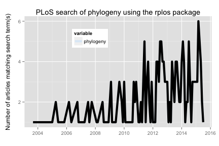

The `rplos` package interacts with the API services of [PLoS](http://www.plos.org/) (Public Library of Science) Journals. You used to need an API key to work with this package - that is no longer needed!

This tutorial will go through three use cases to demonstrate the kinds
of things possible in `rplos`.

* Search across PLoS papers in various sections of papers
* Search for terms and visualize results as a histogram OR as a plot through time
* Text mining of scientific literature

<section id="installation">

## Installation


```r
install.packages("rplos")
```


```r
library(rplos)
```

<section id="usage">

## Usage

### Search across PLoS papers in various sections of papers

`searchplos` is a general search, and in this case searches for the term
**Helianthus** and returns the DOI's of matching papers


```r
searchplos(q= "Helianthus", fl= "id", limit = 5)
```

```
#> $meta
#>   numFound start maxScore
#> 1      396     0       NA
#> 
#> $data
#>                             id
#> 1 10.1371/journal.pone.0111982
#> 2 10.1371/journal.pone.0139188
#> 3 10.1371/journal.pone.0057533
#> 4 10.1371/journal.pone.0045899
#> 5 10.1371/journal.pone.0037191
```

Get only full article DOIs


```r
searchplos(q="*:*", fl='id', fq='doc_type:full', start=0, limit=5)
```

```
#> $meta
#>   numFound start maxScore
#> 1   174910     0       NA
#> 
#> $data
#>                                                        id
#> 1                            10.1371/journal.pbio.0000030
#> 2 10.1371/annotation/d090733e-1f34-43c5-a06a-255456946303
#> 3 10.1371/annotation/d1b28569-d9c0-4812-8332-9a6bfa9eb27f
#> 4 10.1371/annotation/d29aed40-7667-4901-8008-ef473c363216
#> 5 10.1371/annotation/d271d9c1-5588-4b43-85c3-d3de58ab61a4
```

Get DOIs for only PLoS One articles


```r
searchplos(q="*:*", fl='id', fq='cross_published_journal_key:PLoSONE', start=0, limit=5)
```

```
#> $meta
#>   numFound start maxScore
#> 1  1268014     0       NA
#> 
#> $data
#>                                                                   id
#> 1            10.1371/annotation/d090733e-1f34-43c5-a06a-255456946303
#> 2      10.1371/annotation/d090733e-1f34-43c5-a06a-255456946303/title
#> 3   10.1371/annotation/d090733e-1f34-43c5-a06a-255456946303/abstract
#> 4 10.1371/annotation/d090733e-1f34-43c5-a06a-255456946303/references
#> 5       10.1371/annotation/d090733e-1f34-43c5-a06a-255456946303/body
```

Get DOIs for full article in PLoS One


```r
searchplos(q="*:*", fl='id',
   fq=list('cross_published_journal_key:PLoSONE', 'doc_type:full'),
   start=0, limit=5)
```

```
#> $meta
#>   numFound start maxScore
#> 1   148355     0       NA
#> 
#> $data
#>                                                        id
#> 1 10.1371/annotation/d090733e-1f34-43c5-a06a-255456946303
#> 2 10.1371/annotation/d1b28569-d9c0-4812-8332-9a6bfa9eb27f
#> 3 10.1371/annotation/d29aed40-7667-4901-8008-ef473c363216
#> 4 10.1371/annotation/d271d9c1-5588-4b43-85c3-d3de58ab61a4
#> 5 10.1371/annotation/d2692d0c-26c3-4a7d-b4f5-1139e051e59a
```

Search for many terms


```r
q <- c('ecology','evolution','science')
lapply(q, function(x) searchplos(x, limit=2))
```

```
#> [[1]]
#> [[1]]$meta
#>   numFound start maxScore
#> 1    30856     0       NA
#> 
#> [[1]]$data
#>                             id
#> 1 10.1371/journal.pone.0059813
#> 2 10.1371/journal.pone.0001248
#> 
#> 
#> [[2]]
#> [[2]]$meta
#>   numFound start maxScore
#> 1    50847     0       NA
#> 
#> [[2]]$data
#>                                                        id
#> 1 10.1371/annotation/c55d5089-ba2f-449d-8696-2bc8395978db
#> 2 10.1371/annotation/9773af53-a076-4946-a3f1-83914226c10d
#> 
#> 
#> [[3]]
#> [[3]]$meta
#>   numFound start maxScore
#> 1   147829     0       NA
#> 
#> [[3]]$data
#>                             id
#> 1 10.1371/journal.pbio.0020122
#> 2 10.1371/journal.pbio.1001166
```

### Search on specific sections

A suite of functions were created as light wrappers around `searchplos` as a shorthand to search specific sections of a paper.

* `plosauthor` searchers in authors
* `plosabstract` searches in abstracts
* `plostitle` searches in titles
* `plosfigtabcaps` searches in figure and table captions
* `plossubject` searches in subject areas

`plosauthor` searches across authors, and in this case returns the authors of the matching papers. the fl parameter determines what is returned


```r
plosauthor(q = "Eisen", fl = "author", limit = 5)
```

```
#> $meta
#>   numFound start maxScore
#> 1      824     0       NA
#> 
#> $data
#>             author
#> 1 Jonathan A Eisen
#> 2 Jonathan A Eisen
#> 3 Jonathan A Eisen
#> 4 Jonathan A Eisen
#> 5 Jonathan A Eisen
```

`plosabstract` searches across abstracts, and in this case returns the id and title of the matching papers


```r
plosabstract(q = 'drosophila', fl='id,title', limit = 5)
```

```
#> $meta
#>   numFound start maxScore
#> 1     2835     0       NA
#> 
#> $data
#>                             id
#> 1 10.1371/journal.pbio.0040198
#> 2 10.1371/journal.pbio.0030246
#> 3 10.1371/journal.pone.0012421
#> 4 10.1371/journal.pone.0002817
#> 5 10.1371/journal.pbio.1000342
#>                                                                             title
#> 1                                                                     All for All
#> 2                                     School Students as Drosophila Experimenters
#> 3                            Host Range and Specificity of the Drosophila C Virus
#> 4 High-Resolution, In Vivo Magnetic Resonance Imaging of Drosophila at 18.8 Tesla
#> 5       Variable Transcription Factor Binding: A Mechanism of Evolutionary Change
```

`plostitle` searches across titles, and in this case returns the title and journal of the matching papers


```r
plostitle(q='drosophila', fl='title,journal', limit=5)
```

```
#> $meta
#>   numFound start maxScore
#> 1     1838     0       NA
#> 
#> $data
#>                      journal
#> 1                   PLoS ONE
#> 2              PLoS Genetics
#> 3                   PLoS ONE
#> 4                   PLoS ONE
#> 5 PLOS Computational Biology
#>                                                   title
#> 1           Quantification of Food Intake in Drosophila
#> 2 Phenotypic Plasticity of the Drosophila Transcriptome
#> 3                             A DNA Virus of Drosophila
#> 4              A Tripartite Synapse Model in Drosophila
#> 5                A Model of Drosophila Larva Chemotaxis
```

### Search for terms and visualize results as a histogram OR as a plot through time

`plosword` allows you to search for 1 to K words and visualize the results
as a histogram, comparing number of matching papers for each word


```r
out <- plosword(list("monkey", "Helianthus", "sunflower", "protein", "whale"),
    vis = "TRUE")
out$table
```

```
#>   No_Articles       Term
#> 1        9841     monkey
#> 2         396 Helianthus
#> 3        1060  sunflower
#> 4      109616    protein
#> 5        1268      whale
```


```r
out$plot
```

 

You can also pass in curl options, in this case get verbose information on the curl call.


```r
plosword('Helianthus', callopts=list(verbose=TRUE))
```

```
#> Number of articles with search term 
#>                                 396
```

### Visualize terms

`plot_throughtime` allows you to search for up to 2 words and visualize the results as a line plot through time, comparing number of articles matching through time. Visualize with the ggplot2 package, only up to two terms for now.


```r
plot_throughtime(terms = "phylogeny", limit = 200) + geom_line(size=2, color='black')
```

 

### Faceted search

In addition to `searchplos()` and related searching functions, there are a few slightly different ways to search: faceting and highlighted searches. Faceting allows you to ask, e.g., how many articles are published in each of the PLOS journals. Highlighting allows you to ask, e.g., highlight terms that I search for in the text results given back, which can make downstream processing easier, and help visualize search results (see `highbrow()` below).

Facet by journal


```r
facetplos(q='*:*', facet.field='journal')
```

```
#> $facet_queries
#> NULL
#> 
#> $facet_fields
#> $facet_fields$journal
#>                                 X1      X2
#> 1                         plos one 1209117
#> 2                    plos genetics   48536
#> 3                   plos pathogens   42131
#> 4       plos computational biology   35793
#> 5 plos neglected tropical diseases   32948
#> 6                     plos biology   28488
#> 7                    plos medicine   19776
#> 8             plos clinical trials     521
#> 9                     plos medicin       9
#> 
#> 
#> $facet_dates
#> NULL
#> 
#> $facet_ranges
#> NULL
```

Using `facet.query` to get counts


```r
facetplos(q='*:*', facet.field='journal', facet.query='cell,bird')
```

```
#> $facet_queries
#>        term value
#> 1 cell,bird    24
#> 
#> $facet_fields
#> $facet_fields$journal
#>                                 X1      X2
#> 1                         plos one 1209117
#> 2                    plos genetics   48536
#> 3                   plos pathogens   42131
#> 4       plos computational biology   35793
#> 5 plos neglected tropical diseases   32948
#> 6                     plos biology   28488
#> 7                    plos medicine   19776
#> 8             plos clinical trials     521
#> 9                     plos medicin       9
#> 
#> 
#> $facet_dates
#> NULL
#> 
#> $facet_ranges
#> NULL
```

Date faceting


```r
facetplos(q='*:*', url=url, facet.date='publication_date',
  facet.date.start='NOW/DAY-5DAYS', facet.date.end='NOW', facet.date.gap='+1DAY')
```

```
#> $facet_queries
#> NULL
#> 
#> $facet_fields
#> NULL
#> 
#> $facet_dates
#> $facet_dates$publication_date
#>                   date value
#> 1 2015-12-24T00:00:00Z     0
#> 2 2015-12-25T00:00:00Z     0
#> 3 2015-12-26T00:00:00Z     0
#> 4 2015-12-27T00:00:00Z   920
#> 5 2015-12-28T00:00:00Z  2161
#> 6 2015-12-29T00:00:00Z  1241
#> 
#> 
#> $facet_ranges
#> NULL
```

### Highlighted search

Search for the term _alcohol_ in the abstracts of articles, return only 10 results


```r
highplos(q='alcohol', hl.fl = 'abstract', rows=2)
```

```
#> $`10.1371/journal.pmed.0040151`
#> $`10.1371/journal.pmed.0040151`$abstract
#> [1] "Background: <em>Alcohol</em> consumption causes an estimated 4% of the global disease burden, prompting"
#> 
#> 
#> $`10.1371/journal.pone.0027752`
#> $`10.1371/journal.pone.0027752`$abstract
#> [1] "Background: The negative influences of <em>alcohol</em> on TB management with regard to delays in seeking"
```

Search for the term _alcohol_ in the abstracts of articles, and return fragment size of 20 characters, return only 5 results


```r
highplos(q='alcohol', hl.fl='abstract', hl.fragsize=20, rows=2)
```

```
#> $`10.1371/journal.pmed.0040151`
#> $`10.1371/journal.pmed.0040151`$abstract
#> [1] "Background: <em>Alcohol</em>"
#> 
#> 
#> $`10.1371/journal.pone.0027752`
#> $`10.1371/journal.pone.0027752`$abstract
#> [1] " of <em>alcohol</em> on TB management"
```

Search for the term _experiment_ across all sections of an article, return id (DOI) and title fl only, search in full articles only (via `fq='doc_type:full'`), and return only 10 results


```r
highplos(q='everything:"experiment"', fl='id,title', fq='doc_type:full',
   rows=2)
```

```
#> $`10.1371/journal.pone.0039681`
#> $`10.1371/journal.pone.0039681`$everything
#> [1] " Selection of Transcriptomics <em>Experiments</em> Improves Guilt-by-Association Analyses Transcriptomics <em>Experiment</em>"
#> 
#> 
#> $`10.1371/annotation/9b8741e2-0f5f-49f9-9eaa-1b0cb9b8d25f`
#> $`10.1371/annotation/9b8741e2-0f5f-49f9-9eaa-1b0cb9b8d25f`$everything
#> [1] " in the labels under the bars. The labels should read <em>Experiment</em> 3 / <em>Experiment</em> 4 instead of <em>Experiment</em>"
```

### Visualize highligted searches

Browse highlighted fragments in your default browser

This first examle, we only looko at 10 results


```r
out <- highplos(q='alcohol', hl.fl = 'abstract', rows=10)
highbrow(out)
```


But it works quickly with lots of results too


```r
out <- highplos(q='alcohol', hl.fl = 'abstract', rows=1200)
highbrow(out)
```


<section id="citing">

## Citing

To cite `rplos` in publications use:

<br>

> Scott Chamberlain, Carl Boettiger and Karthik Ram (2015). rplos: Interface to PLOS Journals search API. R package version 0.5.4 https://github.com/ropensci/rplos

<section id="license_bugs">

## License and bugs

* License: [MIT](http://opensource.org/licenses/MIT)
* Report bugs at [our Github repo for rplos](https://github.com/ropensci/rplos/issues?state=open)

[Back to top](#top)
