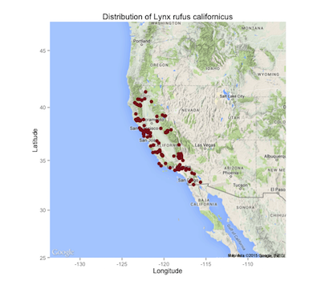

The rOpenSci projects aims to provide programmatic access to scientific data repositories on the web. A vast majority of the packages in our current suite retrieve some form of biodiversity or taxonomic data. Since several of these datasets have been georeferenced, it provides numerous opportunities for visualizing species distributions, building species distribution maps, and for using it analyses such as species distribution models. In an effort to streamline access to these data, we have developed a package called Spocc, which provides a unified API to all the biodiversity sources that we provide. The obvious advantage is that a user can interact with a common API and not worry about the nuances in syntax that differ between packages. As more data sources come online, users can access even more data without significant changes to their code. However, it is important to note that spocc will never replicate the full functionality that exists within specific packages. Therefore users with a strong interest in one of the specific data sources listed below would benefit from familiarising themselves with the inner working of the appropriate packages.

> `spocc` utilities for cleaning data and mapping have been moved to `spoccutils`

### Data Sources

`spocc` currently interfaces with six major biodiversity repositories

1. Global Biodiversity Information Facility (`rgbif`)
[GBIF](http://www.gbif.org/) is a government funded open data repository with several partner organizations with the express goal of providing access to data on Earth's biodiversity. The data are made available by a network of member nodes, coordinating information from various participant organizations and government agencies.

2. [iDigBio](https://www.idigbio.org/)
Integrated Digitized Biocollections (iDigBio) is the U.S. National Resource for Advancing Digitization of Biodiversity Collections (ADBC) funded by the National Science Foundation. Through ADBC, data and images for millions of biological specimens are being made available in electronic format for the research community, government agencies, students, educators, and the general public. Data are available via a specimen portal and the iDigBio Search APIs.

3. [Berkeley Ecoengine](http://ecoengine.berkeley.edu/) (`ecoengine`)
The ecoengine is an open API built by the [Berkeley Initiative for Global Change Biology](http://globalchange.berkeley.edu/). The repository provides access to over 3 million specimens from various Berkeley natural history museums. These data span more than a century and provide access to georeferenced specimens, species checklists, photographs, vegetation surveys and resurveys and a variety of measurements from environmental sensors located at reserves across University of California's natural reserve system.

4. [iNaturalist](http://www.inaturalist.org/) (`rinat`)
iNaturalist provides access to crowd sourced citizen science data on species observations.

5. [Biodiversity Information Serving Our Nation](http://bison.usgs.ornl.gov/) (`rbison`)
Built by the US Geological Survey's core science analytic team, BISON is a portal that provides access to species occurrence data from several participating institutions.

6. [eBird](http://ebird.org/content/ebird/) (`rebird`)
ebird is a database developed and maintained by the Cornell Lab of Ornithology and the National Audubon Society. It provides real-time access to checklist data, data on bird abundance and distribution, and communtiy reports from birders.

7. [AntWeb](http://antweb.org) (`AntWeb`)
AntWeb is the world's largest online database of images, specimen records, and natural history information on ants. It is community driven and open to contribution from anyone with specimen records, natural history comments, or images.

__Note:__ It's important to keep in mind that several data providers interface with many of the above mentioned repositories. This means that occurrence data obtained from aggregators such as BISON and iDigBio may be duplicates of data that are also available through GBIF. We do not have a way to resolve these duplicates or overlaps at this time but it is an issue we are hoping to resolve in future versions of the package.

<section id="installation">

## Installation

Stable version from CRAN


```r
install.packages("spocc")
```

Or dev version from GitHub


```r
install.packages("devtools")
install_github("ropensci/spocc")
```


<section id="usage">

## Usage

### Data retrieval

The most significant function in spocc is the `occ` (short for occurrence) function. `occ` takes a query, often a species name, and searches across all data sources specified in the `from` argument. For example, one can search for all occurrences of [Sharp-shinned Hawks](http://www.allaboutbirds.org/guide/sharp-shinned_hawk/id) (_Accipiter striatus_) from the GBIF database with the following R call.


```r
library('spocc')
(df <- occ(query = 'Accipiter striatus', from = 'gbif', limit = 100))
```

```
#> Searched: gbif
#> Occurrences - Found: 447,905, Returned: 100
#> Search type: Scientific
#>   gbif: Accipiter striatus (100)
```

The data returned are part of a `S3` class called `occdat`. This class has slots for the five data sources described above. One can easily switch the source by changing the `from` parameter in the function call above.

Within each data source is the set of species queried. In the above example, we only asked for occurrence data for one species, but we could have asked for any number. Let's say we asked for data for two species: _Accipiter striatus_, and _Pinus contorta_. Then the structure of the response would be

```
response -- |
            | -- gbif ------- |
                              | -- Accipiter_striatus
                              | -- Pinus_contorta

            | -- ecoengine -- |
                              | -- Accipiter_striatus
                              | -- Pinus_contorta

            | -- inat ------- |
                              | -- Accipiter_striatus
                              | -- Pinus_contorta

            | -- bison ------ |
                              | -- Accipiter_striatus
                              | -- Pinus_contorta

            | -- ebird ------ |
                              | -- Accipiter_striatus
                              | -- Pinus_contorta

            | -- antweb ----- |
                              | -- Accipiter_striatus
                              | -- Pinus_contorta

```

If you only request data from gbif, like `from = 'gbif'`, then the other four source slots are present in the response object, but have no data.

You can quickly get just the data by indexing to the data element, like


```r
df$gbif$data$Accipiter_striatus[1:4,1:5]
```

```
#>                 name  longitude latitude                        issues
#> 1 Accipiter striatus    0.00000  0.00000 cucdmis,gass84,mdatunl,zerocd
#> 2 Accipiter striatus  -71.19554 42.31845           cdround,cudc,gass84
#> 3 Accipiter striatus         NA       NA                              
#> 4 Accipiter striatus -104.88120 21.46585           cdround,cudc,gass84
#>   prov
#> 1 gbif
#> 2 gbif
#> 3 gbif
#> 4 gbif
```

When you get data from multiple providers, the fields returned are slightly different, e.g.:


```r
df <- occ(query = 'Accipiter striatus', from = c('gbif', 'ecoengine'), limit = 25)
head(df$gbif$data$Accipiter_striatus)[1:6,1:10]
```

```
#>                 name  longitude latitude                        issues
#> 1 Accipiter striatus    0.00000  0.00000 cucdmis,gass84,mdatunl,zerocd
#> 2 Accipiter striatus  -71.19554 42.31845           cdround,cudc,gass84
#> 3 Accipiter striatus         NA       NA                              
#> 4 Accipiter striatus -104.88120 21.46585           cdround,cudc,gass84
#> 5 Accipiter striatus  -75.17209 40.34000           cdround,cudc,gass84
#> 6 Accipiter striatus  -78.15051 37.95521           cdround,cudc,gass84
#>   prov        key                           datasetKey
#> 1 gbif 1064538129 84b26828-f762-11e1-a439-00145eb45e9a
#> 2 gbif 1065595652 50c9509d-22c7-4a22-a47d-8c48425ef4a7
#> 3 gbif 1065586305 50c9509d-22c7-4a22-a47d-8c48425ef4a7
#> 4 gbif 1065595128 50c9509d-22c7-4a22-a47d-8c48425ef4a7
#> 5 gbif 1065588599 50c9509d-22c7-4a22-a47d-8c48425ef4a7
#> 6 gbif 1065595954 50c9509d-22c7-4a22-a47d-8c48425ef4a7
#>                       publishingOrgKey publishingCountry    protocol
#> 1 8a471700-4ce8-11db-b80e-b8a03c50a862                US DWC_ARCHIVE
#> 2 28eb1a3f-1c15-4a95-931a-4af90ecb574d                US DWC_ARCHIVE
#> 3 28eb1a3f-1c15-4a95-931a-4af90ecb574d                US DWC_ARCHIVE
#> 4 28eb1a3f-1c15-4a95-931a-4af90ecb574d                US DWC_ARCHIVE
#> 5 28eb1a3f-1c15-4a95-931a-4af90ecb574d                US DWC_ARCHIVE
#> 6 28eb1a3f-1c15-4a95-931a-4af90ecb574d                US DWC_ARCHIVE
```

```r
head(df$ecoengine$data$Accipiter_striatus)
```

```
#>   longitude latitude    type state_province
#> 1 -122.1706 37.42894 Feature     California
#> 2 -122.2238 37.46977 Feature     California
#> 3 -122.2238 37.46977 Feature     California
#> 4 -122.2238 37.46977 Feature     California
#> 5 -122.2238 37.46977 Feature     California
#> 6 -122.2238 37.46977 Feature     California
#>   coordinate_uncertainty_in_meters   recorded_by begin_date   end_date
#> 1                             1000 C. J. Pierson 1895-01-25 1895-01-25
#> 2                             1000 C. Littlejohn 1922-11-22 1922-11-22
#> 3                             1000 C. Littlejohn 1892-11-18 1892-11-18
#> 4                             1000 C. Littlejohn 1914-10-11 1914-10-11
#> 5                             1000 C. Littlejohn 1922-11-22 1922-11-22
#> 6                             1000 C. Littlejohn 1922-10-25 1922-10-25
#>                                          source
#> 1 https://ecoengine.berkeley.edu/api/sources/8/
#> 2 https://ecoengine.berkeley.edu/api/sources/8/
#> 3 https://ecoengine.berkeley.edu/api/sources/8/
#> 4 https://ecoengine.berkeley.edu/api/sources/8/
#> 5 https://ecoengine.berkeley.edu/api/sources/8/
#> 6 https://ecoengine.berkeley.edu/api/sources/8/
#>                                                                  url
#> 1 https://ecoengine.berkeley.edu/api/observations/CAS%3AORN%3A73314/
#> 2 https://ecoengine.berkeley.edu/api/observations/CAS%3AORN%3A73315/
#> 3 https://ecoengine.berkeley.edu/api/observations/CAS%3AORN%3A73338/
#> 4 https://ecoengine.berkeley.edu/api/observations/CAS%3AORN%3A73318/
#> 5 https://ecoengine.berkeley.edu/api/observations/CAS%3AORN%3A73319/
#> 6 https://ecoengine.berkeley.edu/api/observations/CAS%3AORN%3A73320/
#>         country                     name            locality           key
#> 1 United States Accipiter striatus velox Stanford University CAS:ORN:73314
#> 2 United States Accipiter striatus velox        Redwood City CAS:ORN:73315
#> 3 United States Accipiter striatus velox        Redwood City CAS:ORN:73338
#> 4 United States Accipiter striatus velox        Redwood City CAS:ORN:73318
#> 5 United States Accipiter striatus velox        Redwood City CAS:ORN:73319
#> 6 United States Accipiter striatus velox        Redwood City CAS:ORN:73320
#>   remote_resource last_modified observation_type      prov
#> 1                    2014-06-02         specimen ecoengine
#> 2                    2014-06-02         specimen ecoengine
#> 3                    2014-06-02         specimen ecoengine
#> 4                    2014-06-02         specimen ecoengine
#> 5                    2014-06-02         specimen ecoengine
#> 6                    2014-06-02         specimen ecoengine
```

We provide a function `occ2df` that pulls out a few key columns needed for making maps:


```r
head(occ2df(df))
```

```
#>                 name  longitude latitude prov                date
#> 1 Accipiter striatus    0.00000  0.00000 gbif 2014-12-31 23:00:00
#> 2 Accipiter striatus  -71.19554 42.31845 gbif 2015-01-22 17:48:59
#> 3 Accipiter striatus         NA       NA gbif 2015-01-06 23:00:00
#> 4 Accipiter striatus -104.88120 21.46585 gbif 2015-01-20 23:00:00
#> 5 Accipiter striatus  -75.17209 40.34000 gbif 2015-01-11 20:50:25
#> 6 Accipiter striatus  -78.15051 37.95521 gbif 2015-01-23 14:30:00
#>          key
#> 1 1064538129
#> 2 1065595652
#> 3 1065586305
#> 4 1065595128
#> 5 1065588599
#> 6 1065595954
```


### Fix names

One problem you often run in to is that there can be various names for the same taxon in any one source. For example:


```r
df <- occ(query = 'Pinus contorta', from = c('gbif', 'ecoengine'), limit = 50)
unique(df$gbif$data$Pinus_contorta$name)
```

```
#> [1] "Pinus contorta"
```

```r
unique(df$ecoengine$data$Pinus_contorta$name)
```

```
#> [1] "Pinus contorta"                  "Pinus contorta subsp. murrayana"
```

This is fine, but when trying to make a map in which points are colored for each taxon, you can have many colors for a single taxon, where instead one color per taxon is more appropriate. There is a function in `spocc` called `fixnames`, which has a few options in which you can take the shortest names (usually just the plain binomials like _Homo sapiens_), or the original name queried, or a vector of names supplied by the user.


```r
df <- fixnames(df, how = "supplied", namevec = 'Pinus contorta')
unique(df$gbif$data$Pinus_contorta$name)
```

```
#> [1] "Pinus contorta"
```

```r
unique(df$ecoengine$data$Pinus_contorta$name)
```

```
#> [1] "Pinus contorta"
```

```r
df_comb <- occ2df(df)
head(df_comb); tail(df_comb)
```

```
#>             name  longitude latitude prov                date        key
#> 1 Pinus contorta   11.78660 58.16500 gbif 2015-01-17 23:00:00 1052933649
#> 2 Pinus contorta -110.69412 44.72325 gbif 2015-01-01 23:00:00 1088897277
#> 3 Pinus contorta   16.66390 56.63950 gbif 2015-01-03 23:00:00 1051515518
#> 4 Pinus contorta   17.84890 59.12440 gbif 2015-02-14 23:00:00 1058422905
#> 5 Pinus contorta    9.38997 62.56203 gbif 2015-02-19 23:00:00 1092518927
#> 6 Pinus contorta    9.39000 62.56203 gbif 2015-02-19 23:00:00 1092518920
```

```
#>               name longitude latitude      prov       date
#> 95  Pinus contorta -119.4536 37.59285 ecoengine 1935-08-08
#> 96  Pinus contorta -120.9033 38.62829 ecoengine 1934-10-11
#> 97  Pinus contorta -119.9077 38.63392 ecoengine 1934-10-11
#> 98  Pinus contorta -119.9077 38.63392 ecoengine 1934-10-11
#> 99  Pinus contorta -119.9077 38.63392 ecoengine 1934-10-11
#> 100 Pinus contorta -119.9043 38.60915 ecoengine 1934-10-11
#>                                 key
#> 95  CalPhotos:5555+5555+0000+1419:2
#> 96  CalPhotos:5555+5555+0000+1719:2
#> 97  CalPhotos:5555+5555+0000+1721:4
#> 98  CalPhotos:5555+5555+0000+1722:2
#> 99  CalPhotos:5555+5555+0000+1723:2
#> 100 CalPhotos:5555+5555+0000+1724:3
```

### Visualization routines

These have all been moved to `spoccutils`. Install it like


```r
install.packages("spoccutils")
```

Binaries aren't up on CRAN yet for OSX systems, in which case install from source from CRAN or from GitHub like


```r
devtools::install_github("ropensci/spoccutils")
```

Then load


```r
library("spoccutils")
```

__Interactive maps__

_Leaflet.js_

[Leaflet JS](http://leafletjs.com/) is an open source mapping library that can leverage various layers from multiple sources. Using the [`leafletR`](http://cran.r-project.org/web/packages/leafletR/index.html) library, it's possible to generate a local `geoJSON` file and a html file of species distribution maps. The folder can easily be moved to a web server and served widely without any additional coding.

It's also possible to render similar maps with Mapbox by committing just the geoJSON file to GitHub or posting it as a gist on GitHub. All the remaining fields will become part of a table inside a tooltip, providing a extremely quick and easy way to serve up interactive maps. This is especially useful when users do not have their own web hosting options.

Here is an example of making a leaflet map:


```r
spp <- c('Danaus plexippus', 'Accipiter striatus', 'Pinus contorta')
dat <- occ(query = spp, from = 'gbif', has_coords = TRUE, limit = 100)
map_leaflet(dat, dest = ".")
```


_Geojson map as a Github gist_

You can also create interactive maps via the `mapgist` function. You have to have a Github account to use this function. Github accounts are free though, and great for versioning and collaborating on code or papers. When you run the `mapgist` function it will ask for your Github username and password. You can alternatively store those in your `.Rprofile` file by adding entries for username (`options(github.username = 'username')`) and password (`options(github.password = 'password')`).


```r
dat <- fixnames(dat)
map_gist(dat, color = c("#976AAE", "#6B944D", "#BD5945"))
```


__Static maps__

_base plots_

Base plots, or the built in plotting facility in R accessed via `plot()`, is quite fast, but not easy or efficient to use, but are good for a quick glance at some data. `map_plot()` is a simple wrapper around `plot()`.


```r
spnames <- c('Accipiter striatus', 'Setophaga caerulescens', 'Spinus tristis')
out <- occ(query = spnames, from = 'gbif', has_coords = TRUE, limit = 200)
map_plot(out, cex = 1, pch = 10)
```


_ggmap_

`ggplot2` is a powerful package for making visualizations in R. Read more about it [here](http://docs.ggplot2.org/0.9.3.1/). We created a simple wrapper function `mapggplot` to make a ggplot2 map from occurrence data using the `ggmap` package, which is built on top of `ggplot2`. Here's an example:


```r
ecoengine_data <- occ(query = 'Lynx rufus californicus', from = 'ecoengine', has_coords = TRUE, limit = 200)
map_ggmap(ecoengine_data)
```



_ggplot2_

We can also make plots using `ggplot2` without the map layer background.


```r
map_ggplot(ecoengine_data, map = "county")
```


<section id="citing">

## Citing

To cite `spocc` in publications use:

<br>

> Scott Chamberlain, Karthik Ram and Ted Hart (2015). spocc: R interface to many species occurrence data sources. R package version 0.3.0. https://github.com/ropensci/spocc

<section id="license_bugs">

## License and bugs

* License: [MIT](http://opensource.org/licenses/MIT)
* Report bugs at [our Github repo for spocc](https://github.com/ropensci/spocc/issues?state=open)

[Back to top](#top)
