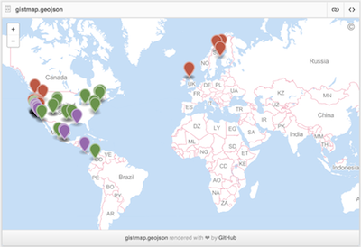

The rOpenSci projects aims to provide programmatic access to scientific data repositories on the web. A vast majority of the packages in our current suite retrieve some form of biodiversity or taxonomic data. Since several of these datasets have been georeferenced, it provides numerous opportunities for visualizing species distributions, building species distribution maps, and for using it analyses such as species distribution models. In an effort to streamline access to these data, we have developed a package called Spocc, which provides a unified API to all the biodiversity sources that we provide. The obvious advantage is that a user can interact with a common API and not worry about the nuances in syntax that differ between packages. As more data sources come online, users can access even more data without significant changes to their code. However, it is important to note that spocc will never replicate the full functionality that exists within specific packages. Therefore users with a strong interest in one of the specific data sources listed below would benefit from familiarising themselves with the inner working of the appropriate packages.

### Data Sources

`spocc` currently interfaces with six major biodiversity repositories

1. Global Biodiversity Information Facility (`rgbif`)
[GBIF](http://www.gbif.org/) is a government funded open data repository with several partner organizations with the express goal of providing access to data on Earth's biodiversity. The data are made available by a network of member nodes, coordinating information from various participant organizations and government agencies.

2. [Berkeley Ecoengine](http://ecoengine.berkeley.edu/) (`ecoengine`)
The ecoengine is an open API built by the [Berkeley Initiative for Global Change Biology](http://globalchange.berkeley.edu/). The repository provides access to over 3 million specimens from various Berkeley natural history museums. These data span more than a century and provide access to georeferenced specimens, species checklists, photographs, vegetation surveys and resurveys and a variety of measurements from environmental sensors located at reserves across University of California's natural reserve system.

3. [iNaturalist](http://www.inaturalist.org/) (`rinat`)
iNaturalist provides access to crowd sourced citizen science data on species observations.

5. [Biodiversity Information Serving Our Nation](http://bison.usgs.ornl.gov/) (`rbison`)
Built by the US Geological Survey's core science analytic team, BISON is a portal that provides access to species occurrence data from several participating institutions.

6. [eBird](http://ebird.org/content/ebird/) (`rebird`)
ebird is a database developed and maintained by the Cornell Lab of Ornithology and the National Audubon Society. It provides real-time access to checklist data, data on bird abundance and distribution, and communtiy reports from birders.

7. [AntWeb](http://antweb.org) (`AntWeb`)
AntWeb is the world's largest online database of images, specimen records, and natural history information on ants. It is community driven and open to contribution from anyone with specimen records, natural history comments, or images.

__Note:__ It's important to keep in mind that several data providers interface with many of the above mentioned repositories. This means that occurence data obtained from BISON may be duplicates of data that are also available through GBIF. We do not have a way to resolve these duplicates or overlaps at this time but it is an issue we are hoping to resolve in future versions of the package.


### Data retrieval

The most significant function in spocc is the `occ` (short for occurrence) function. `occ` takes a query, often a species name, and searches across all data sources specified in the `from` argument. For example, one can search for all occurrences of [Sharp-shinned Hawks](http://www.allaboutbirds.org/guide/sharp-shinned_hawk/id) (_Accipiter striatus_) from the GBIF database with the following R call.


```r
library('spocc')
df <- occ(query = 'Accipiter striatus', from = 'gbif')
df
```

```
#> Summary of results - occurrences found for: 
#>  gbif  : 500 records across 1 species 
#>  bison :  0 records across 1 species 
#>  inat  :  0 records across 1 species 
#>  ebird :  0 records across 1 species 
#>  ecoengine :  0 records across 1 species 
#>  antweb :  0 records across 1 species
```

```r
df$gbif$data[[1]][1:6,1:10]
```

```
#>                 name longitude latitude                      issues prov
#> 1 Accipiter striatus -76.33708 42.25353                     cdround gbif
#> 2 Accipiter striatus -76.37695 42.42883                     cdround gbif
#> 3 Accipiter striatus -71.72514 18.26982         cdround,cudc,gass84 gbif
#> 4 Accipiter striatus -72.52547 43.13234         cdround,cudc,gass84 gbif
#> 5 Accipiter striatus -99.84577 20.62069 cdround,cudc,gass84,mdatunl gbif
#> 6 Accipiter striatus -97.00035 33.07049         cdround,cudc,gass84 gbif
#>          key                           datasetKey
#> 1 1037859368 f96a6f8c-b992-4159-8039-db8f30bac985
#> 2 1037859379 f96a6f8c-b992-4159-8039-db8f30bac985
#> 3  891035119 50c9509d-22c7-4a22-a47d-8c48425ef4a7
#> 4  891035349 50c9509d-22c7-4a22-a47d-8c48425ef4a7
#> 5 1038292911 50c9509d-22c7-4a22-a47d-8c48425ef4a7
#> 6 1024205119 50c9509d-22c7-4a22-a47d-8c48425ef4a7
#>                       publishingOrgKey publishingCountry    protocol
#> 1 cf9ceb80-9f3d-11da-b791-b8a03c50a862                US DWC_ARCHIVE
#> 2 cf9ceb80-9f3d-11da-b791-b8a03c50a862                US DWC_ARCHIVE
#> 3 28eb1a3f-1c15-4a95-931a-4af90ecb574d                US DWC_ARCHIVE
#> 4 28eb1a3f-1c15-4a95-931a-4af90ecb574d                US DWC_ARCHIVE
#> 5 28eb1a3f-1c15-4a95-931a-4af90ecb574d                US DWC_ARCHIVE
#> 6 28eb1a3f-1c15-4a95-931a-4af90ecb574d                US DWC_ARCHIVE
```

The data returned are part of a `S3` class called `occdat`. This class has slots for the five data sources described above. One can easily switch the source by changing the `from` parameter in the function call above.

Within each data source is the set of species queried. In the above example, we only asked for occurrence data for one species, but we could have asked for any number. Let's say we asked for data for two species: _Accipiter striatus_, and _Pinus contorta_. Then the structure of the response would be

```
response -- |
            | -- gbif ------- |
                              | -- Accipiter_striatus
                              | -- Pinus_contorta

            | -- ecoengine -- |
                              | -- Accipiter_striatus
                              | -- Pinus_contorta

            | -- inat ------- |
                              | -- Accipiter_striatus
                              | -- Pinus_contorta

            | -- bison ------ |
                              | -- Accipiter_striatus
                              | -- Pinus_contorta

            | -- ebird ------ |
                              | -- Accipiter_striatus
                              | -- Pinus_contorta

            | -- antweb ----- |
                              | -- Accipiter_striatus
                              | -- Pinus_contorta

```

If you only request data from gbif, like `from = 'gbif'`, then the other four source slots are present in the response object, but have no data.

You can quickly get just the data by indexing to the data element, like


```r
df$gbif$data$Accipiter_striatus[1:6,1:10]
```

```
#>                 name longitude latitude                      issues prov
#> 1 Accipiter striatus -76.33708 42.25353                     cdround gbif
#> 2 Accipiter striatus -76.37695 42.42883                     cdround gbif
#> 3 Accipiter striatus -71.72514 18.26982         cdround,cudc,gass84 gbif
#> 4 Accipiter striatus -72.52547 43.13234         cdround,cudc,gass84 gbif
#> 5 Accipiter striatus -99.84577 20.62069 cdround,cudc,gass84,mdatunl gbif
#> 6 Accipiter striatus -97.00035 33.07049         cdround,cudc,gass84 gbif
#>          key                           datasetKey
#> 1 1037859368 f96a6f8c-b992-4159-8039-db8f30bac985
#> 2 1037859379 f96a6f8c-b992-4159-8039-db8f30bac985
#> 3  891035119 50c9509d-22c7-4a22-a47d-8c48425ef4a7
#> 4  891035349 50c9509d-22c7-4a22-a47d-8c48425ef4a7
#> 5 1038292911 50c9509d-22c7-4a22-a47d-8c48425ef4a7
#> 6 1024205119 50c9509d-22c7-4a22-a47d-8c48425ef4a7
#>                       publishingOrgKey publishingCountry    protocol
#> 1 cf9ceb80-9f3d-11da-b791-b8a03c50a862                US DWC_ARCHIVE
#> 2 cf9ceb80-9f3d-11da-b791-b8a03c50a862                US DWC_ARCHIVE
#> 3 28eb1a3f-1c15-4a95-931a-4af90ecb574d                US DWC_ARCHIVE
#> 4 28eb1a3f-1c15-4a95-931a-4af90ecb574d                US DWC_ARCHIVE
#> 5 28eb1a3f-1c15-4a95-931a-4af90ecb574d                US DWC_ARCHIVE
#> 6 28eb1a3f-1c15-4a95-931a-4af90ecb574d                US DWC_ARCHIVE
```

When you get data from multiple providers, the fields returned are slightly different, e.g.:


```r
df <- occ(query = 'Accipiter striatus', from = c('gbif', 'ecoengine'), limit = 25)
head(df$gbif$data$Accipiter_striatus)[1:6,1:10]
```

```
#>                 name longitude latitude                      issues prov
#> 1 Accipiter striatus -76.33708 42.25353                     cdround gbif
#> 2 Accipiter striatus -76.37695 42.42883                     cdround gbif
#> 3 Accipiter striatus -71.72514 18.26982         cdround,cudc,gass84 gbif
#> 4 Accipiter striatus -72.52547 43.13234         cdround,cudc,gass84 gbif
#> 5 Accipiter striatus -99.84577 20.62069 cdround,cudc,gass84,mdatunl gbif
#> 6 Accipiter striatus -97.00035 33.07049         cdround,cudc,gass84 gbif
#>          key                           datasetKey
#> 1 1037859368 f96a6f8c-b992-4159-8039-db8f30bac985
#> 2 1037859379 f96a6f8c-b992-4159-8039-db8f30bac985
#> 3  891035119 50c9509d-22c7-4a22-a47d-8c48425ef4a7
#> 4  891035349 50c9509d-22c7-4a22-a47d-8c48425ef4a7
#> 5 1038292911 50c9509d-22c7-4a22-a47d-8c48425ef4a7
#> 6 1024205119 50c9509d-22c7-4a22-a47d-8c48425ef4a7
#>                       publishingOrgKey publishingCountry    protocol
#> 1 cf9ceb80-9f3d-11da-b791-b8a03c50a862                US DWC_ARCHIVE
#> 2 cf9ceb80-9f3d-11da-b791-b8a03c50a862                US DWC_ARCHIVE
#> 3 28eb1a3f-1c15-4a95-931a-4af90ecb574d                US DWC_ARCHIVE
#> 4 28eb1a3f-1c15-4a95-931a-4af90ecb574d                US DWC_ARCHIVE
#> 5 28eb1a3f-1c15-4a95-931a-4af90ecb574d                US DWC_ARCHIVE
#> 6 28eb1a3f-1c15-4a95-931a-4af90ecb574d                US DWC_ARCHIVE
```

```r
head(df$ecoengine$data$Accipiter_striatus)
```

```
#>   longitude latitude    type
#> 1 -115.4017 37.64413 Feature
#> 2  -71.1495 42.47010 Feature
#> 3 -106.3249 41.31006 Feature
#> 4 -117.3132 34.51040 Feature
#> 5 -118.6773 41.67245 Feature
#> 6 -118.8435 39.42228 Feature
#>                                                                   url
#> 1 https://ecoengine.berkeley.edu/api/observations/MVZ%3ABird%3A65783/
#> 2 https://ecoengine.berkeley.edu/api/observations/MVZ%3ABird%3A41296/
#> 3 https://ecoengine.berkeley.edu/api/observations/MVZ%3ABird%3A77818/
#> 4 https://ecoengine.berkeley.edu/api/observations/MVZ%3ABird%3A32223/
#> 5  https://ecoengine.berkeley.edu/api/observations/MVZ%3ABird%3A9094/
#> 6 https://ecoengine.berkeley.edu/api/observations/MVZ%3ABird%3A79193/
#>   observation_type                     name       country state_province
#> 1         specimen Accipiter striatus velox United States         Nevada
#> 2         specimen Accipiter striatus velox United States  Massachusetts
#> 3         specimen Accipiter striatus velox United States        Wyoming
#> 4         specimen Accipiter striatus velox United States     California
#> 5         specimen Accipiter striatus velox United States         Nevada
#> 6         specimen Accipiter striatus velox United States         Nevada
#>   begin_date   end_date                                        source
#> 1 1934-09-25 1934-09-25 https://ecoengine.berkeley.edu/api/sources/1/
#> 2 1904-05-04 1904-05-04 https://ecoengine.berkeley.edu/api/sources/1/
#> 3 1939-09-10 1939-09-10 https://ecoengine.berkeley.edu/api/sources/1/
#> 4 1904-12-24 1904-12-24 https://ecoengine.berkeley.edu/api/sources/1/
#> 5 1909-06-27 1909-06-27 https://ecoengine.berkeley.edu/api/sources/1/
#> 6 1940-02-18 1940-02-18 https://ecoengine.berkeley.edu/api/sources/1/
#>                                     remote_resource last_modified
#> 1 http://arctos.database.museum/guid/MVZ:Bird:65783    2014-05-29
#> 2 http://arctos.database.museum/guid/MVZ:Bird:41296    2014-05-29
#> 3 http://arctos.database.museum/guid/MVZ:Bird:77818    2014-05-29
#> 4 http://arctos.database.museum/guid/MVZ:Bird:32223    2014-05-29
#> 5  http://arctos.database.museum/guid/MVZ:Bird:9094    2014-05-29
#> 6 http://arctos.database.museum/guid/MVZ:Bird:79193    2014-05-29
#>        prov
#> 1 ecoengine
#> 2 ecoengine
#> 3 ecoengine
#> 4 ecoengine
#> 5 ecoengine
#> 6 ecoengine
```

We provide a function `occ2df` that pulls out a few key columns needed for making maps:


```r
head(occ2df(df))
```

```
#>                 name longitude latitude prov
#> 1 Accipiter striatus -76.33708 42.25353 gbif
#> 2 Accipiter striatus -76.37695 42.42883 gbif
#> 3 Accipiter striatus -71.72514 18.26982 gbif
#> 4 Accipiter striatus -72.52547 43.13234 gbif
#> 5 Accipiter striatus -99.84577 20.62069 gbif
#> 6 Accipiter striatus -97.00035 33.07049 gbif
```


### Fix names

One problem you often run in to is that there can be various names for the same taxon in any one source. For example:


```r
df <- occ(query='Pinus contorta', from=c('gbif','inat'), limit = 50)
head(df$gbif$data$Pinus_contorta)[1:6,1:10]
```

```
#>             name longitude latitude              issues prov       key
#> 1 Pinus contorta -122.7613 48.14143 cdround,cudc,gass84 gbif 891034130
#> 2 Pinus contorta -120.0370 38.81988 cdround,cudc,gass84 gbif 891051664
#> 3 Pinus contorta -120.3492 39.34460 cdround,cudc,gass84 gbif 899951519
#> 4 Pinus contorta -120.2195 39.19913 cdround,cudc,gass84 gbif 899960284
#> 5 Pinus contorta -122.2948 47.65622 cdround,cudc,gass84 gbif 899974349
#> 6 Pinus contorta   17.6176 58.88670  cudc,depunl,gass84 gbif 931646616
#>                             datasetKey
#> 1 50c9509d-22c7-4a22-a47d-8c48425ef4a7
#> 2 50c9509d-22c7-4a22-a47d-8c48425ef4a7
#> 3 50c9509d-22c7-4a22-a47d-8c48425ef4a7
#> 4 50c9509d-22c7-4a22-a47d-8c48425ef4a7
#> 5 50c9509d-22c7-4a22-a47d-8c48425ef4a7
#> 6 38b4c89f-584c-41bb-bd8f-cd1def33e92f
#>                       publishingOrgKey publishingCountry    protocol
#> 1 28eb1a3f-1c15-4a95-931a-4af90ecb574d                US DWC_ARCHIVE
#> 2 28eb1a3f-1c15-4a95-931a-4af90ecb574d                US DWC_ARCHIVE
#> 3 28eb1a3f-1c15-4a95-931a-4af90ecb574d                US DWC_ARCHIVE
#> 4 28eb1a3f-1c15-4a95-931a-4af90ecb574d                US DWC_ARCHIVE
#> 5 28eb1a3f-1c15-4a95-931a-4af90ecb574d                US DWC_ARCHIVE
#> 6 b8323864-602a-4a7d-9127-bb903054e97d                SE DWC_ARCHIVE
```

```r
head(df$inat$data$Pinus_contorta)[1:6,1:10]
```

```
#>                      name                  Datetime
#> 1 Pinus contorta contorta 2014-10-14 09:29:37 -0700
#> 2 Pinus contorta contorta 2014-10-14 09:29:39 -0700
#> 3 Pinus contorta contorta 2014-10-23 04:00:00 -0700
#> 4 Pinus contorta contorta                          
#> 5          Pinus contorta 2014-09-06 00:00:00 -0700
#> 6          Pinus contorta 2014-09-06 00:00:00 -0700
#>                                                                                                                                                                   Description
#> 1                                                                                                                                                                            
#> 2                                                                                                                                                                            
#> 3                                                                                                                                                                            
#> 4                                                                        it looked as though the tree was shaped in a bowl or a hump and the color was a darker green color. 
#> 5 3-3.5m coning Pinus contorta in 1.5m tall Manuka. These wilding pines become more common above main branch of Kowai River. Some reaching 4m, & secondary invasion starting.
#> 6                                                                                2.5m Wilding Pine (coning) on edge of small erosion pavement amongst 1.5m tall Dracophyllum.
#>                     Place.guess  latitude longitude Tag.list
#> 1                                57.05960 -135.3441         
#> 2 212 Moller Ave, Sitka, AK, US  57.05868 -135.3418         
#> 3        Union Bay Natural Area  47.65580 -122.2925         
#> 4                  sitka alaska  57.05306 -135.3300         
#> 5     Kowai River, Porters Pass -43.28568  171.7819         
#> 6     Kowai River, Porters Pass -43.28274  171.7767         
#>      Common.name                                             Url
#> 1     shore pine http://www.inaturalist.org/observations/1041247
#> 2     shore pine http://www.inaturalist.org/observations/1041237
#> 3     shore pine http://www.inaturalist.org/observations/1032059
#> 4     shore pine http://www.inaturalist.org/observations/1022007
#> 5 Lodgepole Pine http://www.inaturalist.org/observations/1014535
#> 6 Lodgepole Pine http://www.inaturalist.org/observations/1014523
#>                                                            Image.url
#> 1 http://static.inaturalist.org/photos/1306219/medium.jpg?1414450594
#> 2 http://static.inaturalist.org/photos/1306209/medium.jpg?1414450360
#> 3                                                                   
#> 4 http://static.inaturalist.org/photos/1280955/medium.jpg?1413501046
#> 5                                                                   
#> 6
```

This is fine, but when trying to make a map in which points are colored for each taxon, you can have many colors for a single taxon, where instead one color per taxon is more appropriate. There is a function in `spocc` called `fixnames`, which has a few options in which you can take the shortest names (usually just the plain binomials like _Homo sapiens_), or the original name queried, or a vector of names supplied by the user.


```r
df <- fixnames(df, how = 'shortest')
head(df$gbif$data$Pinus_contorta[,1:2])
```

```
#>             name longitude
#> 1 Pinus contorta -122.7613
#> 2 Pinus contorta -120.0370
#> 3 Pinus contorta -120.3492
#> 4 Pinus contorta -120.2195
#> 5 Pinus contorta -122.2948
#> 6 Pinus contorta   17.6176
```

```r
head(df$inat$data$Pinus_contorta[,1:2])
```

```
#>             name                  Datetime
#> 1 Pinus contorta 2014-10-14 09:29:37 -0700
#> 2 Pinus contorta 2014-10-14 09:29:39 -0700
#> 3 Pinus contorta 2014-10-23 04:00:00 -0700
#> 4 Pinus contorta                          
#> 5 Pinus contorta 2014-09-06 00:00:00 -0700
#> 6 Pinus contorta 2014-09-06 00:00:00 -0700
```

```r
df_comb <- occ2df(df)
head(df_comb); tail(df_comb)
```

```
#>             name longitude latitude prov
#> 1 Pinus contorta -122.7613 48.14143 gbif
#> 2 Pinus contorta -120.0370 38.81988 gbif
#> 3 Pinus contorta -120.3492 39.34460 gbif
#> 4 Pinus contorta -120.2195 39.19913 gbif
#> 5 Pinus contorta -122.2948 47.65622 gbif
#> 6 Pinus contorta   17.6176 58.88670 gbif
```

```
#>               name longitude latitude prov
#> 95  Pinus contorta -119.4130 37.84096 inat
#> 96  Pinus contorta -120.2402 39.42493 inat
#> 97  Pinus contorta -124.4242 43.12515 inat
#> 98  Pinus contorta -123.9358 45.70359 inat
#> 99  Pinus contorta -124.1295 44.03232 inat
#> 100 Pinus contorta -120.2419 39.43014 inat
```

### Visualization routines

__Interactive maps__

_Leaflet.js_

[Leaflet JS](http://leafletjs.com/) is an open source mapping library that can leverage various layers from multiple sources. Using the [`leafletR`](http://cran.r-project.org/web/packages/leafletR/index.html) library, it's possible to generate a local `geoJSON` file and a html file of species distribution maps. The folder can easily be moved to a web server and served widely without any additional coding.

It's also possible to render similar maps with Mapbox by committing just the geoJSON file to GitHub or posting it as a gist on GitHub. All the remaining fields will become part of a table inside a tooltip, providing a extremely quick and easy way to serve up interactive maps. This is especially useful when users do not have their own web hosting options.

Here is an example of making a leaflet map:


```r
spp <- c('Danaus plexippus','Accipiter striatus','Pinus contorta')
dat <- occ(query = spp, from = 'gbif', gbifopts = list(hasCoordinate = TRUE))
data <- occ2df(dat)
mapleaflet(data = data, dest = ".")
```


_Geojson map as a Github gist_

You can also create interactive maps via the `mapgist` function. You have to have a Github account to use this function. Github accounts are free though, and great for versioning and collaborating on code or papers. When you run the `mapgist` function it will ask for your Github username and password. You can alternatively store those in your `.Rprofile` file by adding entries for username (`options(github.username = 'username')`) and password (`options(github.password = 'password')`).


```r
spp <- c('Danaus plexippus','Accipiter striatus','Pinus contorta')
dat <- occ(query = spp, from = 'gbif', gbifopts = list(hasCoordinate = TRUE))
dat <- fixnames(dat)
mapgist(dat, color = c("#976AAE", "#6B944D", "#BD5945"))
```



__Static maps__

_base plots_

Base plots, or the built in plotting facility in R accessed via `plot()`, is quite fast, but not easy or efficient to use, but are good for a quick glance at some data.


```r
spnames <- c('Accipiter striatus', 'Setophaga caerulescens', 'Spinus tristis')
out <- occ(query = spnames, from = 'gbif', gbifopts = list(hasCoordinate = TRUE))
plot(out, cex = 1, pch = 10)
```


_ggplot2_

`ggplot2` is a powerful package for making visualizations in R. Read more about it [here](http://docs.ggplot2.org/0.9.3.1/). We created a simple wrapper function `mapggplot` to make a ggplot2 map from occurrence data using the `ggmap` package, which is built on top of `ggplot2`. Here's an example:


```r
ecoengine_data <- occ(query = 'Lynx rufus californicus', from = 'ecoengine')
mapggplot(ecoengine_data)
```


### Upcoming features

* As soon as we have an updated `rvertnet` package, we'll add the ability to query VertNet data from `spocc`.
* We're helping on a new package `rMaps` to make interactive maps using various Javascript mapping libraries, which will give access to a variety of awesome interactive maps. We will integrate `rMaps` once it's on CRAN.
* We'll add a function to make interactive maps using RStudio's Shiny in a future version.


<section id="citing">

## Citing

To cite `spocc` in publications use:

<br>

> Scott Chamberlain, Karthik Ram and Ted Hart (2014). spocc: R interface to many species occurrence data sources. R package version 0.2.0. https://github.com/ropensci/spocc

<section id="license_bugs">

## License and bugs

* License: [MIT](http://opensource.org/licenses/MIT)
* Report bugs at [our Github repo for spocc](https://github.com/ropensci/spocc/issues?state=open)

[Back to top](#top)
